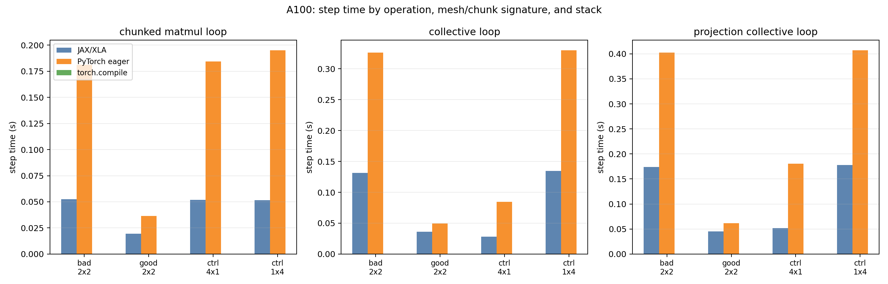
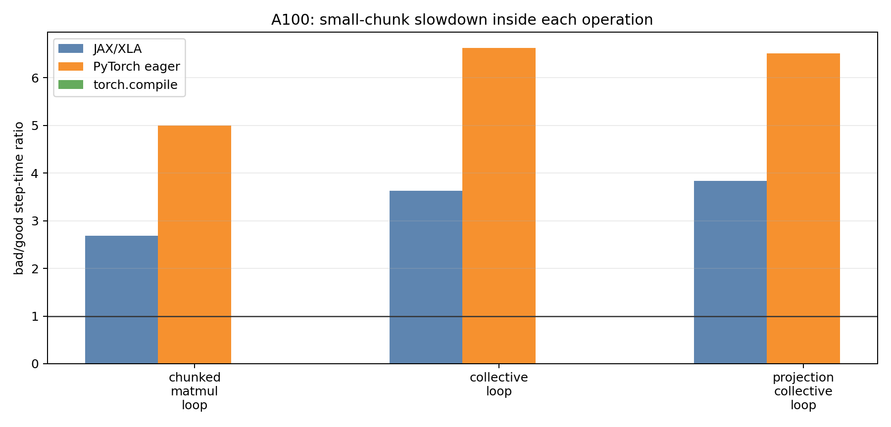
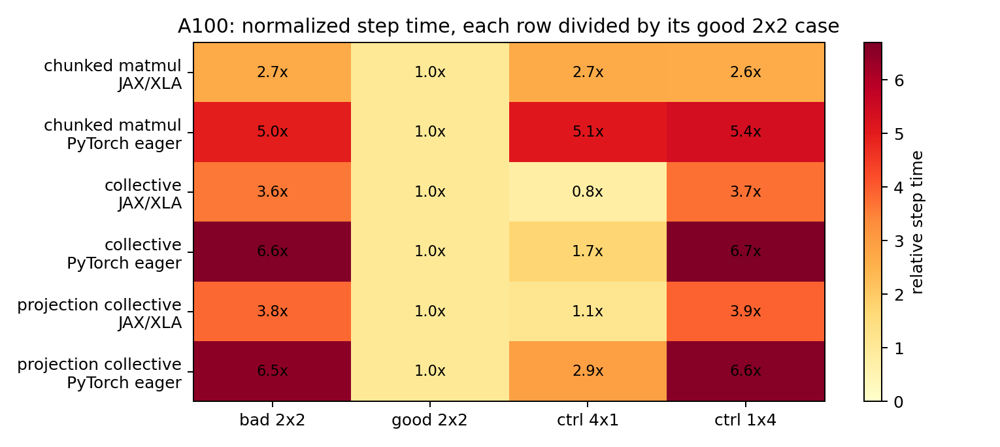
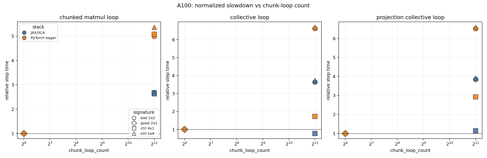
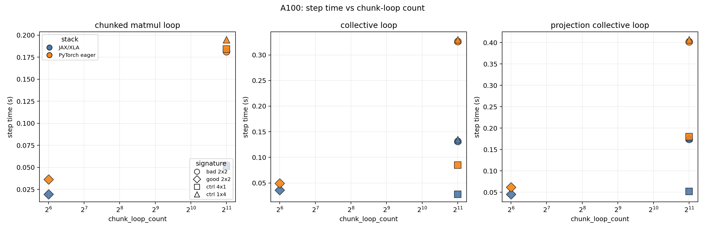
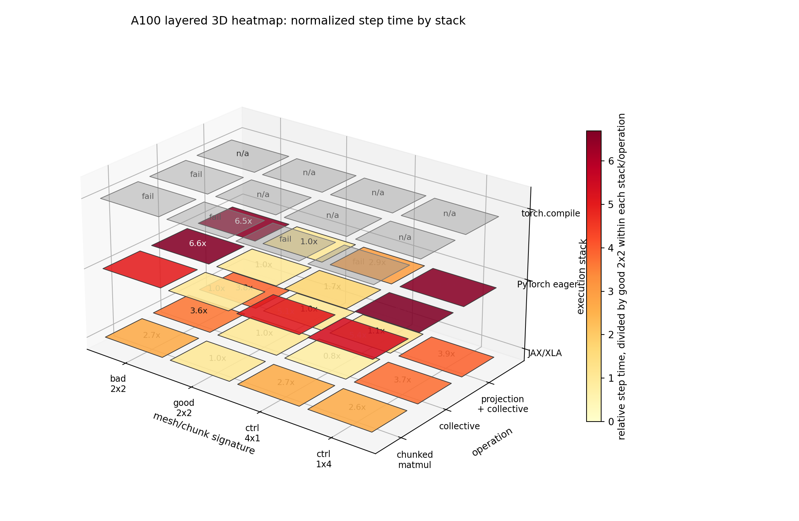

# A100 XLA vs PyTorch Mesh Pathology

This follow-up asks whether the small-chunk slowdown requires JAX/XLA.
It compares A100 4-GPU synthetic mesh-pathology workloads across:

- JAX/XLA synthetic microbenchmarks from the existing A100 dataset.
- PyTorch eager CUDA/NCCL microbenchmarks from a new dstack A100 run.
- torch.compile/Inductor attempts from the same dstack run.

Scope note: this is not a PyTorch reimplementation of CCE. CCE remains the
original JAX/Tunix path here. The PyTorch workloads isolate the suspected
mechanisms: many small chunk-loop matmuls, repeated collectives, and their
combination.

## Run Summary

- Hardware: 4x A100 80GB on dstack/RunPod.
- PyTorch runtime: torch 2.6.0+cu124, CUDA 12.4, 4 CUDA devices.
- Completed PyTorch eager rows: 12/12.
- Completed torch.compile timing rows: 0.
- torch.compile failures/hang: 5 attempted rows recorded, 7 remaining rows skipped after abort.
- Cleanup: the temporary dstack fleet was deleted; no fleet instances remained after deletion.

The dstack run was manually aborted when `torch_compile_collective_loop` made no
new progress after the earlier compile rows had already failed. This preserved
the successful eager data and avoided leaving the paid instance running.

## Key Result

PyTorch eager reproduces the small-chunk slowdown without XLA.

| operation | stack | bad 2x2 step (s) | good 2x2 step (s) | bad/good |
|---|---:|---:|---:|---:|
| chunked matmul loop | JAX/XLA | 0.0525 | 0.0195 | 2.69x |
| chunked matmul loop | PyTorch eager | 0.1813 | 0.0363 | 4.99x |
| collective loop | JAX/XLA | 0.1314 | 0.0362 | 3.63x |
| collective loop | PyTorch eager | 0.3263 | 0.0493 | 6.62x |
| projection + collective loop | JAX/XLA | 0.1742 | 0.0454 | 3.84x |
| projection + collective loop | PyTorch eager | 0.4023 | 0.0618 | 6.51x |

Scatter views:

Experimental layered view. Gray `fail` cells were attempted but did not produce
timings; gray `n/a` cells were not started after the run was aborted to avoid
leaving the paid instance running.

## Interpretation

The phenomenon is not XLA-only. Even in PyTorch eager, which does not use XLA,
small chunk-loop granularity creates a large slowdown. The effect is visible in
plain chunked matmul loops and becomes stronger when TP collectives are part of
the loop.

This does not prove XLA is irrelevant. JAX/XLA still changes the magnitude
through lowering, fusion, scheduling, and collective placement. The right claim
is narrower: XLA is not required for the base pathology to appear.

The most likely root mechanism is:

1. Small token/vocab chunks create many tiny loop bodies.
2. Those loop bodies underutilize the accelerator and raise launch/scheduling overhead.
3. With TP collectives, the small loop body repeatedly pays communication latency.
4. Mesh layout controls whether that communication path exists and how expensive it is.
5. Compiler stacks can amplify the issue differently: JAX/XLA runs but slows down; torch.compile did not yield usable timings in this run.

## torch.compile Result

The compiled rows did not produce usable timings:

| experiment_id | operation | signature | status |
|---:|---|---|---|
| 12 | chunked matmul loop | bad 2x2 | failure |
| 13 | chunked matmul loop | good 2x2 | failure |
| 14 | chunked matmul loop | control 4x1 | failure |
| 15 | chunked matmul loop | control 1x4 | failure |
| 16 | collective loop | bad 2x2 | aborted hang |

The next step for torch.compile is a smaller single-process or two-process
reproduction that captures the actual Inductor error/hang without paying for
the full distributed matrix.

## Artifacts

- PyTorch recovered results: `data/mesh_pathology_a100_xla_vs_torch/pytorch_recovered_results.jsonl`
- Skipped rows: `data/mesh_pathology_a100_xla_vs_torch/pytorch_skipped_experiments.csv`
- Progress log: `data/mesh_pathology_a100_xla_vs_torch/dstack_recovered_progress.log`
- Combined analysis: `data/mesh_pathology_a100_xla_vs_torch/analysis`
- Reusable analysis script: `analyze_a100_xla_vs_torch.py`
