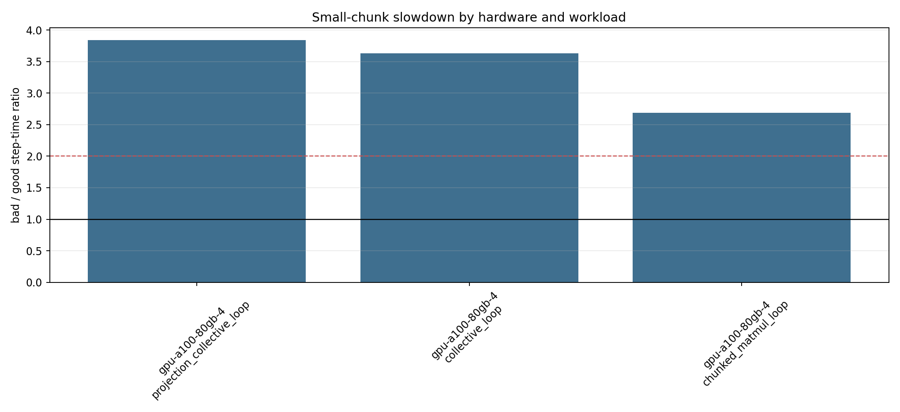

# A100 Mesh/Chunk Pathology Pilot Report

Date: 2026-06-16 01:17:12 KST

This pilot ran the generalized mesh/chunk pathology matrix on one dstack GPU target: `gpu-a100-80gb-4`.
The concrete machine was a GCP spot `a2-ultragpu-4g` with 4x A100 80GB GPUs. The run name was `mesh-pathology-gpu-a100-80gb-4-spot2`.

Cleanup status: the dstack fleet list was empty after cleanup, and `dstack ps` only showed the exited run record. No active fleet or GPU instance remained at cleanup verification time.

## Artifacts

- Console log: `01-CCE/data/mesh_pathology_a100_dstack/dstack_run.log`
- Reconstructed JSONL: `01-CCE/data/mesh_pathology_a100_dstack/reconstructed_results.jsonl`
- Reconstructed CSV: `01-CCE/data/mesh_pathology_a100_dstack/reconstructed_results.csv`
- Analysis directory: `01-CCE/data/mesh_pathology_a100_dstack/analysis`
- Plot: `01-CCE/data/mesh_pathology_a100_dstack/analysis/bad_good_slowdown_by_hardware_workload.png`

## Run Summary

| workload | rows | successes | median step time sec |
|---|---:|---:|---:|
| cce_train | 4 | 0 |  |
| chunked_matmul_loop | 4 | 4 | 0.051703 |
| collective_loop | 4 | 4 | 0.083758 |
| projection_collective_loop | 4 | 4 | 0.112938 |

The 12 synthetic JAX microbench rows completed. The 4 `cce_train` rows failed and were recorded as failure rows. The remote per-case artifacts could not be retrieved because SSH artifact access was denied, so the exact CCE traceback is not available in this local artifact set.

## Bad vs Good Comparison

Bad means `fsdp=2,tp=2,b16/L512,token_chunk=128,vocab_chunk=8192`.
Good means `fsdp=2,tp=2,b16/L512,token_chunk=512,vocab_chunk=65536`.

| workload | bad step sec | good step sec | bad/good | bad/good loop counts |
|---|---:|---:|---:|---:|
| projection_collective_loop | 0.174196 | 0.045364 | 3.84x | 2048 / 64 |
| collective_loop | 0.131361 | 0.036154 | 3.63x | 2048 / 64 |
| chunked_matmul_loop | 0.052492 | 0.019535 | 2.69x | 2048 / 64 |

The bad row has 2048 loop iterations in this generalized microbench schema, versus 64 for the good row, a 32x loop-count ratio.

## Interpretation

The slowdown reproduced on A100 outside the CCE training path:

- `chunked_matmul_loop`: 2.69x slower for the small-chunk bad row.
- `collective_loop`: 3.63x slower for the small-chunk bad row.
- `projection_collective_loop`: 3.84x slower for the small-chunk bad row.

This is evidence that the pathology is not CCE-specific. On A100, repeated small chunk loops alone are already slow, and adding collectives increases the bad/good gap. The current pilot supports the broader hypothesis that throughput failure is governed by chunk-loop granularity interacting with communication/layout, while CCE is one important instance of that pattern.

## Failed Rows

| experiment id | workload | signature | chunks | failure type |
|---:|---|---|---|---|
| 0 | cce_train | bad | 128/8192 | unavailable_remote_case_artifact |
| 1 | cce_train | good | 512/65536 | unavailable_remote_case_artifact |
| 2 | cce_train | control-fsdp4-tp1 | 128/8192 | unavailable_remote_case_artifact |
| 3 | cce_train | control-fsdp1-tp4 | 128/8192 | unavailable_remote_case_artifact |

## Limitations

- Only A100 GPU was run in this pilot; TPU v5e and other GPU types remain in the matrix but were not rerun here.
- CCE GPU rows failed before useful timing data was recovered locally.
- Compile time, HBM, profiler traces, and HLO extraction are not available from this A100 run because the dstack job only exposed console logs locally.

## Next Step

Fix the GPU dstack environment for `cce_train` by installing the full project requirements before `pip install -e .`, then rerun only the four A100 `cce_train` rows. The synthetic rows already provide a useful non-CCE baseline and do not need to be repeated immediately.
