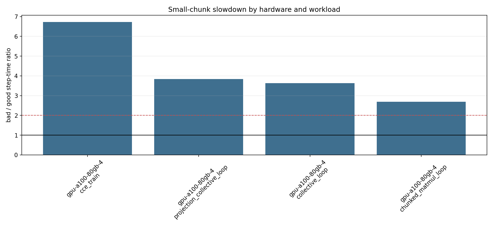

# A100 Mesh/Chunk Pathology Pilot Report

Date: 2026-06-16 KST

This pilot ran the generalized mesh/chunk pathology matrix on one dstack GPU target:
`gpu-a100-80gb-4`. The concrete machine was a GCP spot `a2-ultragpu-4g`
with 4x A100 80GB GPUs.

Cleanup status: after the successful CCE retry, the dstack fleet
`mesh-pathology-a100-fleet-retry` was deleted. A subsequent `dstack fleet list -v`
showed no fleets, and `dstack ps` only showed the exited run record. No active
GPU instance remained at cleanup verification time.

## What Ran

The initial A100 pilot run completed the non-CCE synthetic workloads and recorded
the CCE rows as failures. The CCE failures were retried after fixing the GPU job
environment and the Hugging Face model download path. The final A100 result set
contains 16 successful rows:

- 4 CCE training rows from `mesh-pathology-gpu-a100-cce-retry2`
- 12 non-CCE synthetic rows from the original A100 pilot

## Artifacts

- Initial A100 console log: `01-CCE/data/mesh_pathology_a100_dstack/dstack_run.log`
- CCE retry2 console log: `01-CCE/data/mesh_pathology_a100_cce_retry2/dstack_run.log`
- CCE retry2 JSONL: `01-CCE/data/mesh_pathology_a100_cce_retry2/results.jsonl`
- CCE retry2 CSV: `01-CCE/data/mesh_pathology_a100_cce_retry2/results.csv`
- CCE retry2 summary: `01-CCE/data/mesh_pathology_a100_cce_retry2/summary.md`
- Combined 16-row JSONL: `01-CCE/data/mesh_pathology_a100_combined/results.jsonl`
- Combined 16-row CSV: `01-CCE/data/mesh_pathology_a100_combined/results.csv`
- Combined analysis: `01-CCE/data/mesh_pathology_a100_combined/analysis`
- Combined plot: `01-CCE/data/mesh_pathology_a100_combined/analysis/bad_good_slowdown_by_hardware_workload.png`

## Run Summary

| workload | rows | successes | median step time sec | median compile sec | median planned HBM GiB/chip |
|---|---:|---:|---:|---:|---:|
| cce_train | 4 | 4 | 0.725481 | 46.023 | 19.14 |
| chunked_matmul_loop | 4 | 4 | 0.051703 |  |  |
| collective_loop | 4 | 4 | 0.083758 |  |  |
| projection_collective_loop | 4 | 4 | 0.112938 |  |  |

The 12 synthetic rows completed in the initial A100 pilot. The 4 CCE rows
completed in the second retry after the model path fix.

## CCE Retry Results

| case | mesh | chunks | step time sec | compile sec | planned HBM GiB/chip | runtime HBM GB | tokens/sec | CCE loops |
|---|---|---|---:|---:|---:|---:|---:|---:|
| bad | fsdp=2,tp=2 | 128/8192 | 4.278102 | 46.532 | 18.96 | 81.44 | 487.5 | 76 |
| good | fsdp=2,tp=2 | 512/65536 | 0.635943 | 45.513 | 19.32 | 83.02 | 3279.5 | 3 |
| control-fsdp4-tp1 | fsdp=4,tp=1 | 128/8192 | 0.815018 | 46.655 | 34.47 | 148.10 | 2559.0 | 76 |
| control-fsdp1-tp4 | fsdp=1,tp=4 | 128/8192 | 0.617338 | 39.452 | 10.10 | 44.05 | 3378.4 | 76 |

The A100 CCE bad row is 6.73x slower than the good row. Compile time is nearly
unchanged, and planned HBM is slightly lower in the bad row. This makes the
small-chunk CCE failure look like a steady-state throughput issue, not a
compile-time-only or memory-capacity-only issue.

## Bad vs Good Comparison

Bad means `fsdp=2,tp=2,b16/L512,token_chunk=128,vocab_chunk=8192`.
Good means `fsdp=2,tp=2,b16/L512,token_chunk=512,vocab_chunk=65536`.

| workload | bad step sec | good step sec | bad/good | loop count ratio |
|---|---:|---:|---:|---:|
| cce_train | 4.278102 | 0.635943 | 6.73x | 32.0x generalized, 25.3x CCE |
| projection_collective_loop | 0.174196 | 0.045364 | 3.84x | 32.0x |
| collective_loop | 0.131361 | 0.036154 | 3.63x | 32.0x |
| chunked_matmul_loop | 0.052492 | 0.019535 | 2.69x | 32.0x |

The generalized synthetic loop schema uses 2048 iterations for the bad row and
64 for the good row. CCE itself reports 76 loops for the bad row and 3 loops for
the good row because it computes `ceil(sequence_length / token_chunk) *
ceil(vocab_size / vocab_chunk)` for the Qwen vocabulary.

## Interpretation

The A100 results support the broader hypothesis that the pathology is not
CCE-specific:

- Small repeated chunked matmul loops are already slower on A100.
- Adding collective-heavy communication increases the bad/good gap.
- CCE shows the largest A100 gap in this pilot.
- In the CCE retry, planned HBM does not explain the slowdown.
- The failure appears in steady-state step time, not only in compile time.

The most likely current explanation is that small chunk granularity creates many
short loop bodies or kernels, and the cost becomes much worse when the workload
also interacts with mesh layout and communication. CCE is one important instance
of that pattern, but the non-CCE synthetic A100 rows show the same direction.

## Remaining Limits

- Only the A100 GPU target has been run for the GPU side so far.
- H100, L40S, and other GPU targets are configured but were not launched to avoid
  extra cost.
- TPU v5e results exist separately in `01-CCE/data/v5e_cce_full_matrix`, but this
  report focuses on the A100 pilot and retry.
- The synthetic workloads are intentionally simplified and should be used as
  mechanism probes, not replacements for full model training.
