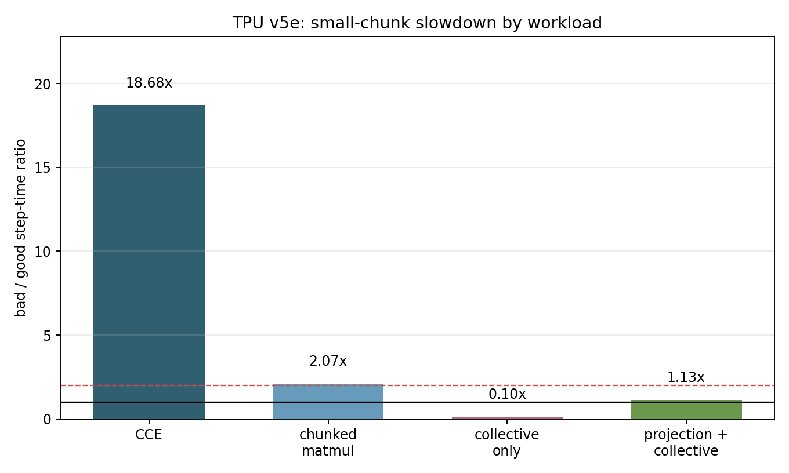
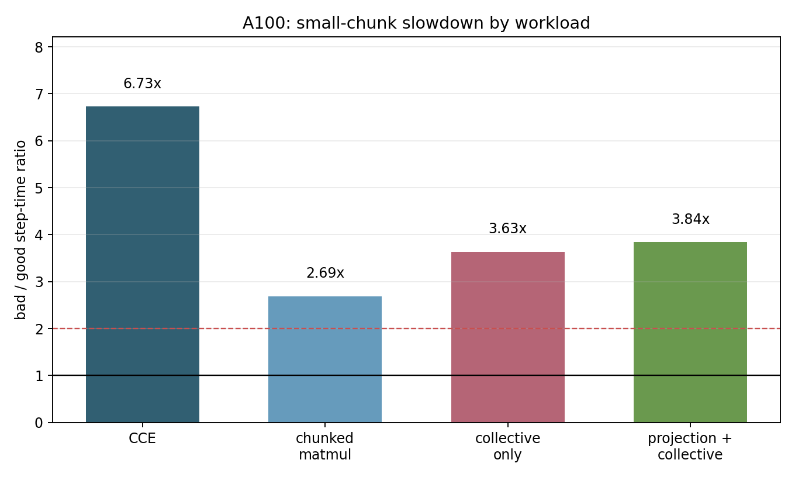

# TPU v5e / A100 Mesh Pathology Comparison

Date: 2026-06-16 KST

This report brings the TPU side to the same level as the A100 pilot for the
generalized mesh/chunk pathology question. The TPU run executed the three
non-CCE synthetic microbench workloads on one `v5litepod-4` TPU VM, using the
same four target signatures as the CCE profiler study. The TPU VM
`mesh-path-v5e-synth-0616` was deleted after results were copied back; a
follow-up `gcloud compute tpus tpu-vm list --zone=us-west4-a` showed no active
TPU VMs.

The final cross-hardware comparison now has 32 successful rows:

- TPU v5e: 4 CCE profiler rows + 12 synthetic microbench rows
- A100: 4 CCE retry rows + 12 synthetic microbench rows

## Artifacts

- TPU synthetic raw tarball:
  `01-CCE/data/mesh_pathology_tpu_v5e_synthetic/mesh-pathology-tpu-v5e-4-synthetic.tar.gz`
- TPU synthetic JSONL: `01-CCE/data/mesh_pathology_tpu_v5e_synthetic/results.jsonl`
- TPU combined 16-row JSONL: `01-CCE/data/mesh_pathology_tpu_v5e_combined/results.jsonl`
- TPU combined analysis: `01-CCE/data/mesh_pathology_tpu_v5e_combined/analysis`
- TPU+A100 combined 32-row JSONL: `01-CCE/data/mesh_pathology_tpu_a100_combined/results.jsonl`
- TPU+A100 combined analysis: `01-CCE/data/mesh_pathology_tpu_a100_combined/analysis`

## Per-Accelerator Operation Comparisons

The useful comparison is within one accelerator at a time: for each workload,
how much slower is the small-chunk bad row than the large-chunk good row?





## Bad vs Good Ratios

Bad means `fsdp=2,tp=2,b16/L512,token_chunk=128,vocab_chunk=8192`.
Good means `fsdp=2,tp=2,b16/L512,token_chunk=512,vocab_chunk=65536`.

| hardware | workload | bad step sec | good step sec | bad/good | planned HBM bad/good |
|---|---|---:|---:|---:|---:|
| TPU v5e | cce_train | 15.363363 | 0.822422 | 18.68x | 2.65 / 2.65 |
| A100 | cce_train | 4.278102 | 0.635943 | 6.73x | 18.96 / 19.32 |
| A100 | projection_collective_loop | 0.174196 | 0.045364 | 3.84x |  |
| A100 | collective_loop | 0.131361 | 0.036154 | 3.63x |  |
| A100 | chunked_matmul_loop | 0.052492 | 0.019535 | 2.69x |  |
| TPU v5e | chunked_matmul_loop | 0.035530 | 0.017136 | 2.07x | 0.161 / 0.162 |
| TPU v5e | projection_collective_loop | 0.140491 | 0.124453 | 1.13x | 0.165 / 0.287 |
| TPU v5e | collective_loop | 0.000497 | 0.004850 | 0.10x | 0.004 / 0.125 |

All rows use a 32x generalized bad/good loop-count ratio: 2048 iterations for
the bad signature and 64 for the good signature.

## Interpretation

The TPU result is not a simple copy of the A100 result:

- The original CCE failure is much stronger on TPU v5e than on A100: 18.68x vs
  6.73x.
- TPU `chunked_matmul_loop` still reproduces a non-CCE small-chunk slowdown
  at 2.07x, so the phenomenon is not purely inside the CCE code path.
- TPU `projection_collective_loop` is only mildly slower at 1.13x, while A100
  shows 3.84x for the same synthetic shape.
- TPU `collective_loop` reverses direction: the small-chunk bad row is faster
  than the large-chunk good row. This likely reflects the synthetic collective
  shape and XLA lowering, not the CCE behavior.
- Planned HBM does not explain the CCE slowdown on either hardware. TPU CCE
  bad/good planned HBM is equal at 2.65 GiB/chip, while step time changes
  18.68x.

## What This Does Not Prove

These experiments do not prove that XLA is not the cause. In fact, all four
workloads are JAX workloads that lower through XLA, so XLA remains one of the
most likely layers where the bad behavior is expressed.

What the experiment does show is narrower:

- The slowdown is not exclusively a high-level CCE API artifact, because
  non-CCE chunked matmul slows down on both A100 and TPU.
- Collective count alone does not explain TPU v5e CCE, because TPU
  `collective_loop` reverses direction and TPU `projection_collective_loop` is
  only 1.13x slower.
- Planned HBM does not explain the CCE slowdown, because TPU CCE bad/good HBM
  is equal while step time changes 18.68x.

The updated hypothesis is therefore sharper: small chunk granularity is a
general risk factor, but the extreme TPU v5e CCE failure likely requires the
interaction between the CCE loss-head loop, XLA lowering, and the FSDP/TP mesh.
The non-CCE synthetic TPU rows prove that small loop granularity can hurt
outside CCE, but they do not fully reproduce the 18.68x TPU CCE collapse.

## Run Details

The TPU synthetic run used:

```bash
python 01-CCE/run_mesh_pathology_matrix.py \
  --hardware-targets tpu-v5e-4 \
  --workloads chunked_matmul_loop,collective_loop,projection_collective_loop \
  --outdir /tmp/mesh-pathology-tpu-v5e-4-synthetic \
  --run-id 20260616-tpu-synthetic \
  --force
```

The CCE TPU rows are the existing v5e profiler cases from
`01-CCE/data/v5e_cce_full_matrix/profiler_results.csv`.
