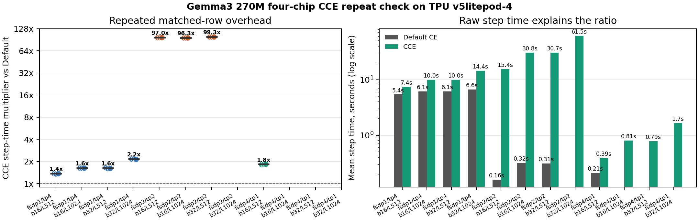
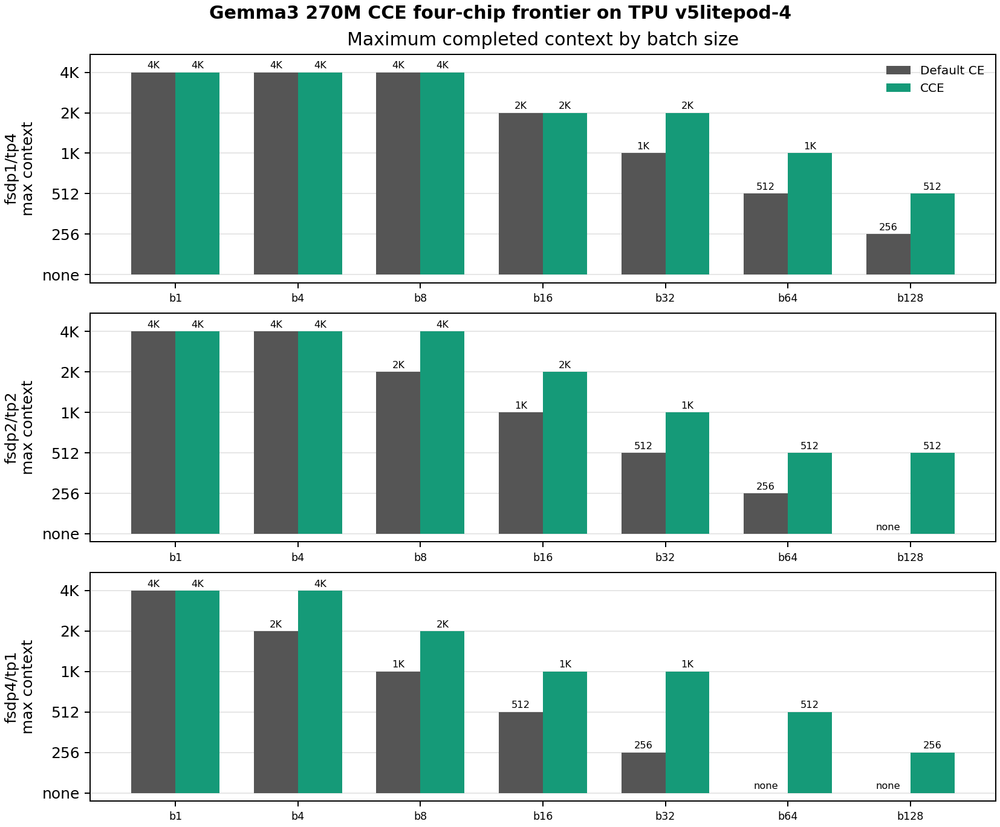
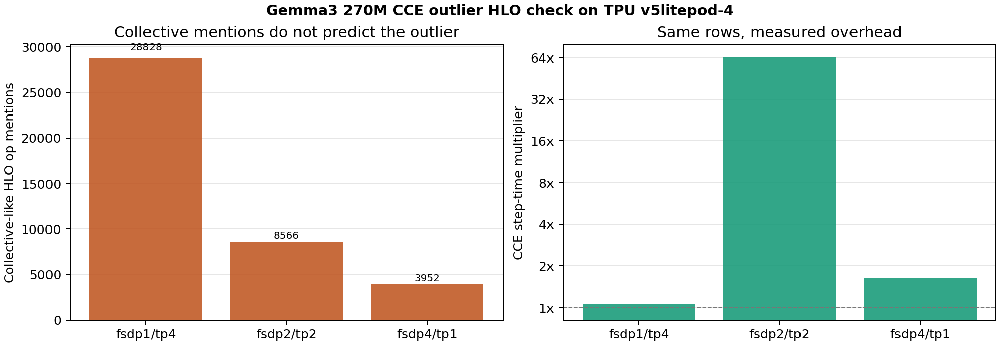
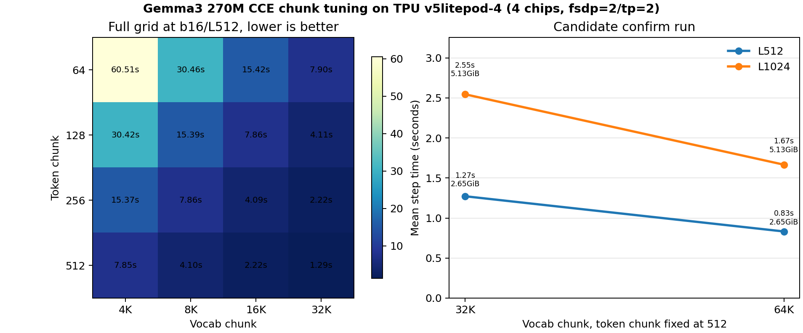
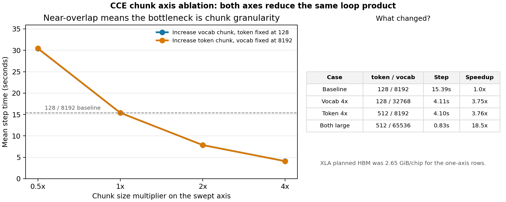
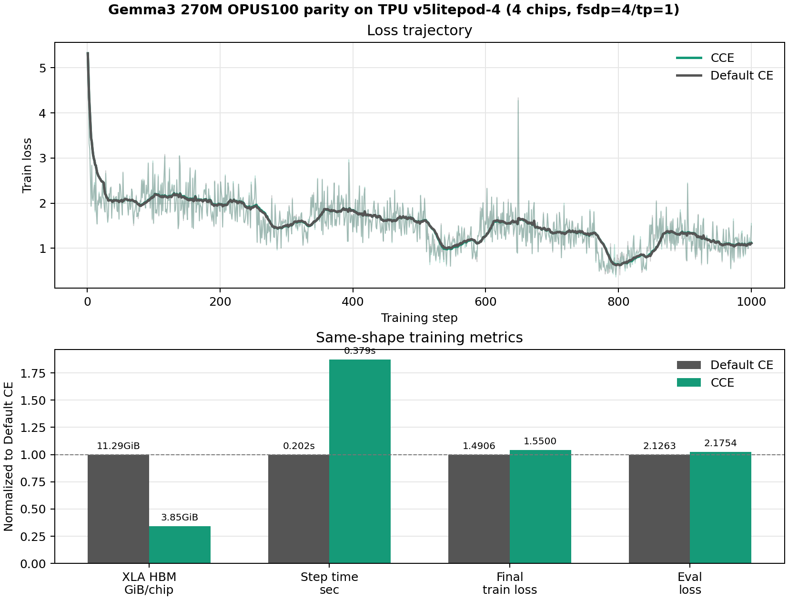

# Cut Cross Entropy on JAX/Tunix TPU: Gemma3 270M Evidence Report

This report makes one narrow, reproducible claim: on Gemma3 270M LoRA SFT with
JAX/Tunix on Cloud TPU v5e, Cut Cross Entropy removes a real loss-logits memory
wall without materially changing the training result. Larger models should be
treated as transfer checks until they receive the same level of coverage.

## Executive Summary

| Question | Result |
| --- | --- |
| Does CCE move the feasible batch/context frontier? | Yes. On `v5litepod-1`, b16 moved from L512 to L1024, b32 moved from L256 to L1024, and b64 moved from no Default CE fit to L512 with CCE. |
| Does it reduce memory at matched passing shapes? | Yes. Rank-sensitive matched rows show about 43-68% XLA planned HBM reduction. The OPUS100 b16/L512 run dropped from 12.57 GiB/chip to 4.98 GiB/chip. |
| Does real training still behave normally? | Yes. OPUS100 EN-FR b16/L512 LoRA SFT produced final train loss 0.1731 vs 0.1766 and eval loss 3.4292 vs 3.4251 for Default CE vs CCE. |
| What is the tradeoff? | Same-shape training is slower. In the 5,000-step b16/L512 run, mean step time rose from 0.106s to 0.196s. |
| Does it survive multi-chip mesh layouts? | Yes. A follow-up on `v5litepod-4` tested `fsdp=4,tp=1`, `fsdp=2,tp=2`, and `fsdp=1,tp=4`; matched passing rows showed 53-66% per-chip XLA planned HBM reduction and CCE moved the context frontier in all three meshes. |
| Did multi-chip expose a throughput pitfall? | Yes. The repeated `fsdp=2,tp=2` default chunk row was a real outlier: b16/L512 CCE was about 97x slower than Default CE. Larger TPU chunk settings reduced that same row from 15.37s/step to 0.83s/step without increasing XLA HBM. |
| What TPU was used? | The primary 270M rerun used Cloud TPU `v5litepod-1`, one chip, in `us-west4-a`. The mesh generalization check used `v5litepod-4`, four chips, in the same zone. |

The memory metric used throughout the new 270M plots is **max per-chip XLA
buffer-assignment planned HBM**. This is the number that decides whether a TPU
program fits on a chip. Runtime HBM snapshots are retained when the worker
reported them, but they are not the primary frontier axis.

## Claim Boundary

The report supports three claims:

1. CCE increases the feasible batch/context frontier when the dense loss logits
   tensor is the active memory wall.
2. At matched shapes, CCE can substantially reduce planned HBM while keeping
   train/eval loss in the same band.
3. The drop-in Tunix patch works on both single-chip and four-chip Gemma3 270M
   LoRA jobs, but throughput depends on mesh layout and chunk policy.

It does not claim that CCE is always faster, that CCE removes every memory wall,
or that the OPUS100 samples establish translation quality. Those rows are sanity
checks for training behavior and generation-path integrity.

## Why This Should Work

Default language-model cross entropy usually materializes a full logits tensor
with shape roughly:

```text
batch_size * context_length * vocabulary_size
```

That tensor grows directly with the two knobs we care about for SFT capacity:
batch and context length. CCE computes the same cross-entropy objective by
streaming over token/vocab chunks, avoiding the dense full-vocab logits tensor
in the loss path.

The Tunix integration is a drop-in patch for the LoRA training path. During
training, it intercepts the model output before the tied LM-head decode and
computes CCE against the frozen LM head. During generation, the original decode
path is restored before sampling. A regression test now guards that restore
path because generation must not see the hidden-state intercept.

## Experiment Scope

| Field | Value |
| --- | --- |
| Model | `google/gemma-3-270m-it` |
| Training mode | Tunix PEFT/LoRA |
| Main LoRA rank | 16 |
| TPU | Cloud TPU `v5litepod-1`, 1 chip |
| Zone | `us-west4-a` |
| Systems dataset | deterministic synthetic SFT records |
| Quality dataset | OPUS100 EN-FR |
| Compared variants | Default CE vs CCE |
| Other acceleration patches | disabled |
| Conservative CCE chunks | token chunk 128, vocab chunk 8192 unless swept |
| TPU large-chunk preset | token chunk 512, vocab chunk 65536 for the mixed-mesh follow-up |

The one-chip rerun produced 307 result rows: frontier sweeps, pressure points,
rank sensitivity, chunk tuning, one-step parity, and OPUS100 training runs.
The four-chip follow-up added repeated mesh timings, frontier sweeps, HLO text
scans, mixed-mesh chunk tuning, and a 1,000-step OPUS100 parity run.

## 1. Frontier: CCE Moves the Fit Boundary

The frontier sweep is deliberately synthetic. It is not intended to prove
translation quality. Its job is to isolate the `batch * context * vocab` memory
pressure and ask whether the same model, TPU, and LoRA configuration can run
when only the loss implementation changes.


The left panel is the practical result: maximum completed context length by
batch size. The right panel shows the underlying XLA planned HBM pressure for
representative batch sizes.

| Batch | Default CE max context | CCE max context | Gain |
| --- | ---: | ---: | ---: |
| 1 | 8,192 | 8,192 | 1.0x |
| 2 | 4,096 | 4,096 | 1.0x |
| 4 | 2,048 | 4,096 | 2.0x |
| 8 | 1,024 | 2,048 | 2.0x |
| 16 | 512 | 1,024 | 2.0x |
| 32 | 256 | 1,024 | 4.0x |
| 64 | none | 512 | CCE-only fit |
| 128 | none | 256 | CCE-only fit |

The important pattern is not that CCE makes every shape fit. It moves the wall.
For small batches, both variants can still be limited by other model or
activation buffers. As batch grows, the loss-logits tensor becomes the visible
wall, and CCE opens shapes that Default CE cannot compile.

The pass/fail map shows that the sweep did not stop at the first Default CE
failure. CCE was pushed until it reached its own boundary.


## 2. Pressure Points: Same Shape, Different Memory Wall

The pressure-point rows keep the sweep readable by focusing on a few
representative shapes.

| Shape | Default CE | Default XLA HBM | CCE | CCE XLA HBM |
| --- | --- | ---: | --- | ---: |
| b16/L512 | OK | 12.57 GiB/chip | OK | 4.98 GiB/chip |
| b16/L1024 | compile OOM | 21.36 GiB/chip | OK | 9.65 GiB/chip |
| b32/L512 | compile OOM | 21.32 GiB/chip | OK | 8.13 GiB/chip |
| b32/L1024 | compile OOM | 45.45 GiB/chip | OK | 14.26 GiB/chip |
| b64/L512 | compile OOM | 57.41 GiB/chip | OK | 14.13 GiB/chip |
| b64/L1024 | resource exhausted | 88.02 GiB/chip | compile OOM | 25.16 GiB/chip |

This is the cleanest systems result: CCE turns multiple Default CE OOM rows into
completed TPU train steps, and the remaining CCE failures occur at much higher
pressure points.

## 3. Rank and Chunk Checks

CCE should mostly track `batch * context * vocab`, not LoRA rank. The rank sweep
used ranks 4, 16, and 64 across b8/b16/b32/b64 and L512/L1024/L2048/L4096.
The frontier pattern was unchanged across ranks: for example, b16 moved from
L512 to L1024 and b32 moved from no Default CE fit at L512 to CCE fitting
through L1024.

The chunk sweep asks a different question: once CCE is enabled, which token/vocab
chunk sizes are faster at a fixed shape? On b16/L512, all tested chunk pairs
used roughly the same XLA planned HBM, but step time varied.


The best b16/L512 chunk rows were:

| Token chunk | Vocab chunk | Mean step time | Valid tokens/sec | XLA HBM |
| ---: | ---: | ---: | ---: | ---: |
| 512 | 16K | 0.141s | 12,588 | 4.98 GiB/chip |
| 256 | 32K | 0.146s | 12,134 | 4.98 GiB/chip |
| 256 | 16K | 0.150s | 11,868 | 4.98 GiB/chip |
| 512 | 4K | 0.157s | 11,312 | 4.98 GiB/chip |

The conservative package knobs are `128/8192` because they are stable across
shapes. The one-chip sweep suggests that larger token chunks can be faster for
this particular 270M b16/L512 case, but chunk tuning should be shape-aware. The
four-chip follow-up below shows why: the best chunk policy can change when the
mesh changes.

## 4. Multi-Chip Mesh Generalization and the Mixed-Mesh Outlier

The main rerun is intentionally single-chip so that the memory story is easy to
read. We then checked whether the patch still works when Tunix/JAX shards the
same Gemma3 270M LoRA job over four TPU chips.

| Field | Value |
| --- | --- |
| TPU | Cloud TPU `v5litepod-4`, 4 chips |
| Zone | `us-west4-a` |
| Meshes | `fsdp=4,tp=1`, `fsdp=2,tp=2`, `fsdp=1,tp=4` |
| Repeated timing grid | batches 16/32, contexts 512/1024 |
| Frontier grid | batches 1/4/8/16/32/64/128, contexts 256/512/1024/2048/4096 |
| Steps | 8 repeated synthetic steps for timing; 2 synthetic steps for frontier |
| Other acceleration patches | disabled |



The result is not a single-chip artifact. CCE worked in the FSDP-only,
mixed-FSDP/TP, and TP-only layouts. At b16/L512, all three meshes reduced
max per-chip XLA planned HBM, but throughput behavior was mesh-specific:

| Mesh | Default step | CCE step | CCE multiplier | XLA HBM reduction |
| --- | ---: | ---: | ---: | ---: |
| `fsdp=4,tp=1` | 0.212s | 0.388s | 1.83x | 65.9% |
| `fsdp=2,tp=2` | 0.158s | 15.374s | 97.0x | 57.5% |
| `fsdp=1,tp=4` | 5.410s | 7.390s | 1.37x | 52.7% |

That table separates three facts that are easy to blur together:

1. CCE still saves memory in every tested mesh.
2. TP-heavy layouts can be slow even without CCE on this small model.
3. The dramatic CCE throughput outlier is local to the mixed `fsdp=2,tp=2`
   layout with the conservative default chunk settings.

The broader four-chip frontier sweep still shows the desired capacity behavior:



| Mesh | Batch | Default CE max context | CCE max context |
| --- | ---: | ---: | ---: |
| `fsdp=4,tp=1` | 16 | 512 | 1024 |
| `fsdp=4,tp=1` | 32 | 256 | 1024 |
| `fsdp=4,tp=1` | 64 | none | 512 |
| `fsdp=2,tp=2` | 16 | 1024 | 2048 |
| `fsdp=2,tp=2` | 64 | 256 | 512 |
| `fsdp=2,tp=2` | 128 | none | 512 |
| `fsdp=1,tp=4` | 32 | 1024 | 2048 |
| `fsdp=1,tp=4` | 64 | 512 | 1024 |
| `fsdp=1,tp=4` | 128 | 256 | 512 |

To inspect the `fsdp=2,tp=2` outlier, we kept full train-step XLA dumps and
scanned the optimized HLO text. This scan is intentionally a coarse compiler
artifact check, not a full profiler. It did not show a simple collective-count
explosion large enough to explain the 97x slowdown by itself.



The more actionable finding came from chunk tuning. The package default
(`token_chunk=128`, `vocab_chunk=8192`) is conservative and portable, but it is
too fine-grained for this mixed mesh. On `fsdp=2,tp=2`, b16/L512, increasing
the chunk size kept XLA HBM at 2.65 GiB/chip while dramatically reducing step
time:



| Shape | Token chunk | Vocab chunk | Mean step time | XLA HBM |
| --- | ---: | ---: | ---: | ---: |
| b16/L512 | 128 | 8192 | 15.39s | 2.65 GiB/chip |
| b16/L512 | 512 | 32768 | 1.27s | 2.65 GiB/chip |
| b16/L512 | 512 | 65536 | 0.83s | 2.65 GiB/chip |
| b16/L1024 | 128 | 8192 | 30.83s | 5.13 GiB/chip |
| b16/L1024 | 512 | 32768 | 2.55s | 5.13 GiB/chip |
| b16/L1024 | 512 | 65536 | 1.67s | 5.13 GiB/chip |

The same grid also gives a one-factor-at-a-time view. At b16/L512, holding
`token_chunk=128` fixed and increasing `vocab_chunk` made the run faster; holding
`vocab_chunk=8192` fixed and increasing `token_chunk` showed the same pattern.
XLA planned HBM stayed at 2.65 GiB/chip for every row in these two slices.



| Fixed knob | Swept knob | Step-time range | Interpretation |
| --- | --- | ---: | --- |
| `token_chunk=128` | `vocab_chunk=4096 -> 32768` | 30.42s -> 4.11s | Larger vocab chunks reduced the inner CCE loop count. |
| `vocab_chunk=8192` | `token_chunk=64 -> 512` | 30.46s -> 4.10s | Larger token chunks reduced the outer CCE loop count. |

So the mixed-mesh slowdown was not caused by only one bad axis. The problematic
case was excessive chunk granularity: many small token chunks multiplied by many
small vocab chunks. The larger `512/65536` preset reduces both loop dimensions,
which is why it fixes the outlier so strongly.

The clean interpretation is therefore: CCE is compatible with FSDP/TP sharding,
and the large mixed-mesh slowdown is mostly a chunk-policy problem rather than a
correctness or memory failure. The package keeps the conservative `128/8192`
default, but adds an opt-in `TUNIX_ACCEL_CE_PRESET=tpu_large_chunks` shortcut
for the validated `512/65536` TPU setting.

## 5. Real EN-FR Training Parity

The systems sweeps prove memory behavior, not usefulness. For a training sanity
check, we ran OPUS100 EN-FR LoRA SFT.

Same-shape A/B:

| Field | Default CE | CCE |
| --- | ---: | ---: |
| Batch / max length | b16 / L512 | b16 / L512 |
| Steps | 5,000 | 5,000 |
| LoRA rank | 16 | 16 |
| Learning rate | 2e-4 | 2e-4 |
| Final train loss | 0.1731 | 0.1766 |
| Eval loss | 3.4292 | 3.4251 |
| 16-sample BLEU sanity | 16.54 | 18.72 |
| 16-sample chrF sanity | 41.22 | 40.34 |
| XLA planned HBM | 12.57 GiB/chip | 4.98 GiB/chip |
| Mean step time | 0.106s | 0.196s |
| Wall time | 10.0 min | 18.2 min |


The loss curves follow the same trajectory. The normalized metric panel shows
the tradeoff clearly: much lower planned HBM, similar train/eval loss, and
slower same-shape steps.

BLEU and chrF here are deliberately labeled as sanity metrics. They use 16
evaluation examples, so they are useful for catching obvious generation
breakage, not for making a translation-quality claim.

We also repeated a shorter 1,000-step OPUS100 run on the four-chip FSDP-only
mesh to check that sharded training behaves normally:



| Field | Default CE | CCE |
| --- | ---: | ---: |
| TPU / mesh | `v5litepod-4`, `fsdp=4,tp=1` | `v5litepod-4`, `fsdp=4,tp=1` |
| Batch / max length | b16 / L512 | b16 / L512 |
| Steps | 1,000 | 1,000 |
| Final train loss | 1.4906 | 1.5500 |
| Eval loss | 2.1263 | 2.1754 |
| XLA planned HBM | 11.29 GiB/chip | 3.85 GiB/chip |
| Mean step time | 0.202s | 0.379s |

This is not a replacement for the longer one-chip 5,000-step parity result.
Its purpose is narrower: the same CCE patch trains normally under the four-chip
FSDP sharding setup while preserving the expected memory/speed tradeoff.

We also ran a CCE capacity row: b64/L512 for 1,250 steps, matching the rough
token budget of b16/L512 for 5,000 steps. It fit at 14.13 GiB/chip and finished
in 19.2 minutes. That row did not create a speed win in this setup; it mainly
shows that CCE can spend the saved memory on a much larger batch.

## 6. Generation Sanity Samples

The restored generation path produced normal text for both variants. The
outputs below are not polished translation results; the point is narrower:
after the same training recipe, CCE and Default CE are in the same qualitative
band and generation no longer sees the hidden-state intercept used by the loss
patch.

Sample 1

- EN: They met without me.
- Reference: Ils se sont rencontrés sans moi.
- Default CE: - Ils ne sont pas venus pour moi.
- CCE: Ils ne sont pas venus sans que je ne soit en aware.

Sample 2

- EN: Pay cash week .
- Reference: J'ai payé en liquide pour la semaine.
- Default CE: Pay week .
- CCE: Paye de la semaine.

Sample 3

- EN: The certifrcate can be printed in one or more of the languages of the
  Convention andshould be completed in one of these languages.
- Reference: Le certificat peut être imprimé dans une ou plusieurs langues de
  la convention et doit être complété dans l'une de ces langues.
- Default CE: La certificat peut être imprimé dans un des langues de la
  Convention et complété dans une des langue
- CCE: La certificatabilité peut être imprimée dans une ou des langues de la
  Convention et peut être compli

Sample 4

- EN: The other issue, which is of enormous significance, is the right to the
  veto.
- Reference: L'autre question, d'une portée énorme, est le droit de veto.
- Default CE: L'autre aspect important du droit à veto, qui est de grande
  importance, est le droit à l'apanche.
- CCE: Encore heureux, on questionne aussi le droit à la proposition, à cette
  aussi, du autre facteur qui rend cette session si importante : l'énoncé de
  fait du veto.

Sample 5

- EN: Therefore, let me summarize, at least from the vantage point of one
  Finance Minister.
- Reference: Par conséquent, permettez-moi d'en résumer la teneur, à tout le
  moins en tant que ministre des finances.
- Default CE: Par conséquent, je veux vous rappeler, d'un point de vue
  financier.
- CCE: Par conséquent, je veux te rappeler au moins l'angle de l'examinateur.

The complete 32-row side-by-side sample file is retained as
`01-CCE/data/gemma3_270m_full_cce/generation_samples.jsonl`.

## 7. Interpretation and Limitations

CCE is a strong memory lever when the loss logits are a dominant tensor. That is
why the effect becomes clearer as batch and context grow. It is not a universal
memory solution: after CCE removes the dense logits tensor, the next wall can be
activations, attention, model state, sharding layout, or compile-time buffer
planning.

The tradeoff is also real. CCE streams reductions instead of doing one dense
logits computation, so same-shape step time can increase. On the 270M b16/L512
quality run, the slowdown was about 1.85x. The value of CCE is therefore not
"always faster." The value is "more trainable shapes before OOM," and sometimes
that extra capacity may be worth the slower step.

The mesh check adds one more caveat: memory savings transfer across FSDP/TP
layouts, but throughput does not transfer automatically. TP-heavy layouts can
make a small model communication-bound, and conservative chunk settings can make
mixed FSDP/TP layouts much slower than necessary. The right comparison is
therefore always same-model, same-mesh, Default CE versus CCE, with chunk policy
recorded as part of the system configuration.

## 8. Reproducibility Artifacts

The retained files are intentionally compact: enough to redraw the report and
audit every claim, without keeping extracted TPU dumps or checkpoints.

Single-chip evidence package:

- `01-CCE/data/gemma3_270m_full_cce/run_manifest.csv`
- `01-CCE/data/gemma3_270m_full_cce/all_runs.csv`
- `01-CCE/data/gemma3_270m_full_cce/frontier_summary.csv`
- `01-CCE/data/gemma3_270m_full_cce/pressure_points.csv`
- `01-CCE/data/gemma3_270m_full_cce/rank_frontier_summary.csv`
- `01-CCE/data/gemma3_270m_full_cce/chunk_tuning.csv`
- `01-CCE/data/gemma3_270m_full_cce/training_history.csv`
- `01-CCE/data/gemma3_270m_full_cce/training_summary.csv`
- `01-CCE/data/gemma3_270m_full_cce/generation_metrics.csv`
- `01-CCE/data/gemma3_270m_full_cce/generation_samples.jsonl`
- `01-CCE/data/gemma3_270m_full_cce/oom_events.csv`

Four-chip mesh evidence package:

- `01-CCE/data/gemma3_270m_mesh_cce/mesh_summary.csv`
- `01-CCE/data/gemma3_270m_mesh_cce/matched_memory.csv`
- `01-CCE/data/gemma3_270m_mesh_cce_repeat/repeat_summary.csv`
- `01-CCE/data/gemma3_270m_4chip_frontier/frontier_summary.csv`
- `01-CCE/data/gemma3_270m_outlier_hlo/hlo_op_counts.csv`
- `01-CCE/data/gemma3_270m_4chip_chunk/chunk_summary.csv`
- `01-CCE/data/gemma3_270m_4chip_chunk/chunk_axis_ablation.csv`
- `01-CCE/data/gemma3_270m_4chip_quality/training_summary.csv`

Lower-level audit files are also kept beside those summaries, including
`frontier_runs.csv`, `rank_sensitivity.csv`, `mesh_runs.csv`, `repeat_runs.csv`,
and per-run manifests. Compressed raw worker artifacts are retained under the
corresponding `raw_artifacts/` directories. Extracted `raw/` directories are
reproducible from those tarballs and should not be committed.
