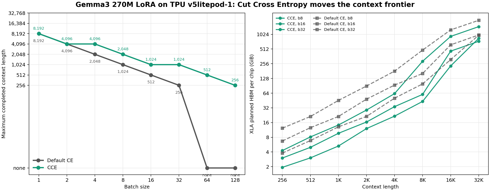
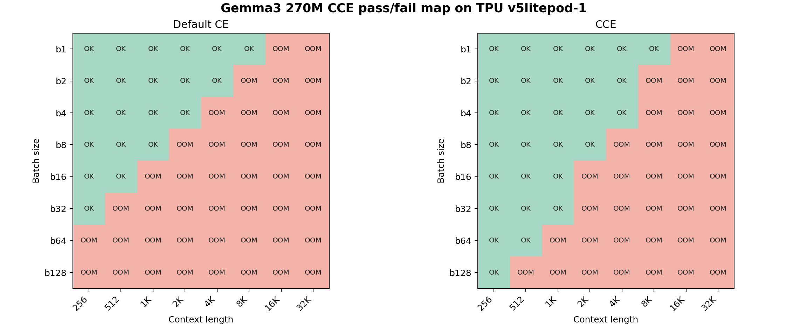
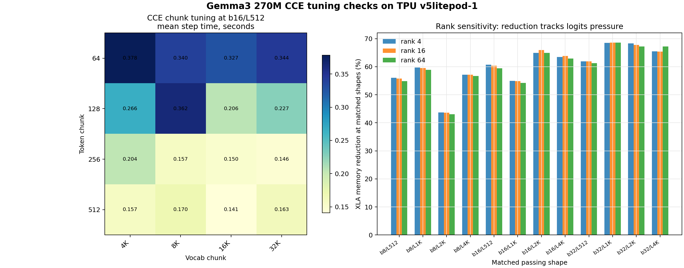
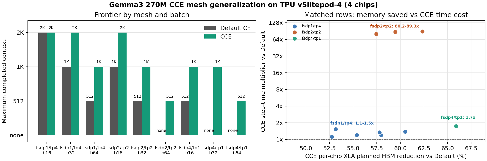
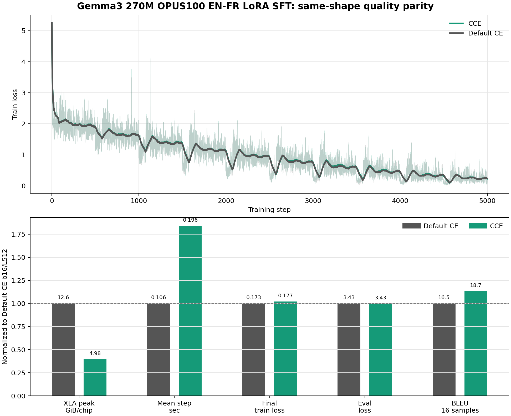

# Cut Cross Entropy on JAX/Tunix TPU: Gemma3 270M Full Rerun

This report rebuilds the CCE evidence chain around a single complete target:
Gemma3 270M LoRA SFT on Cloud TPU v5e. Larger-model rows can still be used as
transfer checks, but the main claim here is intentionally narrow and
reproducible: on Gemma3 270M, Cut Cross Entropy removes a real loss-logits
memory wall without materially changing the training result.

## Executive Summary

| Question | Result |
| --- | --- |
| Does CCE move the feasible batch/context frontier? | Yes. On `v5litepod-1`, b16 moved from L512 to L1024, b32 moved from L256 to L1024, and b64 moved from no Default CE fit to L512 with CCE. |
| Does it reduce memory at matched passing shapes? | Yes. Rank-sensitive matched rows show about 43-68% XLA planned HBM reduction. The OPUS100 b16/L512 run dropped from 12.57 GiB/chip to 4.98 GiB/chip. |
| Does real training still behave normally? | Yes. OPUS100 EN-FR b16/L512 LoRA SFT produced final train loss 0.1731 vs 0.1766 and eval loss 3.4292 vs 3.4251 for Default CE vs CCE. |
| What is the tradeoff? | Same-shape training is slower. In the 5,000-step b16/L512 run, mean step time rose from 0.106s to 0.196s. |
| Does it survive multi-chip mesh layouts? | Yes. A follow-up on `v5litepod-4` tested `fsdp=4,tp=1`, `fsdp=2,tp=2`, and `fsdp=1,tp=4`; matched passing rows showed 53-66% per-chip XLA planned HBM reduction. |
| What TPU was used? | The primary 270M rerun used Cloud TPU `v5litepod-1`, one chip, in `us-west4-a`. The mesh generalization check used `v5litepod-4`, four chips, in the same zone. |

The memory metric used throughout the new 270M plots is **max per-chip XLA
buffer-assignment planned HBM**. This is the number that decides whether a TPU
program fits on a chip. Runtime HBM snapshots are retained when the worker
reported them, but they are not the primary frontier axis.

## Why This Should Work

Default language-model cross entropy usually materializes a full logits tensor
with shape roughly:

```text
batch_size * context_length * vocabulary_size
```

That tensor grows directly with the two knobs we care about for SFT capacity:
batch and context length. CCE computes the same cross-entropy objective by
streaming over token/vocab chunks, avoiding the dense full-vocab logits tensor
in the loss path.

The Tunix integration is a drop-in patch for the LoRA training path. During
training, it intercepts the model output before the tied LM-head decode and
computes CCE against the frozen LM head. During generation, the original decode
path is restored before sampling. A regression test now guards that restore
path because generation must not see the hidden-state intercept.

## Experiment Scope

| Field | Value |
| --- | --- |
| Model | `google/gemma-3-270m-it` |
| Training mode | Tunix PEFT/LoRA |
| Main LoRA rank | 16 |
| TPU | Cloud TPU `v5litepod-1`, 1 chip |
| Zone | `us-west4-a` |
| Systems dataset | deterministic synthetic SFT records |
| Quality dataset | OPUS100 EN-FR |
| Compared variants | Default CE vs CCE |
| Other acceleration patches | disabled |
| Default CCE chunks | token chunk 128, vocab chunk 8192 unless swept |

The rerun produced 307 result rows: frontier sweeps, pressure points, rank
sensitivity, chunk tuning, one-step parity, and OPUS100 training runs.

## 1. Frontier: CCE Moves the Fit Boundary

The frontier sweep is deliberately synthetic. It is not intended to prove
translation quality. Its job is to isolate the `batch * context * vocab` memory
pressure and ask whether the same model, TPU, and LoRA configuration can run
when only the loss implementation changes.



The left panel is the practical result: maximum completed context length by
batch size. The right panel shows the underlying XLA planned HBM pressure for
representative batch sizes.

| Batch | Default CE max context | CCE max context | Gain |
| --- | ---: | ---: | ---: |
| 1 | 8,192 | 8,192 | 1.0x |
| 2 | 4,096 | 4,096 | 1.0x |
| 4 | 2,048 | 4,096 | 2.0x |
| 8 | 1,024 | 2,048 | 2.0x |
| 16 | 512 | 1,024 | 2.0x |
| 32 | 256 | 1,024 | 4.0x |
| 64 | none | 512 | CCE-only fit |
| 128 | none | 256 | CCE-only fit |

The important pattern is not that CCE makes every shape fit. It moves the wall.
For small batches, both variants can still be limited by other model or
activation buffers. As batch grows, the loss-logits tensor becomes the visible
wall, and CCE opens shapes that Default CE cannot compile.

The pass/fail map shows that the sweep did not stop at the first Default CE
failure. CCE was pushed until it reached its own boundary.



## 2. Pressure Points: Same Shape, Different Memory Wall

The pressure-point rows keep the sweep readable by focusing on a few
representative shapes.

| Shape | Default CE | Default XLA HBM | CCE | CCE XLA HBM |
| --- | --- | ---: | --- | ---: |
| b16/L512 | OK | 12.57 GiB/chip | OK | 4.98 GiB/chip |
| b16/L1024 | compile OOM | 21.36 GiB/chip | OK | 9.65 GiB/chip |
| b32/L512 | compile OOM | 21.32 GiB/chip | OK | 8.13 GiB/chip |
| b32/L1024 | compile OOM | 45.45 GiB/chip | OK | 14.26 GiB/chip |
| b64/L512 | compile OOM | 57.41 GiB/chip | OK | 14.13 GiB/chip |
| b64/L1024 | resource exhausted | 88.02 GiB/chip | compile OOM | 25.16 GiB/chip |

This is the cleanest systems result: CCE turns multiple Default CE OOM rows into
completed TPU train steps, and the remaining CCE failures occur at much higher
pressure points.

## 3. Rank and Chunk Checks

CCE should mostly track `batch * context * vocab`, not LoRA rank. The rank sweep
used ranks 4, 16, and 64 across b8/b16/b32/b64 and L512/L1024/L2048/L4096.
The frontier pattern was unchanged across ranks: for example, b16 moved from
L512 to L1024 and b32 moved from no Default CE fit at L512 to CCE fitting
through L1024.

The chunk sweep asks a different question: once CCE is enabled, which token/vocab
chunk sizes are faster at a fixed shape? On b16/L512, all tested chunk pairs
used roughly the same XLA planned HBM, but step time varied.



The best b16/L512 chunk rows were:

| Token chunk | Vocab chunk | Mean step time | Valid tokens/sec | XLA HBM |
| ---: | ---: | ---: | ---: | ---: |
| 512 | 16K | 0.141s | 12,588 | 4.98 GiB/chip |
| 256 | 32K | 0.146s | 12,134 | 4.98 GiB/chip |
| 256 | 16K | 0.150s | 11,868 | 4.98 GiB/chip |
| 512 | 4K | 0.157s | 11,312 | 4.98 GiB/chip |

The default package knobs remain conservative (`128`, `8192`) because they are
stable across shapes. The sweep suggests that larger token chunks may be faster
for this particular 270M b16/L512 case, but chunk tuning should be shape-aware.

## 4. Multi-Chip Mesh Generalization

The main rerun is intentionally single-chip so that the memory story is easy to
read. We then checked whether the patch still works when Tunix/JAX shards the
same Gemma3 270M LoRA job over four TPU chips.

| Field | Value |
| --- | --- |
| TPU | Cloud TPU `v5litepod-4`, 4 chips |
| Zone | `us-west4-a` |
| Meshes | `fsdp=4,tp=1`, `fsdp=2,tp=2`, `fsdp=1,tp=4` |
| Grid | batches 16/32/64, contexts 512/1024/2048 |
| Steps | 3 timed synthetic SFT steps for passing rows |
| Other acceleration patches | disabled |



The result is not a single-chip artifact. CCE worked in the FSDP-only,
mixed-FSDP/TP, and TP-only layouts. At shapes where both variants completed,
CCE reduced max per-chip XLA planned HBM by 53-66%.

The frontier also moved in each mesh:

| Mesh | Batch | Default CE max context | CCE max context |
| --- | ---: | ---: | ---: |
| `fsdp=4,tp=1` | 16 | 512 | 1024 |
| `fsdp=4,tp=1` | 32 | none | 1024 |
| `fsdp=4,tp=1` | 64 | none | 512 |
| `fsdp=2,tp=2` | 16 | 1024 | 2048 |
| `fsdp=2,tp=2` | 64 | none | 512 |
| `fsdp=1,tp=4` | 32 | 1024 | 2048 |
| `fsdp=1,tp=4` | 64 | 512 | 1024 |

The tradeoff is mesh-dependent, and the right panel separates CCE overhead from
the base mesh cost by using matched rows where both variants completed. In the
FSDP-only layout, CCE was about 1.7x slower at the matched b16/L512 shape. In
the TP-only layout, CCE added a smaller 1.1-1.5x step-time multiplier across the
matched rows, although the base TP layout itself was already slow for this small
model. The mixed `fsdp=2,tp=2` layout is the outlier: matched CCE rows were
about 80-89x slower than Default CE. That points to a poor interaction between
the current CCE lowering and this particular sharding layout, not just to the
generic cost of streaming cross entropy.

The clean interpretation is therefore: CCE is compatible with FSDP/TP sharding
and still reduces per-chip memory, but mesh choice can dominate throughput. For
Gemma3 270M, TP is useful as a compatibility stress test, not as the fastest
training layout; `fsdp=2,tp=2` should be treated as an optimization target
rather than a recommended configuration.

## 5. Real EN-FR Training Parity

The systems sweeps prove memory behavior, not usefulness. For a training sanity
check, we ran OPUS100 EN-FR LoRA SFT.

Same-shape A/B:

| Field | Default CE | CCE |
| --- | ---: | ---: |
| Batch / max length | b16 / L512 | b16 / L512 |
| Steps | 5,000 | 5,000 |
| LoRA rank | 16 | 16 |
| Learning rate | 2e-4 | 2e-4 |
| Final train loss | 0.1731 | 0.1766 |
| Eval loss | 3.4292 | 3.4251 |
| BLEU sanity metric | 16.54 | 18.72 |
| chrF sanity metric | 41.22 | 40.34 |
| XLA planned HBM | 12.57 GiB/chip | 4.98 GiB/chip |
| Mean step time | 0.106s | 0.196s |
| Wall time | 10.0 min | 18.2 min |



The loss curves follow the same trajectory. The normalized metric panel shows
the tradeoff clearly: much lower planned HBM, similar train/eval loss, and
slower same-shape steps.

BLEU and chrF here are deliberately labeled as sanity metrics. They use 16
evaluation examples, so they are useful for catching obvious generation
breakage, not for making a translation-quality claim.

We also ran a CCE capacity row: b64/L512 for 1,250 steps, matching the rough
token budget of b16/L512 for 5,000 steps. It fit at 14.13 GiB/chip and finished
in 19.2 minutes. That row did not create a speed win in this setup; it mainly
shows that CCE can spend the saved memory on a much larger batch.

## 6. Generation Samples

The restored generation path produced normal text for both variants. The
outputs below are not polished translation results; the point is that CCE and
Default CE are in the same qualitative band after the same training recipe.

| EN source | Reference | Default CE | CCE |
| --- | --- | --- | --- |
| They met without me. | Ils se sont rencontrés sans moi. | - Ils ne sont pas venus pour moi. | Ils ne sont pas venus sans que je ne soit en aware. |
| Pay cash week . | J'ai payé en liquide pour la semaine. | Pay week . | Paye de la semaine. |
| The certifrcate can be printed in one or more of the languages of the Convention andshould be completed in one of these languages. | Le certificat peut être imprimé dans une ou plusieurs langues de la convention et doit être complété dans l'une de ces langues. | La certificat peut être imprimé dans un des langues de la Convention et complété dans une des langue | La certificatabilité peut être imprimée dans une ou des langues de la Convention et peut être compli |
| The other issue, which is of enormous significance, is the right to the veto. | L'autre question, d'une portée énorme, est le droit de veto. | L'autre aspect important du droit à veto, qui est de grande importance, est le droit à l'apanche. | Encore heureux, on questionne aussi le droit à la proposition, à cette aussi, du autre facteur qui rend cette session si importante : l'énoncé de fait du veto. |
| Therefore, let me summarize, at least from the vantage point of one Finance Minister. | Par conséquent, permettez-moi d'en résumer la teneur, à tout le moins en tant que ministre des finances. | Par conséquent, je veux vous rappeler, d'un point de vue financier. | Par conséquent, je veux te rappeler au moins l'angle de l'examinateur. |

The complete 32-row side-by-side sample file is retained as
`01-CCE/data/gemma3_270m_full_cce/generation_samples.jsonl`.

## 7. Interpretation

CCE is a strong memory lever when the loss logits are a dominant tensor. That is
why the effect becomes clearer as batch and context grow. It is not a universal
memory solution: after CCE removes the dense logits tensor, the next wall can be
activations, attention, model state, sharding layout, or compile-time buffer
planning.

The tradeoff is also real. CCE streams reductions instead of doing one dense
logits computation, so same-shape step time can increase. On the 270M b16/L512
quality run, the slowdown was about 1.85x. The value of CCE is therefore not
"always faster." The value is "more trainable shapes before OOM," and sometimes
that extra capacity may be worth the slower step.

The mesh check adds one more caveat: memory savings transfer across FSDP/TP
layouts, but throughput does not transfer automatically. TP-heavy layouts can
make a small model communication-bound, so the right comparison is always
same-model, same-mesh, Default CE versus CCE.

## 8. Reproducibility Artifacts

Compact data retained from this rerun:

- `01-CCE/data/gemma3_270m_full_cce/run_manifest.csv`
- `01-CCE/data/gemma3_270m_full_cce/all_runs.csv`
- `01-CCE/data/gemma3_270m_full_cce/frontier_runs.csv`
- `01-CCE/data/gemma3_270m_full_cce/frontier_summary.csv`
- `01-CCE/data/gemma3_270m_full_cce/pressure_points.csv`
- `01-CCE/data/gemma3_270m_full_cce/rank_sensitivity.csv`
- `01-CCE/data/gemma3_270m_full_cce/rank_frontier_summary.csv`
- `01-CCE/data/gemma3_270m_full_cce/chunk_tuning.csv`
- `01-CCE/data/gemma3_270m_full_cce/training_history.csv`
- `01-CCE/data/gemma3_270m_full_cce/training_summary.csv`
- `01-CCE/data/gemma3_270m_full_cce/generation_metrics.csv`
- `01-CCE/data/gemma3_270m_full_cce/generation_samples.jsonl`
- `01-CCE/data/gemma3_270m_full_cce/profile_summary.csv`
- `01-CCE/data/gemma3_270m_full_cce/oom_events.csv`
- `01-CCE/data/gemma3_270m_mesh_cce/run_manifest.csv`
- `01-CCE/data/gemma3_270m_mesh_cce/mesh_runs.csv`
- `01-CCE/data/gemma3_270m_mesh_cce/mesh_summary.csv`
- `01-CCE/data/gemma3_270m_mesh_cce/matched_memory.csv`

Compressed raw worker artifacts are retained under
`01-CCE/data/gemma3_270m_full_cce/raw_artifacts/` and
`01-CCE/data/gemma3_270m_mesh_cce/raw_artifacts/`. The extracted `raw/`
directories are reproducible from those tarballs and should not be committed.
