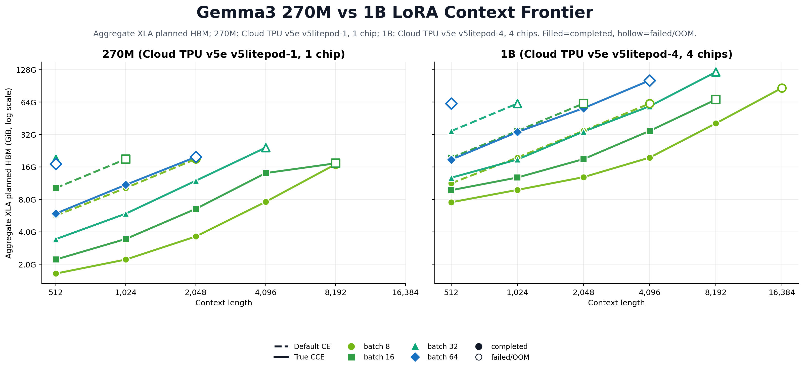
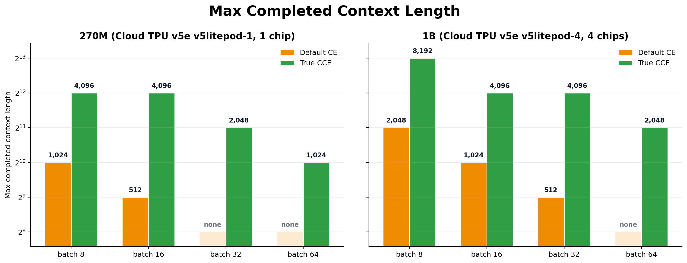
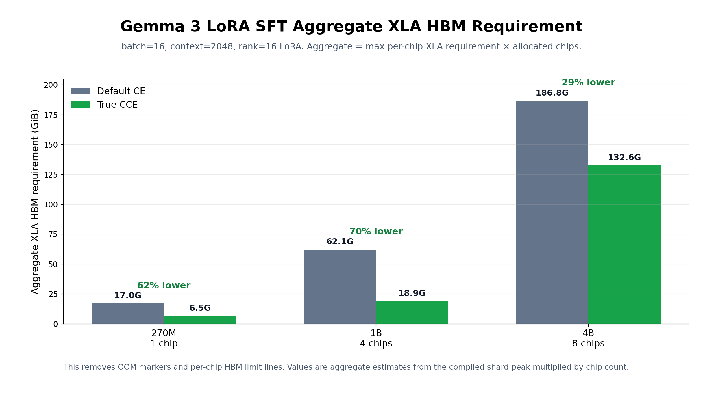
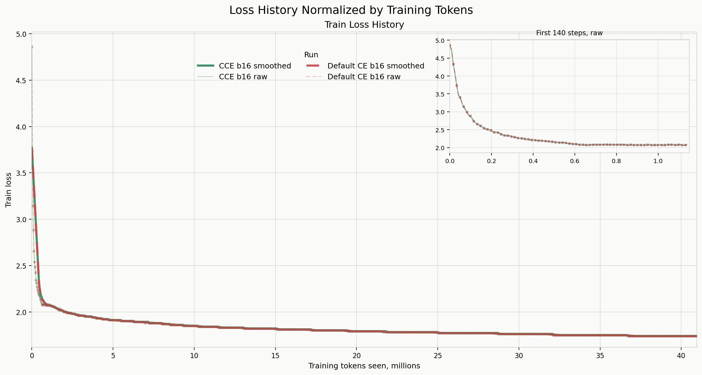
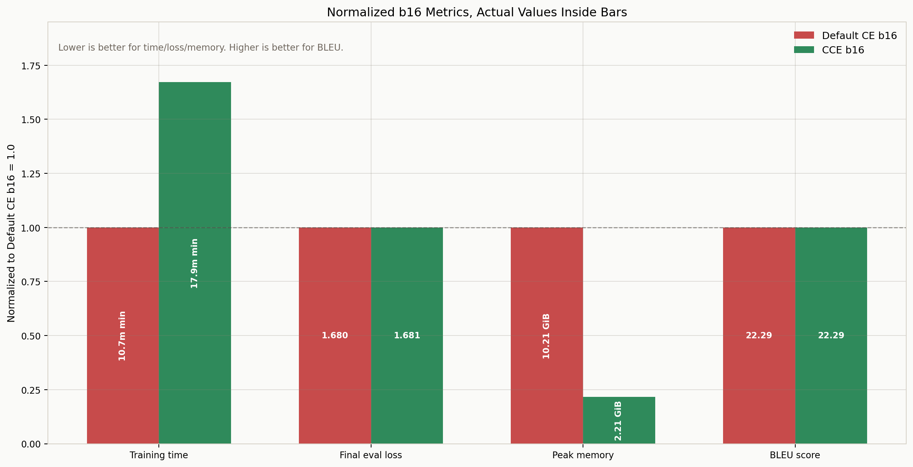

# JAX/Tunix + TPU CCE Technical Report

This report consolidates the CCE experiments we ran on JAX/Tunix + Cloud TPU. The question was simple: if we replace dense full-vocab cross entropy with chunked linear cross entropy, can we recover the kind of memory benefit Unsloth reports, while keeping loss and generation quality intact?

## Executive Summary

| Metric | Result |
| --- | --- |
| EN-FR b16 train-step XLA peak memory reduction | 78.3% |
| BLEU delta, CCE b16 vs Default b16 | -0.01 |
| Eval loss delta, CCE b16 vs Default b16 | +0.0005 |
| Same-batch profiled step-time cost | 1.73x |

The short version: CCE avoids materializing the full `[tokens, vocab]` logits tensor during the loss computation. That directly attacks the tensor that grows with batch size, context length, and vocabulary size. In our Gemma3/Tunix TPU runs, this expanded the trainable context frontier and reduced XLA planned HBM sharply. In the real OPUS100 EN-FR training run, CCE preserved eval loss and BLEU almost exactly, but it was slower at the same batch size.

## 1. The Target: the Loss Logits Tensor

The default CE path computes the full language-model logits by multiplying hidden states by the LM head, then applies softmax cross entropy over the vocabulary. For a training batch, that intermediate tensor is roughly:

```text
batch_size * context_length * vocab_size
```

CCE keeps the same objective, but computes the needed log-sum-exp and target-token logit in token/vocab chunks instead of materializing the full logits matrix. In these experiments, the Tunix/Gemma3 training path was patched so the train-step loss used chunked CE while generation still used the normal decode path.

As a sanity check, the early microbenchmark found that dense CE failed at the b16, seq_len 2048, Gemma3-270M-like shape, while chunked CE ran:

| Kernel | Status | Key tensor estimate | Compile + first run | Interpretation |
| --- | --- | --- | --- | --- |
| naive_ce | FAILED | 32,752 MB | OOM | full vocab logits materialization |
| chunked_ce | OK | 320 MB | 0.559 s | chunked vocab/tokens |

The small parity test produced dense CE loss 8.70297, CCE loss 8.70004, absolute loss difference 0.00293, and hidden-gradient max absolute difference 0.00261. That is not a full numerical proof, but it was enough to move from microbenchmarks to Gemma/Tunix training.

## 2. First Result: Context Length Becomes the Clearest Memory Story

The context sweep used synthetic SFT input. That is deliberate: this stage is not a language-quality benchmark. It isolates the memory pressure created by `batch * context * vocab` and asks whether the same model and TPU can compile and run when only the loss implementation changes.

The memory metric below is not a live TPU profiler allocation sample. It is XLA buffer-assignment planned HBM. For multi-chip runs, aggregate HBM means:

```text
aggregate_xla_hbm_gib = max_per_chip_xla_peak_gib * allocated_chip_count
```

It is a chip-count-normalized reporting value, not one contiguous memory pool.



*Context length turns the logits tensor into the memory wall.*

The frontier view makes the user-visible result easier to read. CCE did not merely reduce a number in a memory report. It moved the maximum completed context length.



*The practical outcome is a larger trainable context frontier.*

The same result as a table:

| Model | Batch | Default CE max context | CCE max context | Gain |
| --- | --- | --- | --- | --- |
| 270M | 8 | 1,024 | 4,096 | 4.0x |
| 270M | 16 | 512 | 4,096 | 8.0x |
| 270M | 32 | none | 2,048 | default none |
| 270M | 64 | none | 1,024 | default none |
| 1B | 8 | 2,048 | 8,192 | 4.0x |
| 1B | 16 | 1,024 | 4,096 | 4.0x |
| 1B | 32 | 512 | 4,096 | 8.0x |
| 1B | 64 | none | 2,048 | default none |

The two headline rows are:

- Gemma3 270M, batch 16: Default CE completed context 512; CCE completed context 4,096.
- Gemma3 1B, batch 16: Default CE completed context 1,024; CCE completed context 4,096.

## 3. Second Result: the b16/L2048 Pressure Point Generalizes Across Model Sizes

After the context sweep, we fixed batch size 16 and context length 2048 and compared Gemma3 model sizes. This is a harsher setting than the final EN-FR quality run, and it is useful because it exposes the OOM frontier directly.



*The same b16/L2048 pressure point across Gemma3 model sizes.*

The table below is the same story numerically. The 4B case is important because CCE still reduces planned HBM, but not enough to make this specific v5e-8 configuration succeed. That is a good guardrail: CCE helps, but it does not erase every other memory source in the model.

| Model | Chips | Default aggregate HBM | CCE aggregate HBM | Reduction | Default status | CCE status |
| --- | --- | --- | --- | --- | --- | --- |
| 270M | 1 | 17.0 GiB | 6.5 GiB | 62% lower | OOM | OK |
| 1B | 4 | 62.1 GiB | 18.9 GiB | 70% lower | OOM | OK |
| 4B | 8 | 186.8 GiB | 132.6 GiB | 29% lower | OOM | OOM |

## 4. Third Result: Real EN-FR Training Keeps Quality at the Same Batch Size

The synthetic sweeps show memory behavior, but they do not prove the training path is useful. For that, we ran Gemma3 270M LoRA SFT on OPUS100 EN-FR for 5,000 steps.

The comparison below is deliberately apples-to-apples: batch 16, max length 512, LoRA rank 16, learning rate 2e-4, Cloud TPU v5e `v5litepod-1`, one chip, same token budget.

| Run | TPU | Batch | Max length | Steps | Rank | LR | Eval loss | XLA peak | Step avg | Wall time | BLEU | chrF |
| --- | --- | --- | --- | --- | --- | --- | --- | --- | --- | --- | --- | --- |
| Default CE b16 | v5litepod-1 x 1 | 16 | 512 | 5000 | 16 | 0.0002 | 1.680 | 10.21 GiB | 0.092 s | 10.7 min | 22.29 | 50.75 |
| CCE b16 | v5litepod-1 x 1 | 16 | 512 | 5000 | 16 | 0.0002 | 1.681 | 2.21 GiB | 0.160 s | 17.9 min | 22.29 | 50.27 |

The loss curves overlap closely. The raw tqdm loss is also shown in the plot; after the first few steps, the recorded raw loss is already very smooth because the log values are rounded and the two runs follow almost the same trajectory.



*Real EN-FR training preserves the loss trajectory.*

The normalized metric chart compresses the result into one view: memory drops sharply, eval loss and BLEU stay essentially unchanged, and same-batch training gets slower.



*The real-training tradeoff: much lower memory, same quality, slower steps.*

Generation metrics after restoring the normal decode path:

| Run | Restored step | Eval examples | BLEU | chrF |
| --- | --- | --- | --- | --- |
| default_b16 | 5000 | 16 | 22.294 | 50.752 |
| cce_b16 | 5000 | 16 | 22.289 | 50.270 |

Important caveat: BLEU/chrF here uses only 16 evaluation examples. Treat it as a parity check that the loss replacement did not break generation quality, not as a full translation benchmark.

## 5. Translation Samples

Below are examples from the final fixed evaluation. In many cases, Default CE b16 and CCE b16 produce identical or near-identical translations. When they are wrong, they tend to be wrong in similar ways, which is exactly what we would expect if the loss implementation changed memory behavior without changing the learned task qualitatively.

### Sample 1

- EN source: They met without me.
- FR reference: Ils se sont rencontrés sans moi.
- Default CE b16: Ils se sont rencontrés sans moi.
- CCE b16: Ils se sont rencontrés sans moi.

### Sample 2

- EN source: The minister Villedrouin, stressed in his speech on Haiti's image outside and the political positioning of Haiti as a tourist destination.
- FR reference: La Ministre Villedrouin, a insisté, dans son intervention, sur l’image d’Haïti à l’extérieur et sur la politique de positionnement d’Haïti comme destination touristique.
- Default CE b16: Le ministre Villedrouin, en son discours sur l'image de Haïti à l'extérieur et le positionnement politique de Haïti comme destination touristique, souligne.
- CCE b16: Le ministre Villedrouin, en son discours sur l'image de Haïti à l'extérieur et le positionnement politique de Haïti comme destination touristique, souligne.

### Sample 3

- EN source: Pay cash week .
- FR reference: J'ai payé en liquide pour la semaine.
- Default CE b16: Paye de la semaine de la fête .
- CCE b16: Paye de la semaine de la fin de l'année .

### Sample 4

- EN source: The certifrcate can be printed in one or more of the languages of the Convention andshould be completed in one of these languages.
- FR reference: Le certificat peut être imprimé dans une ou plusieurs langues de la convention et doit être complété dans l'une de ces langues.
- Default CE b16: Le certificat peut être imprimé dans un ou plusieurs des langages de la Convention et doit être terminé dans un des langages.
- CCE b16: Le certifcate peut être imprimé dans un ou plusieurs des langues de la Convention et doit être terminé dans un de ces langues.

### Sample 5

- EN source: The other issue, which is of enormous significance, is the right to the veto.
- FR reference: L'autre question, d'une portée énorme, est le droit de veto.
- Default CE b16: L'autre question, qui est de grande importance, est le droit de veto.
- CCE b16: L'autre question, qui est de grande importance, est le droit de veto.

### Sample 6

- EN source: What, the surrogacy?
- FR reference: Quoi, la mère porteuse ?
- Default CE b16: Quoi, le surrogat ?
- CCE b16: Quoi, le surrogat ?

### Sample 7

- EN source: Therefore, let me summarize, at least from the vantage point of one Finance Minister.
- FR reference: Par conséquent, permettez-moi d'en résumer la teneur, à tout le moins en tant que ministre des finances.
- Default CE b16: Donc, je vous ai résumé, au moins du point de vue d'un Ministre de la Finance.
- CCE b16: Donc, je vous ai résumé, au moins du point de vue d'un ministre de la Finance.

### Sample 8

- EN source: We recommend the use of Stop if Bid orders only to buy Forex positions. The use of Stop if Bid to sell Forex positions can result in positions being prematurely closed if a market event causes the Bid/Ask spread to temporarily widen.
- FR reference: Nous recommandons l'utilisation des ordres Stop si Demandé uniquement lors de l'achat de positions sur Devises. L'utilisation des ordres Stop si Demandé lors de la vente de positions sur Devises pourrait engendrer la fermeture prématurée de positions si un événement sur le marché entraîne un élargissement de l'écart entre l'Offre et la Demande pour une courte période.
- Default CE b16: Nous recommandons l'utilisation de Stop si les ordres de vente ne sont pas utilisés pour acheter des positions Forex. L'utilisation de Stop si les ordres de vente ne sont pas utilisés pour vendre des positions Forex peuvent entraîner une clôture précoce si un événement de marché provoque un effet de la hausse du prix
- CCE b16: Nous recommandons l'utilisation de Stop si les ordres de vente ne sont pas négociés pour acheter des positions Forex. L'utilisation de Stop si les ordres de vente ne sont pas négociés pour acheter des positions Forex peuvent entraîner un effet précoce si un événement de marché provoque un effet de la hausse du

## 6. Interpretation

- CCE directly targets the full vocab logits/CE intermediate. That is why its benefit grows with context length and batch size.
- The clearest product-style story is context frontier, not raw percentage savings. On the validated b16 rows, 270M moved from context 512 to 4,096, and 1B moved from 1,024 to 4,096.
- In real OPUS100 EN-FR training, Default CE and CCE reached almost the same eval loss and BLEU: 1.6804 vs 1.6809 eval loss, and 22.294 vs 22.289 BLEU.
- The tradeoff is compute time. At the same batch size, CCE increased profiled step time from 0.092s to 0.160s.
- The practical value is not that CCE is automatically faster at the same batch. The value is that it can make otherwise impossible batch/context/model combinations trainable.

## 7. Source Artifacts

- `01-CCE/data/kernel_matrix.csv`
- `01-CCE/data/gemma3_270m_1b_context_frontier.csv`
- `01-CCE/data/gemma3_270m_1b_context_summary.csv`
- `01-CCE/data/gemma3_b16_aggregate_hbm.csv`
- `01-CCE/data/quality_training_summary.csv`
- `01-CCE/data/quality_summary.csv`
- `01-CCE/data/side_by_side.jsonl`
