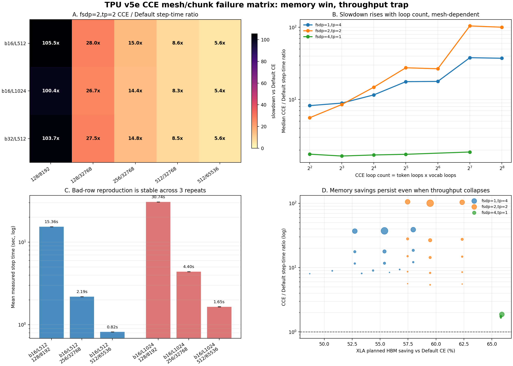

# TPU v5e CCE Full Matrix Report

Generated from the completed TPU v5e run artifacts in `/tmp/v5e-cce-full-local/combined`.
The experiment ran on two `v5litepod-4` instances because the project/zone quota allowed 8 v5e chips total.
Each instance used 4 TPU devices with JAX `0.10.1` and `google-tunix 0.1.7`.



## Executive Summary

The full run supports the working hypothesis:

> CCE memory benefit is mostly governed by loss-logits dominance, while CCE throughput failure is governed by the interaction between chunk-loop granularity and FSDP/TP mesh layout.

Main findings:

- CCE consistently reduced XLA planned HBM versus Default CE on comparable shapes.
- Throughput failure was not explained by HBM alone: the worst and recovered chunk settings often had identical planned HBM.
- `fsdp=2,tp=2` was the sharp failure mode. With `128/8192`, CCE was about `100x` slower than Default CE for the tested mixed-mesh shapes.
- Increasing chunk size recovered performance without increasing planned HBM in the bad-row reproduction cases.
- The slowdown was stable across repeats: `fsdp=2,tp=2`, `b16/L512`, `128/8192` was `15.360s` in all three repeats to within ~0.0001s.

## Run Inventory

| preset   | rows |
| -------- | ---- |
| core     | 54   |
| bad-row  | 18   |
| profiler | 4    |

| status  | rows |
| ------- | ---- |
| success | 74   |
| failure | 2    |

Failures were recorded rather than dropped:

| preset | experiment_id | mesh_configuration | shape     | chunk_configuration | failure_type | xla_planned_hbm_gib_per_chip |
| ------ | ------------- | ------------------ | --------- | ------------------- | ------------ | ---------------------------- |
| core   | 6             | fsdp=4,tp=1        | b16/L1024 | default_ce          | compile_oom  | 21.060                       |
| core   | 12            | fsdp=4,tp=1        | b32/L512  | default_ce          | compile_oom  | 21.060                       |

## Core Matrix: Worst Slowdowns

| mesh_configuration | shape     | chunk_configuration | cce_loop_count | steady_state_mean_step_time_sec | default_step_time_sec | cce_to_default_step_time_ratio | xla_planned_hbm_gib_per_chip | default_xla_hbm_gib | xla_hbm_saving_pct |
| ------------------ | --------- | ------------------- | -------------- | ------------------------------- | --------------------- | ------------------------------ | ---------------------------- | ------------------- | ------------------ |
| fsdp=2,tp=2        | b16/L512  | 128/8192            | 128            | 15.360                          | 0.146                 | 105.5                          | 2.65                         | 6.23                | 57.5               |
| fsdp=2,tp=2        | b32/L512  | 128/8192            | 128            | 30.726                          | 0.296                 | 103.7                          | 4.56                         | 12.11               | 62.3               |
| fsdp=2,tp=2        | b16/L1024 | 128/8192            | 256            | 30.738                          | 0.306                 | 100.4                          | 5.13                         | 12.66               | 59.5               |
| fsdp=1,tp=4        | b32/L512  | 128/8192            | 128            | 3.919                           | 0.101                 | 38.9                           | 2.77                         | 6.59                | 58.0               |
| fsdp=1,tp=4        | b16/L1024 | 128/8192            | 256            | 3.915                           | 0.105                 | 37.3                           | 3.06                         | 6.86                | 55.4               |
| fsdp=1,tp=4        | b16/L512  | 128/8192            | 128            | 1.962                           | 0.053                 | 37.0                           | 1.64                         | 3.47                | 52.7               |
| fsdp=2,tp=2        | b16/L512  | 128/32768           | 32             | 4.074                           | 0.146                 | 28.0                           | 2.65                         | 6.23                | 57.5               |
| fsdp=2,tp=2        | b32/L512  | 128/32768           | 32             | 8.154                           | 0.296                 | 27.5                           | 4.56                         | 12.11               | 62.3               |
| fsdp=2,tp=2        | b16/L1024 | 128/32768           | 64             | 8.164                           | 0.306                 | 26.7                           | 5.13                         | 12.66               | 59.5               |
| fsdp=1,tp=4        | b32/L512  | 128/32768           | 32             | 1.869                           | 0.101                 | 18.6                           | 2.77                         | 6.59                | 58.0               |
| fsdp=1,tp=4        | b16/L1024 | 128/32768           | 64             | 1.871                           | 0.105                 | 17.8                           | 3.06                         | 6.86                | 55.4               |
| fsdp=1,tp=4        | b16/L512  | 128/32768           | 32             | 0.937                           | 0.053                 | 17.7                           | 1.64                         | 3.47                | 52.7               |

## Fastest CCE Configuration Per Mesh/Shape

| mesh_configuration | shape     | chunk_configuration | cce_loop_count | steady_state_mean_step_time_sec | default_step_time_sec | cce_to_default_step_time_ratio | xla_planned_hbm_gib_per_chip | default_xla_hbm_gib | xla_hbm_saving_pct |
| ------------------ | --------- | ------------------- | -------------- | ------------------------------- | --------------------- | ------------------------------ | ---------------------------- | ------------------- | ------------------ |
| fsdp=1,tp=4        | b16/L1024 | 512/65536           | 8              | 0.852                           | 0.105                 | 8.1                            | 3.20                         | 6.86                | 53.4               |
| fsdp=1,tp=4        | b16/L512  | 512/65536           | 4              | 0.426                           | 0.053                 | 8.0                            | 1.78                         | 3.47                | 48.7               |
| fsdp=1,tp=4        | b32/L512  | 512/65536           | 4              | 0.848                           | 0.101                 | 8.4                            | 2.91                         | 6.59                | 55.8               |
| fsdp=2,tp=2        | b16/L1024 | 512/65536           | 8              | 1.653                           | 0.306                 | 5.4                            | 5.13                         | 12.66               | 59.5               |
| fsdp=2,tp=2        | b16/L512  | 512/65536           | 4              | 0.819                           | 0.146                 | 5.6                            | 2.65                         | 6.23                | 57.5               |
| fsdp=2,tp=2        | b32/L512  | 512/65536           | 4              | 1.645                           | 0.296                 | 5.6                            | 4.56                         | 12.11               | 62.3               |
| fsdp=4,tp=1        | b16/L512  | 512/32768           | 8              | 0.333                           | 0.202                 | 1.6                            | 3.86                         | 11.29               | 65.8               |

Note: `fsdp=4,tp=1` only has matched Default rows for `b16/L512`; the larger Default CE rows compile-OOMed.

## Bad-Row Reproduction

| shape     | chunk_configuration | repeats | successes | mean_step_time_sec | std_step_time_sec | mean_xla_hbm_gib |
| --------- | ------------------- | ------- | --------- | ------------------ | ----------------- | ---------------- |
| b16/L1024 | 128/8192            | 3       | 3         | 30.738             | 0.000151          | 5.13             |
| b16/L1024 | 256/32768           | 3       | 3         | 4.396              | 0.000281          | 5.13             |
| b16/L1024 | 512/65536           | 3       | 3         | 1.653              | 0.000231          | 5.13             |
| b16/L512  | 128/8192            | 3       | 3         | 15.360             | 0.000065          | 2.65             |
| b16/L512  | 256/32768           | 3       | 3         | 2.192              | 0.000086          | 2.65             |
| b16/L512  | 512/65536           | 3       | 3         | 0.820              | 0.000012          | 2.65             |

The bad-row preset confirms the slowdown is stable, not a one-off compile/runtime anomaly:

- `b16/L512`, `128/8192`: mean `15.360s`, std `0.000065s`
- `b16/L512`, `512/65536`: mean `0.820s`, std `0.000012s`
- `b16/L1024`, `128/8192`: mean `30.738s`, std `0.000151s`
- `b16/L1024`, `512/65536`: mean `1.653s`, std `0.000231s`

## Recovery Report

Top recovery cases from the core matrix:

| mesh_configuration | shape     | slow_chunk | fast_chunk | slow_cce_loop_count | fast_cce_loop_count | slow_step_time_sec | fast_step_time_sec | recovery_x | slow_xla_hbm_gib | fast_xla_hbm_gib | hbm_increase_pct |
| ------------------ | --------- | ---------- | ---------- | ------------------- | ------------------- | ------------------ | ------------------ | ---------- | ---------------- | ---------------- | ---------------- |
| fsdp=2,tp=2        | b16/L512  | 128/8192   | 512/65536  | 128                 | 4                   | 15.360             | 0.819              | 18.8       | 2.65             | 2.65             | 0.0              |
| fsdp=2,tp=2        | b32/L512  | 128/8192   | 512/65536  | 128                 | 4                   | 30.726             | 1.645              | 18.7       | 4.56             | 4.56             | 0.0              |
| fsdp=2,tp=2        | b16/L1024 | 128/8192   | 512/65536  | 256                 | 8                   | 30.738             | 1.653              | 18.6       | 5.13             | 5.13             | 0.0              |
| fsdp=2,tp=2        | b16/L512  | 128/8192   | 512/32768  | 128                 | 8                   | 15.360             | 1.259              | 12.2       | 2.65             | 2.65             | 0.0              |
| fsdp=2,tp=2        | b32/L512  | 128/8192   | 512/32768  | 128                 | 8                   | 30.726             | 2.522              | 12.2       | 4.56             | 4.56             | 0.0              |
| fsdp=2,tp=2        | b16/L1024 | 128/8192   | 512/32768  | 256                 | 16                  | 30.738             | 2.532              | 12.1       | 5.13             | 5.13             | 0.0              |
| fsdp=2,tp=2        | b16/L512  | 128/8192   | 256/32768  | 128                 | 16                  | 15.360             | 2.192              | 7.0        | 2.65             | 2.65             | 0.0              |
| fsdp=2,tp=2        | b32/L512  | 128/8192   | 256/32768  | 128                 | 16                  | 30.726             | 4.389              | 7.0        | 4.56             | 4.56             | 0.0              |
| fsdp=2,tp=2        | b16/L1024 | 128/8192   | 256/32768  | 256                 | 32                  | 30.738             | 4.397              | 7.0        | 5.13             | 5.13             | 0.0              |
| fsdp=2,tp=2        | b16/L512  | 128/32768  | 512/65536  | 32                  | 4                   | 4.074              | 0.819              | 5.0        | 2.65             | 2.65             | 0.0              |
| fsdp=2,tp=2        | b32/L512  | 128/32768  | 512/65536  | 32                  | 4                   | 8.154              | 1.645              | 5.0        | 4.56             | 4.56             | 0.0              |
| fsdp=2,tp=2        | b16/L1024 | 128/32768  | 512/65536  | 64                  | 8                   | 8.164              | 1.653              | 4.9        | 5.13             | 5.13             | 0.0              |

The strongest recovery case is `fsdp=2,tp=2`, `b16/L512`, changing `128/8192` to `512/65536`: `18.8x` faster with no planned-HBM increase.

## Mesh-Level Hypothesis Summary

| mesh_configuration | median_cce_to_default_ratio | p95_cce_to_default_ratio | median_xla_hbm_saving_pct | rows |
| ------------------ | --------------------------- | ------------------------ | ------------------------- | ---- |
| fsdp=1,tp=4        | 11.7                        | 37.8                     | 55.4                      | 15   |
| fsdp=2,tp=2        | 14.8                        | 104.2                    | 59.5                      | 15   |
| fsdp=4,tp=1        | 1.7                         | 1.8                      | 65.8                      | 5    |

Interpretation:

- `fsdp=4,tp=1`: CCE is modestly slower on matched rows, while saving substantial HBM.
- `fsdp=2,tp=2`: CCE has the most severe throughput cliff, especially at high loop counts.
- `fsdp=1,tp=4`: CCE also slows down at small chunks, but less catastrophically than mixed FSDP/TP.

## Profiler Cases

| experiment_id | mesh_configuration | shape    | chunk_configuration | status  | steady_state_mean_step_time_sec | xla_planned_hbm_gib_per_chip | profiler_path                                                                   |
| ------------- | ------------------ | -------- | ------------------- | ------- | ------------------------------- | ---------------------------- | ------------------------------------------------------------------------------- |
| 0             | fsdp=2,tp=2        | b16/L512 | 128/8192            | success | 15.363                          | 2.65                         | /tmp/v5e-cce-full/profiler/profiler/exp0000_fsdp2_tp2_b16_l512_tc128_vc8192_r0  |
| 1             | fsdp=2,tp=2        | b16/L512 | 512/65536           | success | 0.822                           | 2.65                         | /tmp/v5e-cce-full/profiler/profiler/exp0001_fsdp2_tp2_b16_l512_tc512_vc65536_r0 |
| 2             | fsdp=4,tp=1        | b16/L512 | 128/8192            | success | 0.382                           | 3.85                         | /tmp/v5e-cce-full/profiler/profiler/exp0002_fsdp4_tp1_b16_l512_tc128_vc8192_r0  |
| 3             | fsdp=1,tp=4        | b16/L512 | 128/8192            | success | 1.965                           | 1.64                         | /tmp/v5e-cce-full/profiler/profiler/exp0003_fsdp1_tp4_b16_l512_tc128_vc8192_r0  |

Profiler trace directories were copied to:

```text
/tmp/v5e-cce-full-local/combined/profiler/traces
```

## Retained Local Artifacts

Compact CSVs copied into this repository:

```text
01-CCE/data/v5e_cce_full_matrix/
```

Primary files:

- `all_results.csv`: all 76 experiment rows
- `core_cce_vs_default.csv`: matched CCE/default comparisons for the core matrix
- `top_slowdowns.csv`: worst CCE/default slowdowns
- `bad_row_repeat_summary.csv`: repeat stability table
- `core_recovery.csv`: chunk-size recovery cases
- `profiler_cases.csv`: selected profiler run metadata

The full local raw run bundle remains outside the repository at:

```text
/tmp/v5e-cce-full-local/
```
