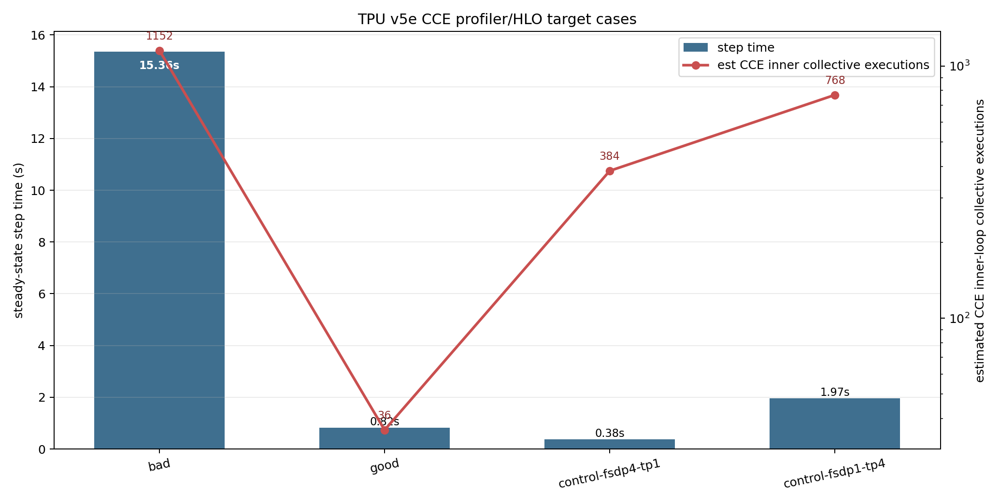

# TPU v5e CCE Profiler/HLO Root-Cause Analysis

Target cases only: bad, good, and two mesh controls. Failed extraction steps are non-fatal and listed below.

## Four-Case Comparison

| case | mesh | chunks | CCE loops | step s | compile s | HBM GiB | collectives | all-gather | all-reduce | CCE coll sites | est CCE coll execs | CCE dot sites | est CCE dot execs | permute | while | fusion | dot metadata | convolution | dyn-slice | CCE dot shapes | HLO files |
| --- | --- | --- | --- | --- | --- | --- | --- | --- | --- | --- | --- | --- | --- | --- | --- | --- | --- | --- | --- | --- | --- |
| bad | fsdp=2,tp=2 | 128/8192 | 128 | 15.363 | 46.534 | 2.65 | 300 | 6 | 294 | 9 | 1152 | 12 | 1536 | 0 | 5 | 6362 | 3133 | 972 | 11 | bf16[128,8192] x10; f32[128,320] x2 | 1 |
| good | fsdp=2,tp=2 | 512/65536 | 4 | 0.823 | 58.813 | 2.65 | 300 | 6 | 294 | 9 | 36 | 12 | 48 | 0 | 5 | 6364 | 3133 | 972 | 11 | bf16[512,65536] x10; f32[512,320] x2 | 1 |
| control-fsdp4-tp1 | fsdp=4,tp=1 | 128/8192 | 128 | 0.381 | 54.614 | 3.85 | 221 | 0 | 221 | 3 | 384 | 11 | 1408 | 0 | 5 | 6318 | 2967 | 972 | 83 | bf16[128,8192] x9; f32[128,160] x2 | 1 |
| control-fsdp1-tp4 | fsdp=1,tp=4 | 128/8192 | 128 | 1.965 | 66.513 | 1.64 | 1841 | 1067 | 766 | 6 | 768 | 22 | 2816 | 0 | 10 | 13784 | 8006 | 1944 | 808 | bf16[128,8192] x18; f32[128,160] x4 | 2 |

## CCE Inner-Loop Matmul/Collective Shapes

| case | kind | shape | count |
| --- | --- | --- | --- |
| bad | dot_general_result | bf16[128,8192] | 10 |
| bad | dot_general_result | f32[128,320] | 2 |
| bad | all_reduce_result | bf16[128,8192] | 3 |
| bad | all_gather_result | bf16[320,262144] | 6 |
| bad | convolution_result | bf16[128,8192] | 3 |
| bad | convolution_result | f32[128,320] | 1 |
| bad | fusion_result | f32[128] | 10 |
| bad | fusion_result | bf16[320,8192] | 4 |
| bad | fusion_result | pred[8192] | 3 |
| bad | fusion_result | bf16[128,8192] | 3 |
| bad | fusion_result | f32[128,8192] | 2 |
| bad | fusion_result | s32[8192] | 1 |
| bad | fusion_result | bf16[320,262144] | 1 |
| bad | fusion_result | f32[128,320] | 1 |
| bad | fusion_result | s32[128,1,1] | 1 |
| bad | fusion_result | s32[128,2] | 1 |
| bad | fusion_result | s32[128] | 1 |
| good | dot_general_result | bf16[512,65536] | 10 |
| good | dot_general_result | f32[512,320] | 2 |
| good | all_reduce_result | bf16[512,65536] | 3 |
| good | all_gather_result | bf16[320,262144] | 6 |
| good | convolution_result | bf16[512,65536] | 3 |
| good | convolution_result | f32[512,320] | 1 |
| good | fusion_result | f32[512] | 10 |

## Most Likely Cause

- The slowdown is a steady-state execution problem, not a compile-time problem.
- The bad and good cases use the same `fsdp=2,tp=2` mesh and the same planned HBM, so planned memory footprint does not explain the 128/8192 cliff.
- The strongest signal is chunk-loop granularity: bad has `cce_loop_count=128`, good has `cce_loop_count=4`.
- In this run, bad/good steady-state step time is `18.7x`.
- Static HLO collective counts are effectively the same for bad/good, so a simple 'more collective ops in the text' explanation is not enough.
- After multiplying CCE inner-loop sites by trip count, bad has about `1152` inner-loop collective executions vs `36` for good.
- The lowered loss-head matmul proxy changes from bad `bf16[128,8192] x10; f32[128,320] x2` to good `bf16[512,65536] x10; f32[512,320] x2`.
- Most likely cause: CCE small chunks create many dynamic loop iterations over tiny loss-head tiles; under mixed FSDP/TP, each iteration carries TP communication and reductions, so overhead and TPU under-utilization dominate even though planned HBM is unchanged.

## Direct Answers

- More collectives: static HLO counts are equal for bad/good, but estimated dynamic CCE inner-loop collectives are `1152` vs `36`.
- More tiny loop/fusion work: yes, bad runs the inner CCE loss loop `128` times vs `4` for good.
- Worse matmul/logit shape: yes, bad uses `bf16[128,8192] x10; f32[128,320] x2` while good uses `bf16[512,65536] x10; f32[512,320] x2`.
- More HBM pressure: no clear evidence; both bad and good planned HBM are `2.65 GiB` per chip.
- Poor TPU utilization / idle time: likely from tiny loop tiles and communication amortization, but explicit idle/utilization counters were not extracted from the raw trace JSON.
- Compile-time issue: no; good compiled slower but ran much faster.

## Extraction Notes

- bad: trace parsed, but explicit idle/utilization events were not extracted
- good: trace parsed, but explicit idle/utilization events were not extracted
- control-fsdp4-tp1: trace parsed, but explicit idle/utilization events were not extracted
- control-fsdp1-tp4: trace parsed, but explicit idle/utilization events were not extracted

## Artifact Files

- `profiler_hlo_case_metrics.csv`: per-case timing, memory, HLO op counts, and trace hints.
- `profiler_hlo_dot_shapes.csv`: extracted CCE inner-loop matmul and collective result shapes.
- `profiler_hlo_extraction_notes.jsonl`: non-fatal extraction misses.
