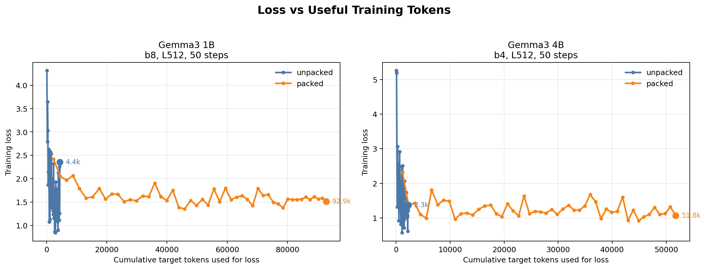
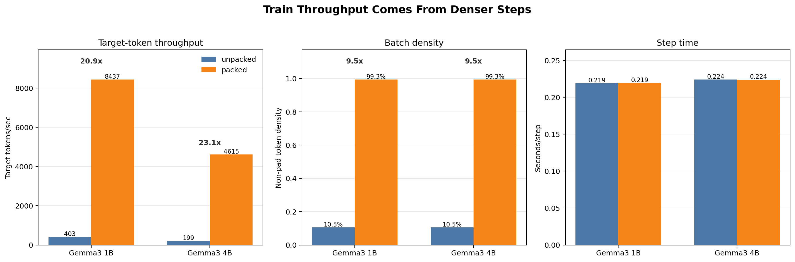

# 02-PACKING

This workstream benchmarks and implements padding-free / uncontaminated packing
for Tunix SFT. The goal is to reproduce the part of the Unsloth story that does
not come from the loss kernel itself: short examples should stop wasting most of
the model sequence length as padding.

## Executive Summary

Sequence packing is now implemented as a model-agnostic data-path optimization
for Tunix SFT, with Gemma/Tunix parity tests and TPU training runs. The patch
does not change the model, optimizer, or loss formula; it changes how tokenized
examples are arranged before they enter the ordinary Tunix SFT path.

The result is consistent across the stack:

- no-model OPUS100 EN-FR length simulation shows that fixed L512 batches waste
  most token slots on padding
- real Gemma tokenization preserves the same opportunity: L512 fixed unpacked
  density is 11.5%, packed density is 99.0%
- actual Tunix Gemma3 270M training reproduces the throughput effect: 50-step
  loss-token throughput improves from 1,538 tok/s to 33,000 tok/s
- the longer Gemma3 270M EN-FR comparison shows that packed 1K consumed 1.9x
  more loss tokens than unpacked 5K while taking 30% of the wall time, with
  BLEU/chrF in the same rough band
- short Gemma3 1B and 4B TPU runs reproduce the same scale behavior: target
  token throughput improves by 20.9x and 23.1x respectively while step time is
  essentially unchanged

The clean claim is therefore throughput/data-density, not model memory. Packing
keeps the same static tensor shape, so it should not be sold as reducing model
or logits memory. It makes the same TPU step much less empty.

## Why Packing Matters

Packing attacks a very simple waste source: ordinary SFT batches often reserve
`batch_size * max_length` token slots even when the examples are much shorter.

```text
ordinary padded batch cost ~= batch_size * max_length_in_batch
packed cost                ~= sum(real example lengths), rounded into rows
```

For real SFT datasets with many short rows, increasing batch size often increases
padding waste. Packing should turn that wasted capacity into valid training
tokens while preserving loss correctness.

## Implemented In This Branch

Core implementation:

- `tunix_accel/packing.py`
- `tunix_accel/tunix_packing.py`
- `02-PACKING/run_efficiency_benchmark.py`
- `02-PACKING/run_gemma_tokenizer_benchmark.py`

Tests:

- `tests/test_packing.py`
- `tests/test_packing_model_parity.py`
- `tests/test_tunix_packing.py`
- `tests/test_tunix_gemma_packing_smoke.py`

The packer is model-agnostic and Tunix-light. It accepts tokenized examples and
returns fixed-length rows with:

- `input_ids`
- `labels`
- `loss_mask`
- `input_mask`
- `positions`
- `segment_ids`
- optional block-causal `attention_mask`

The correctness rule is simple: each packed segment behaves like its own sample.
Positions reset to zero at segment boundaries, and the attention mask blocks
tokens from attending across segment boundaries.

## Usage

```python
from tunix_accel.packing import pack_records

records = [
    {"id": "a", "input_ids": [10, 11, 12, 13]},
    {"id": "b", "input_ids": [20, 21]},
    {"id": "c", "input_ids": [30, 31, 32]},
]

packed = pack_records(
    records,
    max_length=6,
    pad_token_id=0,
    strategy="best_fit_decreasing",
)

batch = packed.as_numpy()
```

`batch["attention_mask"]` has shape `[batch, query, key]`. If a Tunix model path
needs a singleton head axis, callers can expand it before feeding the trainer.

For Tunix trainers, use:

```python
tunix_batch = packed.as_tunix()
```

This intentionally maps `loss_mask` to the Tunix argument named `input_mask`.
That naming is easy to trip over: in Tunix's decoder-LM loss path, `input_mask`
is applied to shifted next-token targets. The token-valid mask remains available
as `valid_mask`.

## Tunix Drop-In Adapter

For existing Tunix datasets that already yield padded batches, use the Tunix
adapter instead of manually calling `pack_records`:

```python
from tunix_accel import TunixPackingConfig
from tunix_accel import pack_tunix_batches
from tunix_accel import packed_input_fn

packing = TunixPackingConfig()
train_ds = pack_tunix_batches(train_ds, packing)
trainer = trainer.with_gen_model_input_fn(
    packed_input_fn(pad_token_id=packing.pad_token_id)
)
trainer.train(train_ds)
```

`TunixPackingConfig()` infers `batch_size` and `max_length` from the first
incoming batch. For the strongest drop-in form, install the process-local train
wrapper:

```python
from tunix_accel import TunixPackingConfig
from tunix_accel import install_packing

install_packing(TunixPackingConfig())
trainer.train(train_ds)
```

This wrapper only changes the training dataset and `gen_model_input_fn`. It does
not patch the model, optimizer, or loss function.

## Validation So Far

Gemma-free validation:

```bash
python -m pytest -q tests/test_packing.py tests/test_packing_model_parity.py
```

This verifies the core invariant with a tiny JAX causal LM:

- packed rows use fewer batch rows than separate examples
- packed loss equals separate-example loss
- replacing the block-causal mask with a plain causal mask changes the loss,
  proving that cross-segment contamination would be observable

Optional Gemma/Tunix validation:

```bash
python -m pytest -q tests/test_tunix_gemma_packing_smoke.py
```

This test skips when Tunix is not installed. In a Tunix environment, it builds a
tiny random Gemma3 model and checks that Tunix's default decoder-LM loss matches
between separate examples and packed examples.

## Benchmark Plan

The first benchmark should mirror Unsloth's cleanest packing story:

1. Choose a real SFT dataset with varied sequence lengths.
2. Tokenize once and retain the per-example lengths.
3. Compare ordinary padded batches vs packed batches at the same `max_length`.
4. Report valid-token ratio, tokens/sec, step time, XLA planned HBM, and loss
   curve parity.
5. Plot loss against consumed target tokens, not only optimizer steps, because
   packing changes how much useful training signal each step carries.

The plot set should stay simple:

- valid-token ratio by batch size
- tokens/sec by batch size
- XLA peak HBM by batch size
- loss vs consumed tokens for packed vs unpacked

## No-Model Efficiency Benchmark

The first model-free benchmark has been run on 5,000 OPUS100 EN-FR training
examples using a simple regex token-count proxy. This does not require Gemma,
Tunix, or a TPU; it only measures sequence-length packing efficiency.

Artifacts:

- `02-PACKING/results/no-model/README.md`
- `02-PACKING/results/no-model/packing_efficiency.csv`
- `02-PACKING/results/no-model/packing_efficiency_overview.png`
- `02-PACKING/results/no-model/packing_batch_sensitivity.png`

Headline at batch 16:

| Max Length | Fixed Unpacked | Dynamic Unpacked | Packed | Rows Reduction | Gain vs Fixed | Gain vs Dynamic |
| --- | ---: | ---: | ---: | ---: | ---: | ---: |
| 256 | 17.5% | 35.5% | 99.4% | 5.66x | 5.67x | 2.80x |
| 512 | 8.8% | 34.5% | 99.5% | 11.26x | 11.28x | 2.88x |
| 1024 | 4.4% | 34.4% | 99.6% | 22.52x | 22.56x | 2.90x |
| 2048 | 2.2% | 34.4% | 99.6% | 45.05x | 45.12x | 2.90x |

Interpretation: fixed max-length padding is the harsh baseline and shows why
long-context SFT can waste almost all sequence slots on short datasets. Dynamic
padding is a stronger baseline; packing still improved useful-token density by
about 2.8-2.9x at batch 16 on this sample.

## Gemma Tokenizer Benchmark

The next benchmark uses the actual `google/gemma-3-270m-it` tokenizer and a
Gemma-style turn format for OPUS100 EN-FR. It still does not instantiate model
weights; the purpose is to verify that the data path and sequence lengths remain
favorable under real Gemma tokenization.

Artifacts:

- `02-PACKING/results/gemma-tokenizer/README.md`
- `02-PACKING/results/gemma-tokenizer/gemma_tokenizer_packing.csv`
- `02-PACKING/results/gemma-tokenizer/gemma_tokenizer_packing_overview.png`

Headline at batch 16:

| Max Length | Fixed Unpacked | Dynamic Unpacked | Packed | Rows Reduction | Gain vs Fixed | Gain vs Dynamic |
| --- | ---: | ---: | ---: | ---: | ---: | ---: |
| 256 | 22.7% | 38.6% | 98.4% | 4.33x | 4.33x | 2.55x |
| 512 | 11.5% | 37.1% | 99.0% | 8.62x | 8.63x | 2.67x |
| 1024 | 5.7% | 36.9% | 99.4% | 17.30x | 17.33x | 2.70x |
| 2048 | 2.9% | 36.9% | 99.8% | 34.72x | 34.78x | 2.71x |

Interpretation: the real Gemma tokenizer makes examples slightly longer than the
regex proxy, but the story remains the same. Packing turns a short-example
translation workload from roughly 37% dynamic-padding token density to about
99% packed density at batch 16.

## Current Status

This branch contains the reusable packing implementation, local parity tests,
optional Gemma/Tunix smoke validation, no-model and Gemma-tokenizer efficiency
benchmarks, real Gemma3 270M quality runs, and short Gemma3 1B/4B TPU scale
smoke runs.

## Actual Tunix Training Benchmark

The real Tunix benchmark now runs `PeftTrainer` steps on Gemma3 270M LoRA SFT.
It uses Tunix's ordinary decoder-LM loss path. Launch it with
`TUNIX_ACCEL_DISABLE_AUTOPATCH=1` so repository-level autopatches are disabled
for this isolated packing benchmark.

On a TPU VM, install TPU JAX explicitly rather than using the local CPU
requirement as-is:

```bash
python -m pip install google-tunix==0.1.6 kagglehub==0.4.3 \
  datasets matplotlib transformers importlib_resources gcsfs==2026.2.0
python -m pip install -U "jax[tpu]" \
  -f https://storage.googleapis.com/jax-releases/libtpu_releases.html
python -m pip install -e .
```

```bash
TUNIX_ACCEL_DISABLE_AUTOPATCH=1 python 02-PACKING/run_gemma_training_benchmark.py \
  --variants unpacked,packed \
  --batch-size 16 \
  --max-length 512 \
  --max-steps 50 \
  --num-examples 5000 \
  --outdir 02-PACKING/results/gemma-training-default-ce
```

For a cheap local data-path check that does not instantiate Gemma or Tunix:

```bash
TUNIX_ACCEL_DISABLE_AUTOPATCH=1 python 02-PACKING/run_gemma_training_benchmark.py \
  --prepare-only \
  --tokenizer-source huggingface \
  --variants unpacked,packed \
  --batch-size 16 \
  --max-length 512 \
  --num-examples 512 \
  --outdir /tmp/tunix-packing-prepare-test
```

The training run writes:

- per-variant `summary.json`
- per-variant `history.csv`
- combined `summary.json`
- combined `history.csv`
- `training_comparison.png`

The key readouts are final loss, step time, valid tokens/sec, loss tokens/sec,
and packed token density. This tells us whether packing improves actual Tunix
training throughput.

Artifacts from the first TPU run:

- `02-PACKING/results/gemma-training-default-ce/README.md`
- `02-PACKING/results/gemma-training-default-ce/summary.json`
- `02-PACKING/results/gemma-training-default-ce/history.csv`
- `02-PACKING/results/gemma-training-default-ce/training_comparison.png`

Run environment:

- Cloud TPU `v5litepod-1`, one TPU chip
- Project `gcp-ml-172005`, zone `us-west4-a`
- `google-tunix==0.1.6`, `jax==0.10.1`, `libtpu==0.0.41`
- Model `google/gemma-3-270m-it`
- Dataset OPUS100 EN-FR train split
- Batch 16, max length 512, LoRA rank 16, learning rate 2e-4
- ordinary Tunix decoder-LM loss path; repository autopatches disabled

Headline result for 50 optimizer steps:

| Variant | Token density | Step time | Valid tok/s | Loss tok/s | Final loss |
| --- | ---: | ---: | ---: | ---: | ---: |
| Unpacked | 10.5% | 0.108s | 4,936 | 1,538 | 2.2959 |
| Packed | 99.3% | 0.107s | 75,899 | 33,000 | 1.8844 |

Interpretation: packing did not make each optimizer step materially slower in
this small 270M setup, but each step carried far more real training tokens. That
is the useful result for this branch: without touching CE, padding waste alone
can dominate the amount of learning signal delivered per TPU second.

The final loss values above are same-step results, not same-token-budget quality
results. Packed consumed 178,077 loss tokens over 50 steps, while unpacked
consumed 8,414. For quality parity, the next comparison should match consumed
loss tokens or train both variants to the same validation budget.

## 1K Packed Quality Comparison

The follow-up TPU run compares two LoRA SFT cases on the same Gemma3 270M IT /
OPUS100 EN-FR setup:

- unpacked, 5,000 optimizer steps
- packed, 1,000 optimizer steps

Artifacts:

- `02-PACKING/results/gemma3-270m-enfr-packing-1k-comparison/README.md`
- `02-PACKING/results/gemma3-270m-enfr-packing-1k-comparison/loss_curves.png`
- `02-PACKING/results/gemma3-270m-enfr-packing-1k-comparison/metric_bars.png`
- `02-PACKING/results/gemma3-270m-enfr-packing-1k-comparison/summary.csv`

Headline result:

| Run | Loss tokens | Wall time | Eval loss | BLEU | chrF | Loss tok/s |
| --- | ---: | ---: | ---: | ---: | ---: | ---: |
| Unpacked 5K | 1,753,490 | 604s | 4.204 | 13.70 | 39.68 | 3,291 |
| Packed 1K | 3,330,580 | 181s | 4.330 | 14.19 | 40.21 | 30,966 |

Interpretation: the packed 1K run consumed about 1.9x as many loss tokens as
the unpacked 5K run while taking about 30% of the wall time, and the 128-sample
generation metrics landed in the same band. Same-step packed vs unpacked is not
a fair quality comparison because packing changes how many useful target tokens
each optimizer step sees.

The translation samples are intentionally included as a sanity check rather than
as a polished model-quality claim. The result supports the data-density story:
packing delivered much more training signal per wall-clock second without an
obvious breakage in the SFT path.

## 1B/4B Scale Smoke

The larger-model check intentionally stays short: 50 optimizer steps, LoRA rank
16, OPUS100 EN-FR, Gemma-style instruction wrapper, and
`TUNIX_ACCEL_DISABLE_AUTOPATCH=1`. The purpose is not final translation quality;
it is to see whether the same useful-token throughput effect survives when the
model is scaled from 270M to 1B and 4B.

Artifacts:

- `02-PACKING/results/gemma3-1b-4b-packing-smoke-comparison/README.md`
- `02-PACKING/results/gemma3-1b-4b-packing-smoke-comparison/loss_vs_useful_tokens.png`
- `02-PACKING/results/gemma3-1b-4b-packing-smoke-comparison/throughput_and_density.png`
- `02-PACKING/results/gemma3-1b-4b-packing-smoke-comparison/summary.csv`
- `02-PACKING/results/gemma3-1b-enfr-packing-smoke-b8-l512-s50/`
- `02-PACKING/results/gemma3-4b-enfr-packing-smoke-b4-l512-s50/`





Run matrix:

| Model | TPU | Chips | Batch | Max length | Steps | Variant | Density | Target tok/s | Final target tokens | Step time |
| --- | --- | ---: | ---: | ---: | ---: | --- | ---: | ---: | ---: | ---: |
| Gemma3 1B | v5litepod-4 / `tunix-packing-1b` | 4 | 8 | 512 | 50 | unpacked | 10.5% | 403 | 4,408 | 0.219s |
| Gemma3 1B | v5litepod-4 / `tunix-packing-1b` | 4 | 8 | 512 | 50 | packed | 99.3% | 8,437 | 92,878 | 0.219s |
| Gemma3 4B | v5litepod-4 / `tunix-packing-4b` | 4 | 4 | 512 | 50 | unpacked | 10.5% | 199 | 2,254 | 0.224s |
| Gemma3 4B | v5litepod-4 / `tunix-packing-4b` | 4 | 4 | 512 | 50 | packed | 99.3% | 4,615 | 51,765 | 0.224s |

Ratios:

| Model | Target-token throughput | Final target tokens in 50 steps | Density change | Step-time change |
| --- | ---: | ---: | ---: | ---: |
| Gemma3 1B | 20.9x | 21.1x | 9.5x | 1.001x |
| Gemma3 4B | 23.1x | 23.0x | 9.5x | 0.999x |

Batch-search notes on v5litepod-4:

| Model | Tried condition | Result |
| --- | --- | --- |
| Gemma3 1B | b16, L512, 50 steps | compile OOM, XLA reported 16.48 GiB used vs 15.75 GiB HBM |
| Gemma3 4B | b16, L512, 50 steps | compile OOM, XLA reported 28.93 GiB used vs 15.75 GiB HBM |
| Gemma3 4B | b8, L512, 50 steps | compile OOM, XLA reported 17.25 GiB used vs 15.75 GiB HBM |

These OOM observations are only batch-sizing context. They should not be used
as evidence that packing lowers the model's memory footprint; the successful
packed and unpacked pairs use the same static shapes, and their JAX memory
snapshots are nearly identical. The important outcome is that the packed step
contains far more useful target tokens.

## What Is Proven

Packing correctness:

- packed loss matches separate-example loss in the local JAX parity test
- segment-local positions and block-causal attention prevent cross-example
  contamination
- optional Gemma/Tunix smoke tests confirm the same behavior through Tunix's
  decoder-LM loss path

Training throughput:

- real Tunix Gemma3 270M, 1B, and 4B runs all show nearly unchanged step time
  and much higher target-token throughput when examples are packed
- the effect is strongest when the dataset has short examples relative to
  `max_length`, which is exactly the OPUS100 EN-FR instruction-tuning setup
  used here

Quality:

- the Gemma3 270M packed 1K run produced BLEU/chrF in the same rough band as
  unpacked 5K while taking much less wall time
- this is enough to show that the training path is not obviously broken, but it
  is not enough to claim broad quality parity for all datasets or models

## What Is Not Proven

Packing does not remove the final LM-head logits tensor and it does not directly
reduce model-state memory. For long examples that already fill `max_length`,
packing has little room to help.

The current 1B/4B experiments are smoke tests, not final quality experiments.
They demonstrate throughput scaling, not final EN-FR translation quality. A
longer 1B or 4B quality run is only necessary if the next claim needs to be
about output quality rather than training efficiency.

## Final Read

This branch gives us a clean Unsloth-inspired packing primitive for Tunix:
short-example SFT should not spend most of its sequence capacity on padding.
The claim is narrow, but useful: packing keeps the data path dense.
