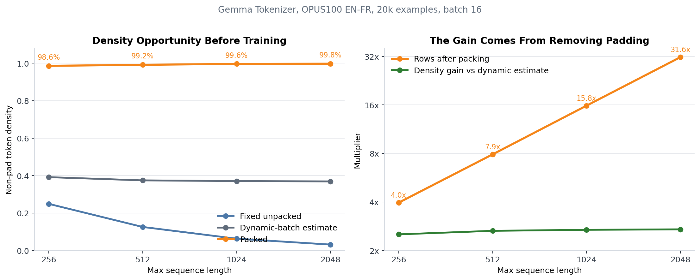
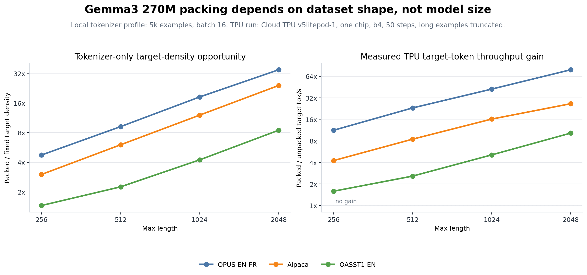
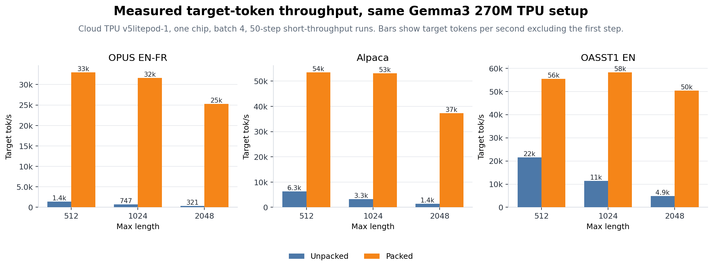
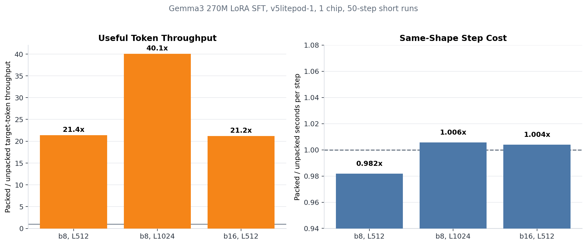
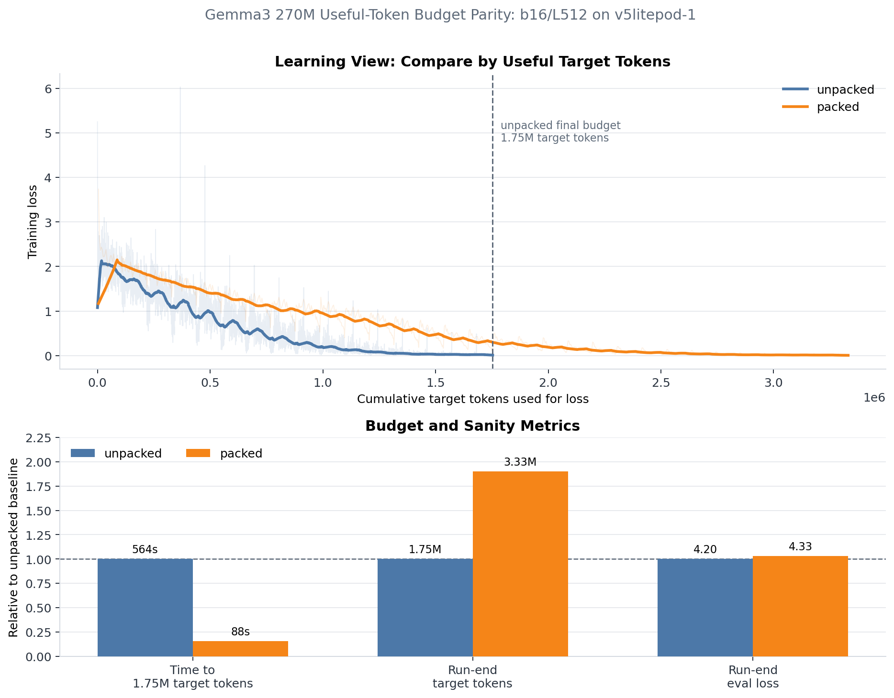
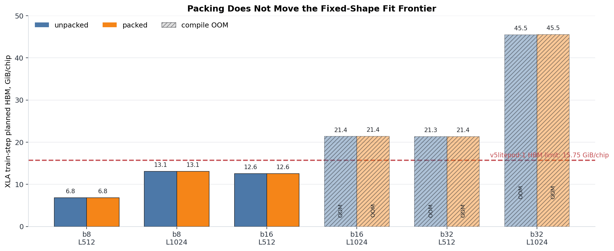

# Sequence Packing on JAX/Tunix TPU: Turning Padding Into Useful Tokens

This report makes one deliberately narrow claim: for Gemma3 270M LoRA SFT on
JAX/Tunix, sequence packing turns padding-heavy fixed rows into useful target
tokens. It is a data-density and useful-token-throughput optimization, not a
fixed-shape memory optimization.

## Executive Summary

| Question | Result |
| --- | --- |
| What is being optimized? | Padding waste. Packing combines multiple short SFT examples into one fixed-length row while preserving per-example positions and block-causal attention. |
| How much padding waste was available? | On OPUS100 EN-FR with the Gemma tokenizer and batch 16, fixed unpacked density fell from 24.9% at L256 to 3.2% at L2048, while packed density stayed around 98.6-99.8%. |
| Does this depend on the dataset? | Yes. OPUS100 EN-FR showed the largest gain, Alpaca remained strong, and OASST1 showed a smaller but still clear gain as examples became longer and less padding-heavy. |
| Does it improve useful-token throughput? | Yes. On the original OPUS matched-shape runs, target-token throughput improved by 21.2x to 40.1x; the b4 dataset ablation reached 78.9x at OPUS L2048. |
| Does same-shape step time change? | Barely in this setup. Packed/unpacked step-time ratios were 0.982x, 1.006x, and 1.004x for the passing matched shapes. |
| Does useful-token training finish faster? | Yes for token budget. Packed reached the unpacked run's 1.75M target-token budget at step 528 in 88s of cumulative step time, versus 5,000 unpacked steps in 564s. |
| Is the optimizer trajectory identical? | No. Packing changes the number of target tokens per optimizer update. Loss should be compared by useful tokens and interpreted with that optimizer-step difference in mind. |
| What is the memory claim? | There is no memory-saving claim. Planned HBM rows are retained only as a negative control showing that packing does not move the fixed-shape fit frontier. |

## Experiment Scope

| Field | Value |
| --- | --- |
| Model | `google/gemma-3-270m-it` |
| Training mode | Tunix PEFT/LoRA |
| LoRA rank / alpha | rank 16, alpha 32 |
| Main training dataset | OPUS100 EN-FR |
| Dataset ablation | OPUS100 EN-FR, Alpaca, OASST1 EN |
| Prompt format | Gemma IT translation wrapper |
| Loss mask | target-only |
| TPU | Cloud TPU `v5litepod-1`, 1 chip |
| Zone | `us-west4-a` |
| Mesh | `fsdp=1,tp=1` |
| CE path | Default Tunix CE |
| Other patches | CCE, Tiled MLP, activation policy, and Splash Attention disabled |

The local density sweeps used 5k and 20k OPUS100 examples. The dataset
ablation used 5k examples per dataset. The TPU runs used 5k examples. All TPU
figures and tables below come from `v5litepod-1`, one chip.

## 1. The Dataset Has a Large Packing Opportunity

Before loading the model, the Gemma tokenizer already shows why packing is
worth testing. With 20k OPUS100 EN-FR examples and batch 16, fixed unpacked
density falls as max length grows: 24.9% at L256, 12.6% at L512, 6.3% at
L1024, and 3.2% at L2048. Packed density stays around 98.6-99.8%.



The most important number here is not memory. It is row reduction. At L512,
20k examples collapse to 2,535 packed rows, a 7.9x row reduction. At L2048,
they collapse to 632 rows, a 31.6x row reduction. That does not make the model
shape smaller during a given step; it makes each fixed row carry far more real
training content.

| Max length | Fixed density | Dynamic estimate | Packed density | Row reduction |
| ---: | ---: | ---: | ---: | ---: |
| 256 | 24.9% | 39.2% | 98.6% | 4.0x |
| 512 | 12.6% | 37.4% | 99.2% | 7.9x |
| 1024 | 6.3% | 37.1% | 99.6% | 15.8x |
| 2048 | 3.2% | 36.9% | 99.8% | 31.6x |

## 2. Dataset Shape Decides the Gain

Packing is model-agnostic at the mechanism level, but the payoff is not
dataset-agnostic. It depends on how many supervised target tokens survive inside
each fixed row. To test that directly, the 270M rerun added a max-length sweep
over three SFT-like datasets: OPUS100 EN-FR, Alpaca, and OASST1 English
assistant turns.



The left panel is tokenizer-only. It asks how much target-token density packing
could recover before any model is loaded. The right panel is the corresponding
measured TPU gain for the collected short runs, using the same Gemma3 270M
LoRA setup on one `v5litepod-1` chip with batch 4 and 50 measured steps.

| Dataset | L512 profile gain | L2048 profile gain | L512 TPU gain | L2048 TPU gain | Interpretation |
| --- | ---: | ---: | ---: | ---: | --- |
| OPUS EN-FR | 9.2x | 34.8x | 23.1x | 78.9x | Very short examples; longer context mostly creates padding unless packed. |
| Alpaca | 6.0x | 24.1x | 8.5x | 26.5x | Short-to-medium instruction records; strong and stable packing case. |
| OASST1 EN | 2.3x | 8.5x | 2.6x | 10.3x | Longer conversational turns; still useful, but less dramatic. |

This is the cleanest way to read packing: max length amplifies the win only
when examples are short relative to the row. OPUS and Alpaca therefore improve
as context length grows. OASST improves more slowly because its examples are
longer and already fill more of each fixed row.

For absolute measured throughput, the retained TPU rows are:



## 3. The Throughput Gain Is Real When the Shape Fits

For the passing matched shapes, step time stayed in the same band while
target-token throughput increased sharply.



| Shape | Unpacked target tok/s | Packed target tok/s | Throughput gain | Step-time ratio |
| --- | ---: | ---: | ---: | ---: |
| b8/L512 | 1.59k/s | 34.01k/s | 21.4x | 0.982x |
| b8/L1024 | 0.74k/s | 29.83k/s | 40.1x | 1.006x |
| b16/L512 | 1.54k/s | 32.62k/s | 21.2x | 1.004x |

The b8/L1024 row gets the largest throughput gain because fixed unpacked
target-token density is especially low at that shape. The model is doing about
the same fixed-shape work either way; packed batches simply waste far fewer
positions.

## 4. Useful-Token Budget View

The quality sanity run used b16/L512 for both variants:

| Variant | Steps | Final target tokens | Cumulative step time | Wall time | Eval loss |
| --- | ---: | ---: | ---: | ---: | ---: |
| unpacked | 5,000 | 1.75M | 564s | 604s | 4.204 |
| packed | 1,000 | 3.33M | 138s | 177s | 4.330 |

Packed reached the unpacked run's final 1.75M target-token budget at step 528,
after 88s of cumulative step time. The unpacked run needed 5,000 steps and 564s
of cumulative step time to reach the same budget. That is a 6.4x time-to-budget
gain in this run.



The loss figure deliberately has two views. The useful-token view asks what the
model achieved after seeing a given number of supervised target tokens. The time
view asks how quickly each input pipeline moved through training. Packing looks
strongest in the time view because it reaches the same 1.75M target-token budget
far earlier.

The useful-token view is the tradeoff. Packing delivers many more target tokens
per optimizer update, so the packed and unpacked loss curves should not be read
as identical optimizer trajectories. If an experiment needs the same number of
optimizer updates, the packed run should be scheduled differently. If it needs
the same useful-token budget, packing can reach that budget much faster.

The eval losses are retained only as a sanity check that both jobs completed
normal Tunix training and evaluation. They are not presented as a translation
quality benchmark.

## 5. Non-Claim Check: Same Shape, Same Planned HBM

The short TPU matrix also records planned HBM, but only as a guardrail. Packing
changes token layout and masks inside a fixed row; it does not change
`(batch, length)`. Therefore the planned HBM footprint should remain the same.



That is what happened. Passing and failing shapes had nearly identical planned
HBM for packed and unpacked variants.

| Shape | Unpacked status / XLA HBM | Packed status / XLA HBM |
| --- | ---: | ---: |
| b8/L512 | OK / 6.85 GiB/chip | OK / 6.85 GiB/chip |
| b8/L1024 | OK / 13.10 GiB/chip | OK / 13.11 GiB/chip |
| b16/L512 | OK / 12.57 GiB/chip | OK / 12.57 GiB/chip |
| b16/L1024 | OOM / 21.36 GiB/chip | OOM / 21.39 GiB/chip |
| b32/L512 | OOM / 21.32 GiB/chip | OOM / 21.35 GiB/chip |
| b32/L1024 | OOM / 45.45 GiB/chip | OOM / 45.51 GiB/chip |

This section exists to bound the claim. If the desired shape cannot compile
because CE logits or attention activations exceed HBM, packing alone will not
make that shape fit. That job belongs to memory-path optimizations such as CCE
or activation-memory work.

## 6. Implementation Notes

The implementation has two layers:

1. `tunix_accel.packing` packs tokenized examples into fixed-length rows. It
   emits `input_ids`, loss masks, valid masks, per-segment positions,
   `segment_ids`, and a block-causal attention mask.
2. `tunix_accel.tunix_packing` adapts ordinary Tunix batches and widens
   `PeftTrainer.with_gen_model_input_fn` with optional `packing=` support.

The patched API is inert unless the caller passes `packing=`:

```python
from tunix_accel import TunixPackingConfig

trainer = peft_trainer.PeftTrainer(...).with_gen_model_input_fn(
    gen_model_input_fn,
    packing=TunixPackingConfig(pad_token_id=0),
)
```

The packed input function preserves Tunix's `input_mask` as the loss mask and
uses `valid_mask` plus block-causal `attention_mask` for model inputs. This is
the correctness-critical part: without segment-aware attention and reset
positions, packed rows can leak information across examples.

Because packing does not touch the loss function, it composes with CCE. The 270M
rerun deliberately disabled CCE so that the sequence-packing claim stayed
isolated.

## 7. Interpretation

The clean message is:

- Use packing when SFT examples are short relative to the chosen max length.
- Preflight the dataset first; model size is secondary to sequence length and
  target-mask density for this optimization.
- Expect useful-token throughput to rise roughly with target-token density.
- Treat optimizer-step parity and useful-token parity as different experiment
  designs.
- Do not use packing as a memory-wall fix; the planned-HBM rows are included
  only to prove that boundary.

In other words, packing is the right lever for padding waste. It is not the
right lever for dense loss logits, attention activation memory, or model-state
sharding.

## 8. Retained Artifacts

Processed tables:

- `data/processed/gemma3_270m_summary.json`
- `data/processed/gemma3_270m_short_throughput_v5litepod1.csv`
- `data/processed/gemma3_270m_quality_v5litepod1.csv`
- `data/processed/gemma3_270m_quality_history_v5litepod1.csv`
- `data/processed/gemma3_270m_dataset_profile.csv`
- `data/processed/gemma3_270m_dataset_tpu_sweep_v5litepod1.csv`
- `data/processed/gemma3_270m_dataset_ablation_summary.json`

Local density tables:

- `data/local_density/no_model_5k_packing_efficiency.csv`
- `data/local_density/no_model_20k_packing_efficiency.csv`
- `data/local_density/gemma_tokenizer_5k_packing.csv`
- `data/local_density/gemma_tokenizer_20k_packing.csv`

Compressed raw TPU artifacts:

- `data/raw_artifacts/gemma3_270m_short_throughput_v5litepod1/*.tgz`
- `data/raw_artifacts/gemma3_270m_quality_unpacked_v5litepod1/*.tgz`
- `data/raw_artifacts/gemma3_270m_quality_packed_v5litepod1/*.tgz`
- `data/raw_artifacts/gemma3_270m_dataset_sweep_opus100_v5litepod1/*.tgz`
- `data/raw_artifacts/gemma3_270m_dataset_sweep_alpaca_v5litepod1/*.tgz`
- `data/raw_artifacts/gemma3_270m_dataset_sweep_oasst1_v5litepod1/*.tgz`
