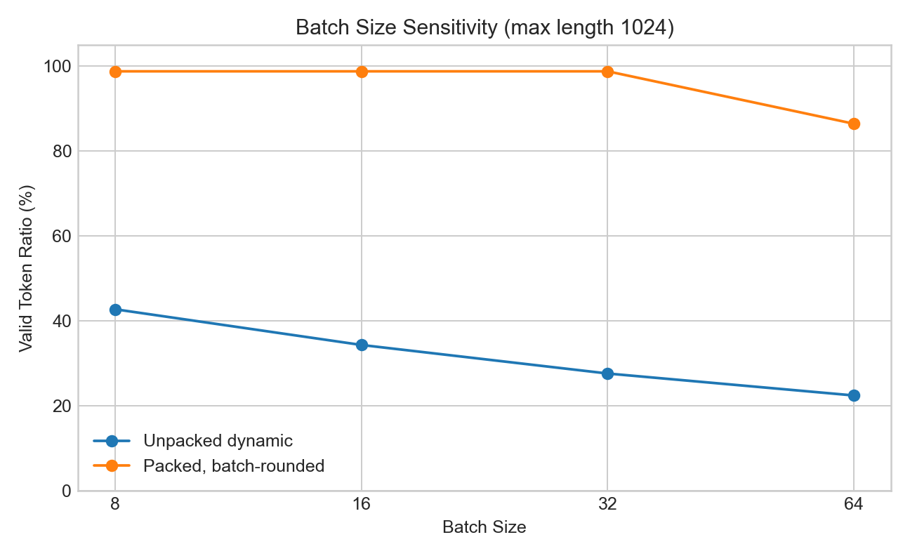
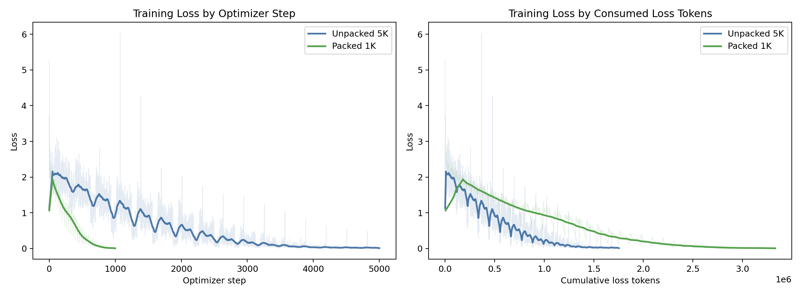
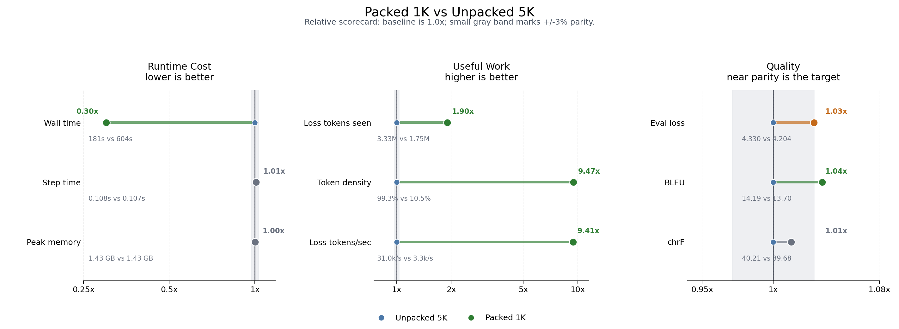

# JAX/Tunix + TPU Sequence Packing Technical Report

This report consolidates the sequence-packing experiments we ran on JAX/Tunix +
Cloud TPU. The question was simple: if a short-example SFT dataset wastes most
of every fixed-length batch on padding, can we recover that capacity with
uncontaminated sequence packing while keeping the normal Tunix training path
intact?

## Executive Summary

| Metric | Result |
| --- | --- |
| Gemma-tokenized L512 packed density | 99.0% |
| Gemma3 270M 50-step target-token throughput gain | 21.5x |
| Gemma3 270M packed 1K wall time vs unpacked 5K | 30.0% |
| Gemma3 270M packed 1K target tokens vs unpacked 5K | 1.9x |
| Gemma3 1B 50-step target-token throughput gain | 20.9x |
| Gemma3 4B 50-step target-token throughput gain | 23.1x |

The short version: sequence packing did not make a single fixed-shape step
materially faster. It made each step much less empty. On this OPUS100 EN-FR SFT
format, ordinary fixed-length batches carried roughly 10-12% useful tokens at
L512, while packed batches were about 99% full. That translated directly into
20x+ target-token throughput gains in short Tunix/Gemma training runs.

## 1. The Target: Padding Waste

The cost of an ordinary fixed-length SFT batch is dominated by the static shape:

```text
ordinary padded batch cost ~= batch_size * max_length
```

If most examples are short, the TPU still processes the full shape while the
loss uses only a small fraction of the token slots. Packing changes only the data
layout:

```text
packed rows ~= sum(real example lengths), rounded into fixed-length rows
```

The implementation keeps segments independent by resetting positions at segment
boundaries and using block-causal attention. Each packed segment should behave
like its own sample.

## 2. First Result: The Opportunity Exists Before Loading a Model

The first benchmark used 5,000 OPUS100 EN-FR examples with a simple token-count
proxy. It does not instantiate Gemma, Tunix, or TPU runtime. It only asks whether
the length distribution is favorable for packing.


*Fixed max-length padding wastes most sequence capacity as context length grows.*



*Batch size increases the amount of wasted fixed-shape capacity for short
examples.*

At batch 16:

| Max Length | Fixed Unpacked | Dynamic Unpacked | Packed | Rows Reduction | Gain vs Fixed | Gain vs Dynamic |
| --- | ---: | ---: | ---: | ---: | ---: | ---: |
| 256 | 17.5% | 35.5% | 99.4% | 5.66x | 5.67x | 2.80x |
| 512 | 8.8% | 34.5% | 99.5% | 11.26x | 11.28x | 2.88x |
| 1024 | 4.4% | 34.4% | 99.6% | 22.52x | 22.56x | 2.90x |
| 2048 | 2.2% | 34.4% | 99.6% | 45.05x | 45.12x | 2.90x |

## 3. Second Result: Real Gemma Tokenization Preserves the Opportunity

The next benchmark used the actual `google/gemma-3-270m-it` tokenizer and the
same Gemma-style instruction wrapper used in the training runs.


*Real tokenization makes examples slightly longer than the proxy, but packing
still fills almost every token slot.*

At batch 16:

| Max Length | Fixed Unpacked | Dynamic Unpacked | Packed | Rows Reduction | Gain vs Fixed | Gain vs Dynamic |
| --- | ---: | ---: | ---: | ---: | ---: | ---: |
| 256 | 22.7% | 38.6% | 98.4% | 4.33x | 4.33x | 2.55x |
| 512 | 11.5% | 37.1% | 99.0% | 8.62x | 8.63x | 2.67x |
| 1024 | 5.7% | 36.9% | 99.4% | 17.30x | 17.33x | 2.70x |
| 2048 | 2.9% | 36.9% | 99.8% | 34.72x | 34.78x | 2.71x |

The L512 row became the main training setting. It predicts that a fixed
unpacked batch will be mostly padding, while a packed batch will be nearly full.

## 4. Third Result: Real Tunix Training Converts Density Into Throughput

The first real training check used Gemma3 270M LoRA SFT on OPUS100 EN-FR,
batch 16, max length 512, and 50 optimizer steps. The point was not final
translation quality; it was to confirm that the data-density result appears in
actual Tunix training.

| Variant | Token density | Step time | Valid tok/s | Target tok/s | Final loss |
| --- | ---: | ---: | ---: | ---: | ---: |
| Unpacked | 10.5% | 0.108s | 4,936 | 1,538 | 2.2959 |
| Packed | 99.3% | 0.107s | 75,899 | 33,000 | 1.8844 |

The step time was almost unchanged. The throughput changed because each step
contained many more non-padding target tokens.

## 5. Fourth Result: 270M Quality Sanity Check

The longer run compared:

- Gemma3 270M unpacked, 5,000 optimizer steps
- Gemma3 270M packed, 1,000 optimizer steps

Both used LoRA rank 16, batch 16, max length 512, learning rate 2e-4, and
OPUS100 EN-FR.



*Loss is plotted by optimizer step and consumed target tokens. The packed run
sees far more target tokens per step.*



*Packed 1K consumed more target tokens in much less wall time, with translation
metrics in the same rough band.*

| Run | Loss tokens | Wall time | Eval loss | BLEU | chrF | Target tok/s |
| --- | ---: | ---: | ---: | ---: | ---: | ---: |
| Unpacked 5K | 1,753,490 | 604s | 4.204 | 13.70 | 39.68 | 3,291 |
| Packed 1K | 3,330,580 | 181s | 4.330 | 14.19 | 40.21 | 30,966 |

Interpretation: this is a useful training-path sanity check, not a broad
translation-quality benchmark. The packed run consumed about 1.9x as many target
tokens while taking about 30% of the wall time. Its BLEU/chrF were in the same
rough band as the longer unpacked run.

## 6. Fifth Result: The Same Throughput Effect Appears at 1B and 4B

The larger-model check intentionally stayed short: 50 optimizer steps. The goal
was to see whether the same packed-vs-unpacked behavior survives scaling from
270M to 1B and 4B.


*For the same number of optimizer steps, packed runs move much farther along the
useful-target-token axis.*


*The throughput gain comes from denser steps, not faster steps.*

| Model | TPU | Chips | Batch | Max length | Steps | Variant | Density | Target tok/s | Final target tokens | Step time |
| --- | --- | ---: | ---: | ---: | ---: | --- | ---: | ---: | ---: | ---: |
| Gemma3 1B | v5litepod-4 | 4 | 8 | 512 | 50 | unpacked | 10.5% | 403 | 4,408 | 0.219s |
| Gemma3 1B | v5litepod-4 | 4 | 8 | 512 | 50 | packed | 99.3% | 8,437 | 92,878 | 0.219s |
| Gemma3 4B | v5litepod-4 | 4 | 4 | 512 | 50 | unpacked | 10.5% | 199 | 2,254 | 0.224s |
| Gemma3 4B | v5litepod-4 | 4 | 4 | 512 | 50 | packed | 99.3% | 4,615 | 51,765 | 0.224s |

Ratios:

| Model | Target-token throughput | Final target tokens in 50 steps | Density change | Step-time change |
| --- | ---: | ---: | ---: | ---: |
| Gemma3 1B | 20.9x | 21.1x | 9.5x | 1.001x |
| Gemma3 4B | 23.1x | 23.0x | 9.5x | 0.999x |

## 7. Interpretation

- Packing is a data-layout optimization. It should be reported as useful-token
  throughput and token-density improvement, not as model-memory reduction.
- The benefit depends on the dataset length distribution. It is strong for this
  OPUS100 EN-FR instruction format because many examples are short relative to
  L512.
- Step time stayed almost unchanged in the validated runs. That is expected:
  the static tensor shape did not shrink.
- Quality is not obviously broken in the 270M sanity check, but 1B and 4B have
  only been tested as short throughput smokes.
- For long examples that already fill `max_length`, packing has little room to
  help.

## 8. Source Artifacts

- `02-PACKING/data/no_model_packing_efficiency.csv`
- `02-PACKING/data/no_model_length_summary.json`
- `02-PACKING/data/gemma_tokenizer_packing.csv`
- `02-PACKING/data/gemma_tokenizer_length_summary.json`
- `02-PACKING/data/gemma3_270m_enfr_quality_summary.csv`
- `02-PACKING/data/gemma3_270m_enfr_translation_samples.md`
- `02-PACKING/data/gemma3_1b_4b_scale_smoke_summary.csv`
