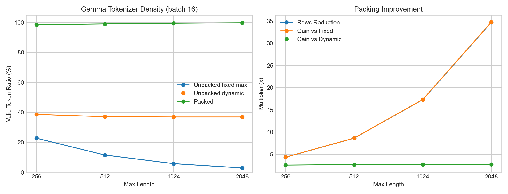

# Gemma Tokenizer Packing Benchmark

- Dataset: `opus100-en-fr-gemma-tokenizer`
- Model tokenizer: `google/gemma-3-270m-it`
- Source: Helsinki-NLP/opus-100 en-fr train split, formatted with Gemma turn tokens and tokenized by the requested Gemma tokenizer
- Examples: 5000
- Lengths: mean 58.8, median 42.0, p90 112.0, p99 227.0, max 817
- Mean answer/loss tokens: 21.9

## Plot

## Focus Rows (Batch 16)

| Max Length | Fixed Unpacked | Dynamic Unpacked | Packed | Rows Reduction | Gain vs Fixed | Gain vs Dynamic |
| --- | ---: | ---: | ---: | ---: | ---: | ---: |
| 256 | 22.7% | 38.6% | 98.4% | 4.33x | 4.33x | 2.55x |
| 512 | 11.5% | 37.1% | 99.0% | 8.62x | 8.63x | 2.67x |
| 1024 | 5.7% | 36.9% | 99.4% | 17.30x | 17.33x | 2.70x |
| 2048 | 2.9% | 36.9% | 99.8% | 34.72x | 34.78x | 2.71x |
