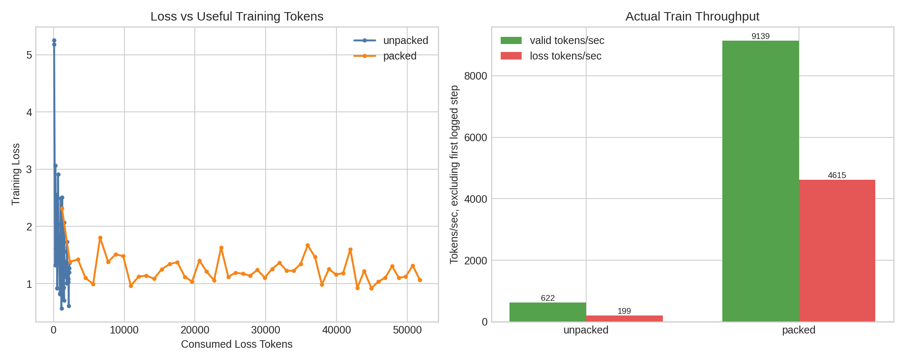

# Gemma3 Packing Training Benchmark

This run compares ordinary fixed-length Tunix SFT batches against packed batches using Default CE only.

- Dataset: `opus100-en-fr-gemma3-it`
- Source: Helsinki-NLP/opus-100 en-fr train split, Tunix Gemma3 IT prompt wrapper, target-only loss mask, target EOS
- Model: `google/gemma-3-4b-it`
- Tokenizer source: `sentencepiece`

## Summary

| Variant | Steps | Batch | Max length | Fit examples | Rows/batches | Final loss | Eval loss | BLEU | chrF | Step time | Valid tok/s | Loss tok/s | Packing density |
| --- | ---: | ---: | ---: | ---: | ---: | ---: | ---: | ---: | ---: | ---: | ---: | ---: | ---: |
| unpacked | 50 | 4 | 512 | 4999 | 1249 | 1.3675 | nan | nan | nan | 0.224s | 622 | 199 | 10.5% |
| packed | 50 | 4 | 512 | 4999 | 132 | 1.0673 | nan | nan | nan | 0.224s | 9139 | 4615 | 99.3% |
