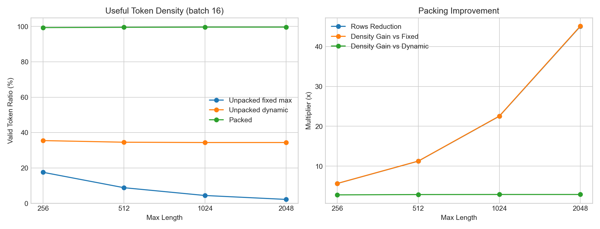

# No-Model Packing Efficiency Benchmark

- Dataset: `opus100-en-fr-simple-token-proxy`
- Source: Helsinki-NLP/opus-100 en-fr train split with regex token-count proxy, not Gemma tokenizer
- Examples: 5000
- Lengths: mean 45.3, median 31.0, p90 90.0, p99 186.0, max 769

## Plots

## Focus Rows (Batch 16)

| Max Length | Fixed Unpacked | Dynamic Unpacked | Packed | Rows Reduction | Gain vs Fixed | Gain vs Dynamic |
| --- | ---: | ---: | ---: | ---: | ---: | ---: |
| 256 | 17.5% | 35.5% | 99.4% | 5.66x | 5.67x | 2.80x |
| 512 | 8.8% | 34.5% | 99.5% | 11.26x | 11.28x | 2.88x |
| 1024 | 4.4% | 34.4% | 99.6% | 22.52x | 22.56x | 2.90x |
| 2048 | 2.2% | 34.4% | 99.6% | 45.05x | 45.12x | 2.90x |
