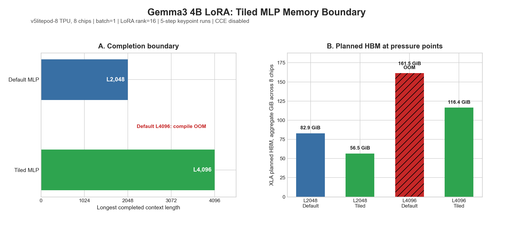
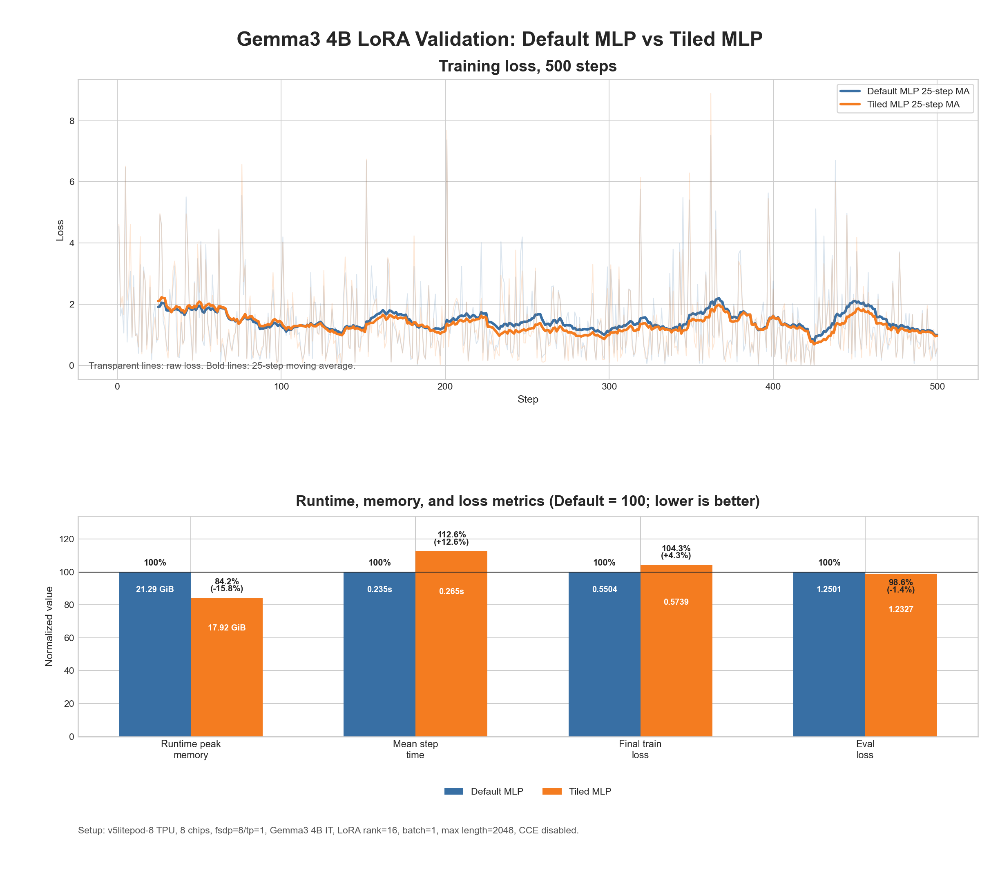
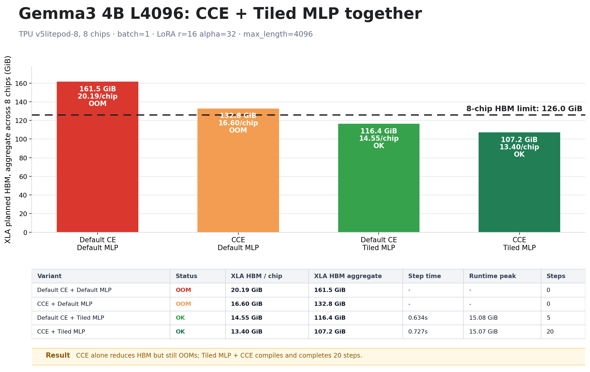

# JAX/Tunix + TPU Gemma3 Tiled MLP Technical Report

This report consolidates the Gemma3 Tiled MLP experiments we ran on JAX/Tunix +
Cloud TPU. The question was narrow: if we replace Tunix Gemma3's dense gated MLP
block with a token-tiled custom-VJP implementation, can we reduce memory pressure
without changing the training objective?

## Executive Summary

| Metric | Result |
| --- | --- |
| Target model family | Gemma3 only |
| Gemma3 4B L4096 Default MLP | compile OOM |
| Gemma3 4B L4096 Tiled MLP | completed the 5-step keypoint run |
| L2048 XLA planned HBM, aggregate | 82.9 GiB -> 56.5 GiB |
| L2048 500-step runtime peak, aggregate | 21.29 GiB -> 17.92 GiB |
| L2048 500-step mean step time | 0.235s -> 0.265s |
| Same-model forward loss diff | 0 |
| LoRA gradient RMS absolute diff | 0.000933 over 28.4M gradient elements |

The short version: Tiled MLP is not as universally high-leverage as Cut Cross
Entropy, but it attacks a real Gemma3 memory source. On the 4B LoRA setup, it
reduced both XLA planned HBM and runtime peak memory, and it moved the observed
context boundary from 2048 to 4096 tokens on the same v5litepod-8 shape. The
tradeoff is slower steps from recompute and smaller sequential GEMMs.

## 1. The Target: Gated-MLP Intermediate Activations

Gemma3's MLP block computes:

```text
output = (gelu_approx(x @ gate) * (x @ up)) @ down
```

The pressure point is the pair of token-by-intermediate projections and the
gated intermediate. At long context, this term scales roughly with:

```text
batch_size * context_length * intermediate_dim
```

Tiled MLP streams the token dimension. The forward pass produces the same output
as the dense block. The custom VJP then recomputes per-tile gate/up/intermediate
values during backward, rather than depending on one full resident intermediate.

The Gemma3 drop-in patch replaces `tunix.models.gemma3.model.FeedForward.block`.
It keeps Gemma3's normal `FeedForward.__call__` wrapper and remat behavior
intact.

## 2. Implementation Surface

The implementation lives in:

- `tunix_accel/tiled_mlp.py`
- `tunix_accel/gemma3_tiled_mlp.py`
- `tunix_accel/autopatch.py`
- `sitecustomize.py`

The core math path supports dense gated MLP and Qwix-LoRA projection deltas. The
drop-in adapter is intentionally Gemma3-specific because model families differ
in module layout, activation choice, projection naming, and LoRA wrappers.

Installed environments use the normal Tunix training code. The patch is toggled
with environment variables:

```bash
export TUNIX_ACCEL_DISABLE_TILED_MLP=1
export TUNIX_ACCEL_TILED_MLP_TOKEN_CHUNK=128
export TUNIX_ACCEL_TILED_MLP_LORA_ALPHA=32.0
```

## 3. First Result: the 4B Context Boundary Moves

The first TPU result used Gemma3 4B IT, LoRA rank 16, batch 1, Cloud TPU
v5litepod-8, 8 chips, `fsdp=8,tp=1`, and 5 train steps. CCE was disabled to
isolate the MLP patch.

The figure reports XLA planned HBM as an aggregate value:

```text
aggregate_xla_hbm_gib = max_per_chip_xla_planned_hbm_gib * 8 chips
```

This is not one contiguous memory pool. OOM is still decided per chip.



| Context | Variant | Status | XLA planned HBM aggregate | Runtime peak aggregate | Mean step |
| ---: | --- | --- | ---: | ---: | ---: |
| 2048 | Default MLP | OK | 82.9 GiB | 19.80 GiB | 0.266s |
| 2048 | Tiled MLP | OK | 56.5 GiB | 17.78 GiB | 0.284s |
| 4096 | Default MLP | OOM | 161.5 GiB |  |  |
| 4096 | Tiled MLP | OK | 116.4 GiB | 15.08 GiB | 0.634s |

The useful reading is not merely "a few GiB saved at L2048." The more important
outcome is that the same model and TPU shape completed L4096 only with Tiled
MLP.

## 4. Second Result: 500-Step Training Smoke Keeps the Loss Story Plausible

The second TPU result used Gemma3 4B IT LoRA SFT on OPUS100 EN-FR for 500 steps,
batch 1, max length 2048, Cloud TPU v5litepod-8, 8 chips. CCE remained disabled.

Generation-quality scores are intentionally not reported here. A 500-step run is
useful for checking runtime, memory, loss trajectory, and obvious output
failures. It is not a completed translation-quality benchmark.



| Metric | Default MLP | Tiled MLP | Delta |
| --- | ---: | ---: | ---: |
| Runtime peak memory | 21.29 GiB | 17.92 GiB | -3.36 GiB (-15.8%) |
| Mean step time | 0.235s | 0.265s | +12.6% |
| Final train loss | 0.5504 | 0.5739 | +0.0235 |
| Eval loss | 1.2501 | 1.2327 | -0.0173 |

The loss curves do not show a training collapse. Eval loss is slightly lower for
Tiled MLP in this smoke, but the correct interpretation is narrower: the patched
path trains and evaluates in the same rough loss band while using less memory
and taking slower steps.

Qualitative translation samples are retained in:

```text
03-TILED-MLP/data/gemma3_4b_translation_samples.md
```

## 5. Same-Model Numerical Parity

A separate parity runner used the same loaded Gemma3 4B model instance and the
same first batch, then toggled Default MLP vs Tiled MLP in process.

| Check | Default MLP | Tiled MLP | Difference |
| --- | ---: | ---: | ---: |
| Forward loss | 4.643880 | 4.643880 | 0 |
| LoRA grad global norm | 155.079 | 155.475 | 0.255% rel |
| LoRA grad RMS abs diff |  |  | 0.000933 |
| LoRA grad elements compared |  |  | 28,409,856 |

The large max relative gradient difference in the raw JSON is driven by
near-zero denominator elements and is not a useful headline metric. The retained
summary is:

```text
03-TILED-MLP/data/gemma3_4b_direct_parity.json
```

## 6. Composition Check

The main report isolates Tiled MLP by disabling CCE. We also retained a small
L4096 composition check because the final package is meant to host multiple
Tunix acceleration patches.



| Variant | Status | XLA planned HBM aggregate | Runtime peak aggregate | Mean step |
| --- | --- | ---: | ---: | ---: |
| Default CE + Default MLP | OOM | 161.5 GiB |  |  |
| CCE + Default MLP | OOM | 132.8 GiB |  |  |
| Default CE + Tiled MLP | OK | 116.4 GiB | 15.08 GiB | 0.634s |
| CCE + Tiled MLP | OK | 107.2 GiB | 15.07 GiB | 0.727s |

This is only a composition smoke. It says the patches can coexist and that the
combined memory plan moved in the expected direction. It is not the headline
quality result for either patch.

## 7. Tradeoffs And Limits

Tiled MLP pays for memory with recompute. At the same L2048 training shape,
mean step time increased by about 12.6% in the 500-step smoke. At L4096, Tiled
MLP completed where the default path did not, so the more relevant comparison is
frontier expansion rather than speedup.

The scope is still Gemma3-only. Extending this to other families should be done
with explicit model-family adapters, not a broad claim that every gated MLP can
be patched safely by name.

The two memory metrics in this report are intentionally separate:

- XLA planned HBM comes from buffer-assignment reports and is useful for compile
  pressure and OOM frontier analysis.
- Runtime peak memory comes from JAX device memory stats after the run and is
  useful for observed execution pressure.

Those numbers should not be mixed as if they were the same measurement.
