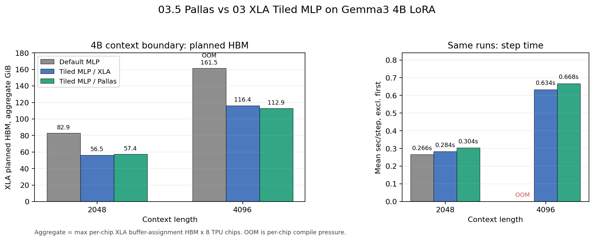
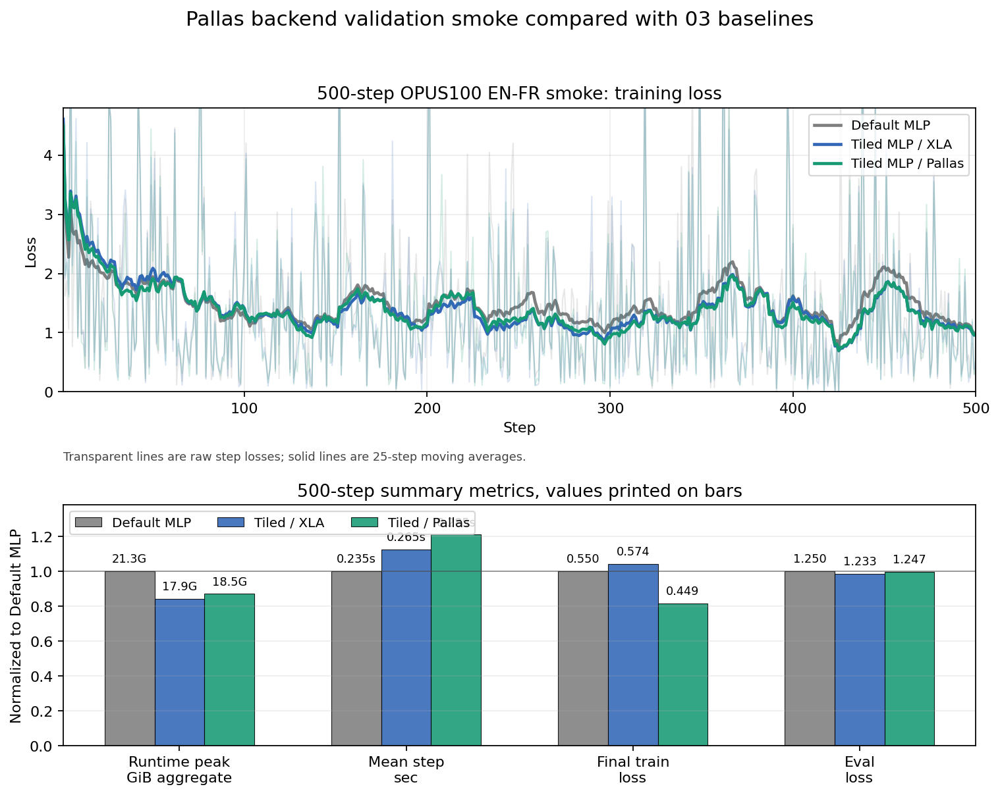
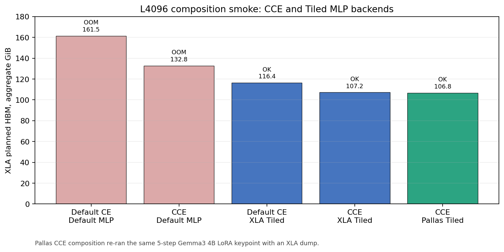

# Pallas Backend for Gemma3 Tiled MLP

This report consolidates the `03.5` follow-up to the Gemma3 Tiled MLP work. The
baseline is `03-TILED-MLP`: a drop-in Gemma3-only tiled MLP implemented with XLA
matmuls and a custom VJP. The follow-up lowered the tile matmuls to Pallas on
TPU and tested whether that produces an additional Unsloth-like memory win.

## Executive Summary

| Metric | Result |
| --- | --- |
| Target model family | Gemma3 only |
| Backend under test | Pallas TPU matmul inside Tiled MLP |
| TPU shape | v5litepod-8, 8 chips, `fsdp=8,tp=1` |
| 4B same-model forward loss diff | 0 |
| 4B LoRA grad norm relative diff | 0.00998% |
| L4096 planned HBM vs 03 XLA tiled | 116.4 GiB -> 112.9 GiB aggregate |
| L4096 mean step time vs 03 XLA tiled | 0.634s -> 0.668s |
| 500-step runtime peak vs 03 XLA tiled | 17.92 GiB -> 18.53 GiB aggregate |

The short version: the Pallas path works, is drop-in configurable, and is
numerically close on the same Gemma3 4B model and batch. It is not yet a better
default than the XLA tiled backend. The only clear memory win is a small
compile-plan reduction at L4096; measured step time is slower and 500-step
runtime peak memory is slightly worse.

## What Changed

The original Tiled MLP computes Gemma3's gated MLP by streaming the token
dimension:

```text
output = (gelu_approx(x @ gate) * (x @ up)) @ down
```

`03.5` keeps the same public patch surface and adds a backend selector:

```bash
export TUNIX_ACCEL_TILED_MLP_BACKEND=xla
export TUNIX_ACCEL_TILED_MLP_BACKEND=pallas
```

The implementation changes are in:

- `tunix_accel/tiled_mlp.py`
- `tunix_accel/gemma3_tiled_mlp.py`
- `tunix_accel/autopatch.py`
- `03-TILED-MLP/run_gemma_training_benchmark.py`
- `03-TILED-MLP/run_gemma3_tiled_mlp_parity.py`

The Pallas path uses TPU Pallas matmul for the tiled forward/recompute matmuls
under the tested Gemma3 FSDP mesh. Weight-gradient construction remains on the
ordinary JAX/XLA path in this version. That distinction matters: this is not a
complete hand-written Pallas training kernel, and the result reflects that.

## Context Boundary: Pallas Helps a Little, Not a Lot

The first experiment repeated the 03 context keypoints:

| Field | Value |
| --- | --- |
| Model | Gemma3 4B IT |
| Training | LoRA rank 16 |
| Batch | 1 |
| Contexts | 2048 and 4096 |
| TPU | v5litepod-8, 8 chips |
| Mesh | `fsdp=8,tp=1` |
| Steps | 5 |
| CCE | disabled |

The plotted memory is XLA planned HBM from buffer-assignment reports, shown as:

```text
aggregate_xla_hbm_gib = max_per_chip_xla_planned_hbm_gib * 8 chips
```

This is a reporting convention, not a single pooled memory space. OOM still
happens per chip.



| Context | Variant | Status | Planned HBM aggregate | Runtime peak aggregate | Mean step |
| ---: | --- | --- | ---: | ---: | ---: |
| 2048 | Default MLP | OK | 82.9 GiB | 19.80 GiB | 0.266s |
| 2048 | Tiled MLP / XLA | OK | 56.5 GiB | 17.78 GiB | 0.284s |
| 2048 | Tiled MLP / Pallas | OK | 57.4 GiB | 18.03 GiB | 0.304s |
| 4096 | Default MLP | OOM | 161.5 GiB |  |  |
| 4096 | Tiled MLP / XLA | OK | 116.4 GiB | 15.08 GiB | 0.634s |
| 4096 | Tiled MLP / Pallas | OK | 112.9 GiB | 15.11 GiB | 0.668s |

At L4096, Pallas reduced the compile-plan memory by about 3.0% relative to the
03 XLA tiled backend. At L2048 it was about 1.6% higher. In both contexts it was
slower.

## 500-Step Training Smoke: No Quality Collapse, No Runtime Win

The second experiment repeated the 03 500-step OPUS100 EN-FR smoke:

| Field | Value |
| --- | --- |
| Model | Gemma3 4B IT |
| Training | LoRA rank 16 |
| Batch | 1 |
| Context | 2048 |
| TPU | v5litepod-8, 8 chips |
| Mesh | `fsdp=8,tp=1` |
| Steps | 500 |
| CCE | disabled |



| Metric | Default MLP | Tiled / XLA | Tiled / Pallas |
| --- | ---: | ---: | ---: |
| Runtime peak, aggregate | 21.29 GiB | 17.92 GiB | 18.53 GiB |
| Mean step time | 0.235s | 0.265s | 0.285s |
| Final train loss | 0.5504 | 0.5739 | 0.4490 |
| Eval loss | 1.2501 | 1.2327 | 1.2468 |

The loss trajectory is plausible and does not show a training failure. The
important comparison for `03.5`, however, is backend efficiency: Pallas was
about 7.5% slower than the 03 XLA tiled backend and used about 3.4% more runtime
peak memory in this smoke.

The Pallas run also produced 32 translation samples and sacreBLEU metrics, but
this remains a 500-step smoke rather than a completed translation benchmark.

## Same-Model Numerical Parity

A separate parity runner used the same loaded Gemma3 4B model instance and the
same first batch, then toggled Default MLP vs Pallas Tiled MLP in process.

| Check | Default MLP | Pallas Tiled MLP | Difference |
| --- | ---: | ---: | ---: |
| Forward loss | 4.643880 | 4.643880 | 0 |
| LoRA grad global norm | 155.079 | 155.064 | 0.00998% rel |
| LoRA grad RMS abs diff |  |  | 0.000935 |
| LoRA grad elements compared |  |  | 28,409,856 |

The large max relative gradient value in the raw JSON is driven by near-zero
denominators and is not a useful headline metric. The retained parity record is:

```text
03.5-PALLAS-TILED-MLP/data/gemma3_4b_pallas_direct_parity.json
```

## CCE Composition

The Pallas backend also composes with Cut Cross Entropy through the same
installed autopatch path. We re-ran the L4096 5-step composition smoke with an
XLA dump.



| Variant | Status | Planned HBM aggregate | Runtime peak aggregate | Mean step |
| --- | --- | ---: | ---: | ---: |
| Default CE + Default MLP | OOM | 161.5 GiB |  |  |
| CCE + Default MLP | OOM | 132.8 GiB |  |  |
| Default CE + XLA Tiled MLP | OK | 116.4 GiB | 15.08 GiB | 0.634s |
| CCE + XLA Tiled MLP | OK | 107.2 GiB | 15.07 GiB | 0.727s |
| CCE + Pallas Tiled MLP | OK | 106.8 GiB | 15.07 GiB | 0.775s |

This confirms compatibility, not a new headline improvement. Pallas saves only
0.35% planned HBM relative to CCE + XLA tiled MLP and is about 6.6% slower in
this 5-step keypoint.

## Interpretation

This was worth doing because it answered the uncomfortable question directly:
does simply moving the already-tiled MLP matmuls into Pallas unlock another
large TPU memory win? In this implementation, no.

The likely reasons are:

- XLA already does a strong job for the tile matmul shapes used here.
- The Pallas path adds `shard_map` and FSDP collective structure that is not
  free.
- Weight-gradient construction still uses JAX/XLA, so this is not a full
  fused-training-kernel rewrite.
- Tiled MLP's dominant win already came from the algorithmic choice to avoid
  keeping the large token-by-intermediate activation resident. Pallas only
  changes the matmul backend inside that design.

The practical decision is to keep Pallas as an opt-in experimental backend, not
promote it to the default. The next serious Pallas attempt should target a
larger fused region with a clearer compiler/runtime gap, or implement the
backward/update path more completely instead of lowering only the tile matmuls.
