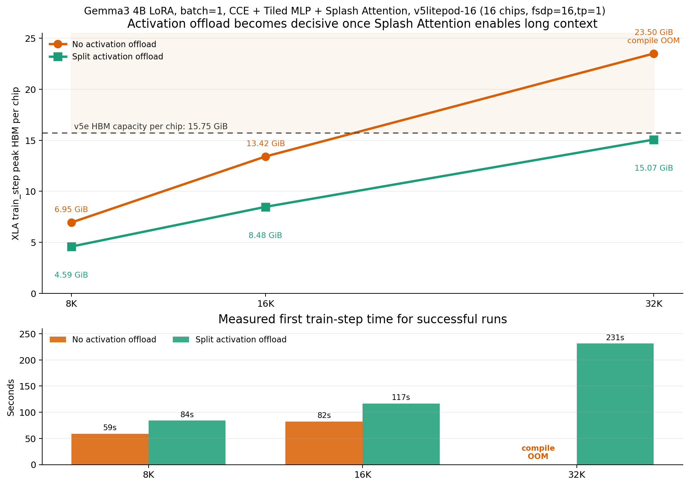
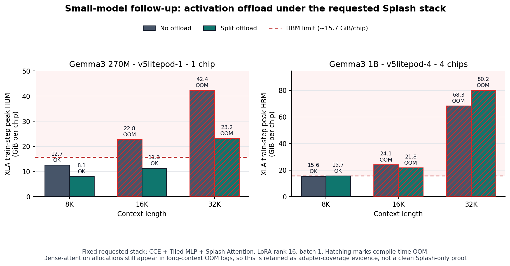

# 04-ACTIVATION-POLICY

This directory contains the retained artifacts for the Gemma3 activation
remat/offload policy experiment.

## Contents

- `TECHNICAL_REPORT.md`: final narrative report with embedded plots.
- `REPRODUCE.md`: guide for reproducing the retained TPU runs.
- `assets/`: final plots used by the report.
- `data/`: compact CSV/JSON summaries retained from the experiments.
- `data/raw/`: raw summary, history, and XLA train-step memory reports for the
  retained runs.
- `results/long-context-splash/`: retained CCE + Tiled MLP + Splash Attention
  long-context frontier with `split_offload`.
- `results/splash-activation-ablation/`: follow-up ablation that keeps CCE,
  Tiled MLP, and Splash Attention fixed and compares activation policy `none`
  vs `split_offload` on v5litepod-16.
- `results/small-model-splash-activation-ablation/`: Gemma3 270M and 1B
  follow-up on smaller TPU slices. These runs are retained as adapter-coverage
  diagnostics because the long-context OOM logs still expose dense attention
  allocations.
- `references/`: background notes used to frame the benchmark.
- `analyze_activation_policy_results.py`: regenerates the 4B keypoint summary
  tables and figures.
- `analyze_small_model_activation_followup.py`: regenerates the 270M/1B
  follow-up summary table and figure.
- `run_gemma_training_benchmark.py`: TPU training runner for activation policy
  keypoints.
- `run_gemma3_activation_policy_parity.py`: same-model parity runner.

The patch implementation itself lives outside this directory in
`tunix_accel/gemma3_activation_policy.py`.

## Summary

The experiment targets Gemma3 decoder-layer activation residency. It does not
change model math. It changes how JAX/NNX saves, rematerializes, or offloads
intermediate activations during autodiff.

The current scope is deliberately **Gemma3-only** because the drop-in patch
overrides Tunix Gemma3's `DecoderLayer.__call__` structure.

## Headline Result

On Gemma3 4B LoRA, batch 1, max length 4096, TPU v5litepod-8:

| CE path | Activation policy | Status | XLA planned HBM, aggregate |
| --- | --- | --- | ---: |
| Default CE | none | compile OOM | 177.3 GiB |
| Default CE | split offload | OK | 115.2 GiB |

The useful result is narrow but real: named activation offload moved the same
Default CE training shape from compile OOM to completion. A separate
`split_remat` diagnostic did not move the boundary, so the headline is
activation **offload**, not remat alone.

## Splash Attention Follow-Up

After adding the Gemma3 Splash Attention adapter, we also isolated activation
offload at longer contexts. Fixed setup: Gemma3 4B IT, LoRA rank 16, batch 1,
CCE enabled, Tiled MLP enabled, Splash Attention enabled, TPU v5litepod-16, 16
global chips, `fsdp=16,tp=1`.

| Context | Activation policy | Status | XLA planned HBM per chip |
| ---: | --- | --- | ---: |
| 8192 | none | OK | 6.95 GiB |
| 8192 | split offload | OK | 4.59 GiB |
| 16384 | none | OK | 13.42 GiB |
| 16384 | split offload | OK | 8.48 GiB |
| 32768 | none | compile OOM | 23.50 GiB |
| 32768 | split offload | OK | 15.07 GiB |

This is not a single-chip result. It is a same-shape A/B on the 16-chip mesh
used by the retained Splash frontier. FSDP is not tensor parallel, but it does
shard model state residency across the mesh; the long-context activation term
is still reported per chip.



## Small-Model Follow-Up

The same requested long-context stack was also run on smaller slices:

| Model | TPU | Mesh | Outcome |
| --- | --- | --- | --- |
| Gemma3 270M | v5litepod-1, 1 chip | fsdp=1,tp=1 | `split_offload` moved the fit boundary from 8K to 16K; 32K still OOM. |
| Gemma3 1B | v5litepod-4, 4 chips | fsdp=4,tp=1 | Both arms fit at 8K only; 16K and 32K still OOM. |



This follow-up is deliberately not presented as a clean Splash Attention proof.
Although the Splash hook was installed, long-context OOM logs still contain
dense attention score/mask allocations. The retained value is diagnostic: the
activation policy can move a small-model memory boundary, but the Splash adapter
needs stronger per-call coverage instrumentation before making a cross-size
claim.

## Drop-In Controls

Installed environments only apply this patch when a non-`none` activation
policy is requested.

```bash
export TUNIX_ACCEL_ACTIVATION_POLICY=split_offload
export TUNIX_ACCEL_ACTIVATION_PREVENT_CSE=0
export TUNIX_ACCEL_ACTIVATION_OFFLOAD_SRC=device
export TUNIX_ACCEL_ACTIVATION_OFFLOAD_DST=pinned_host
export TUNIX_ACCEL_DISABLE_ACTIVATION_POLICY=1
```

Use `TUNIX_ACCEL_ACTIVATION_POLICY=none` or unset the variable for the baseline.

For notebooks or scoped tests:

```python
from tunix_accel import gemma3_activation_policy

gemma3_activation_policy.install(policy="split_offload")
```

Normal Tunix training code should not need that explicit call after the package
is installed and the environment variable is set.

## Verification

Local tests:

```bash
python -m pytest -q tests/test_gemma3_activation_policy.py tests/test_autopatch.py
```

The retained TPU validation artifacts are:

- Keypoint data: `data/gemma3_4b_activation_policy_keypoints.csv`
- Same-model parity data: `data/gemma3_4b_activation_policy_parity.json`
- Small-model follow-up data: `data/gemma3_small_model_activation_followup.csv`
- Final figures:
  - `assets/gemma3_4b_activation_hbm_headroom.png`
  - `assets/gemma3_4b_activation_before_after_memory.png`
  - `assets/gemma3_4b_l4096_activation_frontier.png`
  - `assets/gemma3_4b_l2048_activation_tradeoff.png`
  - `assets/gemma3_small_model_activation_followup.png`
  - `results/splash-activation-ablation/splash_activation_offload_ablation.png`
