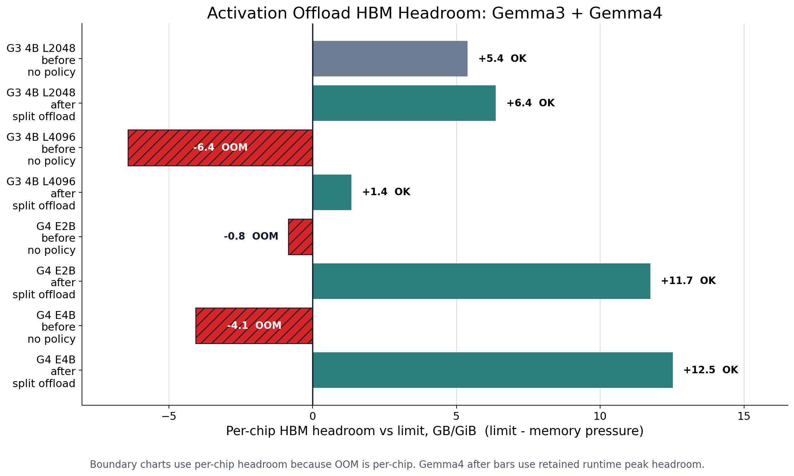
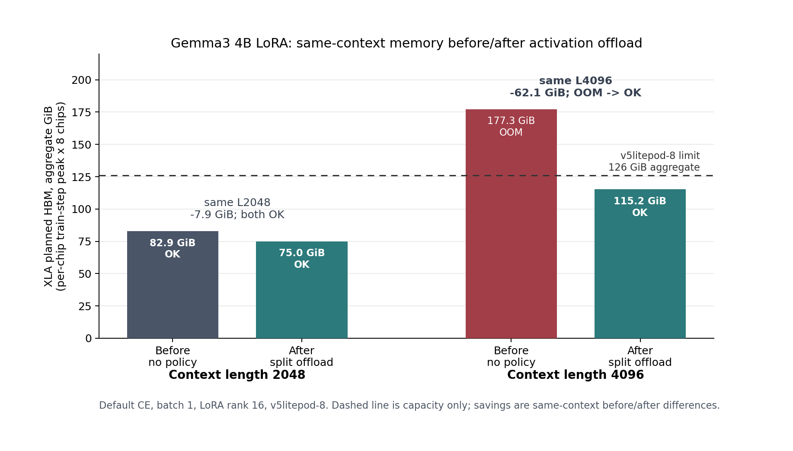
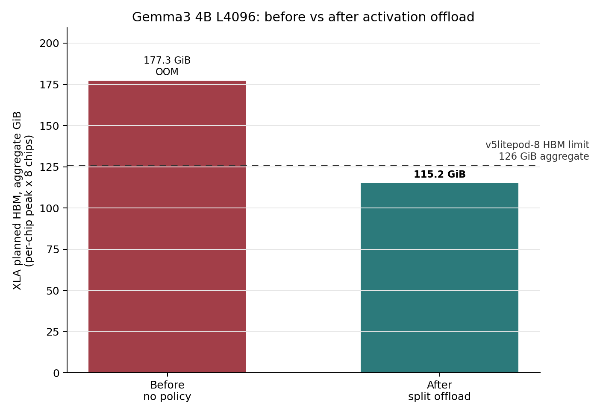
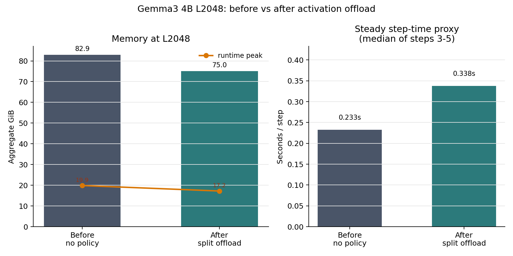

# JAX/Tunix + TPU Activation Policy Technical Report

This report consolidates the activation remat/offload workstream on JAX/Tunix +
Cloud TPU. The primary result is Gemma3 4B; Gemma4 base boundary rows are folded
into the same headroom readout. The core question is narrow: with Tunix training
code otherwise unchanged, can a drop-in activation policy reduce HBM residency
enough to move a real training boundary without changing model math?

## Executive Summary

There are two separate results in this workstream, and they should not be
collapsed into one comparison.

First, on the plain Default CE path, Gemma3 4B LoRA at L4096 moved from
compile-time HBM OOM to completion when `split_offload` was enabled:

| Setup | Activation policy | Status | XLA planned HBM max/chip |
| --- | --- | --- | ---: |
| Gemma3 4B, Default CE, L4096, v5litepod-8 | none | compile OOM | 22.16 GiB/chip |
| Gemma3 4B, Default CE, L4096, v5litepod-8 | split_offload | OK | 14.40 GiB/chip |

Second, after CCE, Tiled MLP, and Splash Attention were already enabled, we ran
a long-context ablation that changed only activation policy. In that fixed
stack, `split_offload` still mattered: Gemma3 4B LoRA at L32768 moved from
compile-time HBM OOM to completion.

| Setup | Activation policy | Status | XLA planned HBM per chip |
| --- | --- | --- | ---: |
| Gemma3 4B, CCE + Tiled MLP + Splash, L32768, v5litepod-16 | none | compile OOM | 23.50 GiB |
| Gemma3 4B, CCE + Tiled MLP + Splash, L32768, v5litepod-16 | split_offload | OK | 15.07 GiB |

The interpretation is precise: Splash Attention removes the dense-attention
memory wall, but very long context still leaves decoder activation, MLP, and
attention residual residency pressure. Split activation offload is
complementary to Splash Attention because it lowers that remaining HBM pressure.
It is not a speed feature; where both variants fit, no-offload is faster.

A smaller-model follow-up did not reproduce the same clean story on the first
attempt. Gemma3 270M on one v5e chip showed a useful offload boundary move from
8K to 16K, but Gemma3 1B on four v5e chips did not move beyond 8K. More
importantly, the long-context OOM logs still exposed dense attention score/mask
allocations. Those runs are retained as adapter-coverage diagnostics, not as a
clean Splash Attention ablation.

## 1. What We Patched

The patch changes the Gemma3 decoder-layer call path. It does not replace a
linear kernel, attention kernel, loss function, or optimizer. It only changes
where autodiff is allowed to save, recompute, or offload activations.

Implemented policies:

| Policy | Meaning |
| --- | --- |
| `layer_remat` | Remat the whole decoder layer. |
| `layer_offload` | Remat the whole decoder layer and name/offload the layer input. |
| `split_remat` | Remat attention and MLP as separate regions. |
| `split_offload` | Split remat plus named pinned-host offload of attention/MLP residuals. |

The retained headline compares `none` and `split_offload`. `split_remat` was
also run as a diagnostic; it is useful for interpretation, but it is not part of
the main before/after plot.

## 2. Drop-In Surface

The implementation lives in:

- `tunix_accel/gemma3_activation_policy.py`
- `tunix_accel/gemma4_activation_policy.py`
- `tunix_accel/autopatch.py`
- `sitecustomize.py`

The package keeps the default activation policy as `none`. Installed
environments only patch Tunix Gemma3 or Gemma4 when the user asks for it:

```bash
export TUNIX_ACCEL_ACTIVATION_POLICY=split_offload
export TUNIX_ACCEL_ACTIVATION_PREVENT_CSE=0
export TUNIX_ACCEL_ACTIVATION_OFFLOAD_SRC=device
export TUNIX_ACCEL_ACTIVATION_OFFLOAD_DST=pinned_host
```

The runner supports the full stack, but each experiment section below states
which patches are fixed. The long-context Splash ablation fixes CCE, Tiled MLP,
and Splash Attention **on for both arms**; it is not a CCE ablation.

## 3. First Result: Headroom, Not Raw Memory

The keypoint runs used Gemma3 4B IT, LoRA rank 16, batch 1, Default CE, Cloud
TPU v5litepod-8, 8 chips, `fsdp=8,tp=1`, and 5 train steps.

The main figure is expressed as per-chip HBM headroom:

```text
headroom_gib_per_chip = hbm_limit_gib_per_chip - max_per_chip_hbm_gib
```

Positive values fit below the TPU limit. Negative values are compile-OOM. This
view is intentionally used instead of a raw-memory bar chart because it answers
the important question directly: did the activation policy merely save some
memory, or did it cross the fit boundary?

For fixed-chip Gemma3 4B rows, aggregate accounting is still:

```text
aggregate_xla_hbm_gib = max_per_chip_xla_planned_hbm_gib * 8 chips
```

but the figure avoids raw aggregate memory as the visual axis because the
Gemma4 rows use different TPU slice sizes.

For consistency, every row uses the XLA buffer-assignment
`*jit__train_step*memory-usage-report.txt` `Memory Space: default` `Total bytes`
value. TPU OOM stderr also prints a shorter "program HBM" number; that is a
different XLA diagnostic and is not mixed into the table below.



The same before/after boundary question was then checked on Gemma4 E2B and E4B
base checkpoints at LoRA rank 16, batch 1, max length 2048, with quality
evaluation disabled. Those rows are systems boundary checks, not
translation-quality runs. They are folded into the same headroom figure above.

| Context | Activation policy | Status | Max/chip planned HBM | Per-chip headroom | Runtime peak aggregate | Steady step |
| ---: | --- | --- | ---: | ---: | ---: | ---: |
| 2048 | none | OK | 10.36 GiB | +5.39 GiB | 19.87 GiB | 0.233s |
| 2048 | split offload | OK | 9.38 GiB | +6.37 GiB | 17.22 GiB | 0.338s |
| 4096 | none | OOM | 22.16 GiB | -6.41 GiB |  |  |
| 4096 | split offload | OK | 14.40 GiB | +1.35 GiB | 18.83 GiB | 0.793s |

The clean interpretation:

- At L2048 both variants fit; offload gives modest memory relief and slower
  steps.
- At L4096 the baseline crosses the HBM limit and fails, while `split_offload`
  moves the same Default CE training shape below the limit.
- A remat-only diagnostic stayed at roughly the same OOM point, so the observed
  win comes from offloading named residual activations out of HBM.

The larger L4096 drop should not be read as a linear scaling claim. L4096 is a
memory-frontier case with different XLA liveness pressure; moving saved
residuals changes the buffer schedule enough to cross the fit boundary.

The equivalent raw-memory view is retained as supporting evidence:



Gemma4 lines up with the Gemma3 interpretation: offload moved the fit boundary.
The retained Gemma4 split-remat diagnostic still OOMed, so the result remains
about activation **offload**, not remat alone. The cost is also visible:
`split_offload` is a capacity feature, not a speed feature.

## 4. L4096 Boundary Close-Up



## 5. L2048 Tradeoff

The L2048 run used the same Gemma3 4B LoRA setup with CCE and Tiled MLP
disabled. This is not a quality benchmark; it is a steady-state memory/time
tradeoff check.



| Activation policy | XLA planned HBM max/chip | Runtime peak aggregate | Steady step |
| --- | ---: | ---: | ---: |
| none | 10.36 GiB/chip | 19.87 GiB | 0.233s |
| split offload | 9.38 GiB/chip | 17.22 GiB | 0.338s |

The steady step is the median of steps 3-5. The usual
`mean_step_time_sec_excl_first` metric is misleading in this tiny smoke because
remat/offload compile and async dispatch effects leaked into step 2.

The tradeoff is visible: offload cut XLA planned HBM by about 9.5% at L2048,
but steady step time increased by about 45%.

## 6. Same-Model Numerical Parity

A separate parity runner loaded one Gemma3 4B model instance and the same first
OPUS100 EN-FR batch, then compared the unpatched layer call against
`split_offload`.

| Check | Baseline | split offload | Difference |
| --- | ---: | ---: | ---: |
| Forward loss | 4.643880 | 4.643880 | 0 |
| LoRA grad global norm | 155.079 | 155.184 | 0.0673% rel |
| LoRA grad RMS abs diff |  |  | 0.000804 |
| LoRA grad elements compared |  |  | 28,409,856 |

The max relative gradient diff in the raw JSON is dominated by near-zero
denominator elements, so it is not used as a headline metric. The retained
parity file is:

```text
04-ACTIVATION-POLICY/data/gemma3_4b_activation_policy_parity.json
```

## 7. What This Means

This workstream is a good drop-in candidate, but the lesson is precise:
activation offload mattered; remat-by-itself did not. That matches the intuition
that Tunix/Gemma3/XLA already has substantial remat behavior, while explicit
named offload can still change HBM residency enough to move a boundary.

This first result should not be read as a CCE-composition claim. The clean
result here is only before/after on the Default CE path. Activation offload
attacks saved residuals and schedule residency; it is a separate memory lever
from the loss kernel work.

## 8. Splash Attention + Activation Offload Ablation

The next question was whether activation offload still matters after the
long-context stack already includes CCE, Tiled MLP, and Splash Attention. To
isolate that, we kept the stack fixed and changed only activation policy:

```text
Gemma3 4B IT, LoRA rank 16, batch 1
CCE enabled, Tiled MLP enabled, Splash Attention enabled
Cloud TPU v5litepod-16, 16 chips, mesh fsdp=16,tp=1
Variable: activation_policy = none vs split_offload
```

This v5litepod-16 run should be read as a same-environment A/B, not as a
single-chip claim. FSDP does not tensor-parallelize one layer's matmul, but it
does shard model state residency across the mesh. The reported memory below is
still the XLA train-step planned HBM **per chip**, because TPU OOM is decided
per chip.

This ablation does not measure the marginal effect of CCE. CCE is part of the
fixed long-context stack in both arms. The same is true for Tiled MLP and Splash
Attention.


| Context | Policy | Status | XLA planned HBM per chip | First train step |
| ---: | --- | --- | ---: | ---: |
| 8192 | none | OK | 6.95 GiB | 59s |
| 8192 | split offload | OK | 4.59 GiB | 84s |
| 16384 | none | OK | 13.42 GiB | 82s |
| 16384 | split offload | OK | 8.48 GiB | 117s |
| 32768 | none | compile OOM | 23.50 GiB |  |
| 32768 | split offload | OK | 15.07 GiB | 231s |

This answers the scaling question more directly than the first L4096 result:
with Splash enabled, no-offload still scales up quickly with context length and
fails at L32768 on v5e HBM. `split_offload` is slower where both variants fit,
but it is the difference between compile OOM and completion at 32K.

The absolute memory savings also grow with context length in this setup:

| Context | Memory reduction from split_offload |
| ---: | ---: |
| 8192 | 2.36 GiB/chip |
| 16384 | 4.93 GiB/chip |
| 32768 | 8.43 GiB/chip |

That is the synergy claim: Splash makes the 32K graph structurally possible by
removing dense attention's `T x T` memory wall; split activation offload then
determines whether the remaining train-step graph fits inside v5e HBM.

The retained data is:

```text
04-ACTIVATION-POLICY/results/splash-activation-ablation/
```

## 9. Smaller-Model Follow-Up

The 4B result above was run on a 16-chip v5e mesh. To check whether the same
pattern appears at smaller model sizes without over-allocating chips, the next
retained experiment uses the same long-context stack and only changes model
size and chip count:

| Model | TPU slice | Mesh | Stack | Variable |
| --- | --- | --- | --- | --- |
| Gemma3 270M IT | v5litepod-1 | fsdp=1,tp=1 | CCE + Tiled MLP + Splash Attention | activation policy |
| Gemma3 1B IT | v5litepod-4 | fsdp=4,tp=1 | CCE + Tiled MLP + Splash Attention | activation policy |

The context sweep was L8192, L16384, and L32768. Every row used batch 1 and
LoRA rank 16. Memory is the XLA train-step planned HBM per chip, because the
TPU fit decision is per chip.


| Model | TPU | Context | Policy | Status | XLA planned HBM per chip | First train step |
| --- | --- | ---: | --- | --- | ---: | ---: |
| Gemma3 270M | v5litepod-1, 1 chip | 8192 | none | OK | 12.66 GiB | 26.5s |
| Gemma3 270M | v5litepod-1, 1 chip | 8192 | split offload | OK | 8.11 GiB | 34.6s |
| Gemma3 270M | v5litepod-1, 1 chip | 16384 | none | compile OOM | 22.81 GiB |  |
| Gemma3 270M | v5litepod-1, 1 chip | 16384 | split offload | OK | 11.34 GiB | 35.8s |
| Gemma3 270M | v5litepod-1, 1 chip | 32768 | none | compile OOM | 42.39 GiB |  |
| Gemma3 270M | v5litepod-1, 1 chip | 32768 | split offload | compile OOM | 23.17 GiB |  |
| Gemma3 1B | v5litepod-4, 4 chips | 8192 | none | OK | 15.55 GiB | 31.3s |
| Gemma3 1B | v5litepod-4, 4 chips | 8192 | split offload | OK | 15.68 GiB | 43.3s |
| Gemma3 1B | v5litepod-4, 4 chips | 16384 | none | compile OOM | 24.07 GiB |  |
| Gemma3 1B | v5litepod-4, 4 chips | 16384 | split offload | compile OOM | 21.82 GiB |  |
| Gemma3 1B | v5litepod-4, 4 chips | 32768 | none | compile OOM | 68.25 GiB |  |
| Gemma3 1B | v5litepod-4, 4 chips | 32768 | split offload | compile OOM | 80.23 GiB |  |

The smaller-model follow-up gives a mixed but useful result:

- On Gemma3 270M with one chip, `split_offload` moved the fit boundary from
  L8192 to L16384. This is the same kind of memory-frontier behavior as the 4B
  result, just on a smaller slice.
- On Gemma3 1B with four chips, both variants fit only at L8192. The
  `split_offload` arm reduced L16384 planned HBM from 24.07 GiB/chip to
  21.82 GiB/chip, but not enough to fit. At L32768 it was worse than the
  no-offload arm, which indicates a different XLA schedule rather than a simple
  monotonic memory saving.
- The long-context OOM logs for these smaller-model runs still contain dense
  attention score/mask allocation evidence. The summary JSON says the Splash
  hook was installed, but "installed" is not the same as "the compiled graph
  used the Splash lowering for every attention path." Therefore these rows
  should not be used as a clean proof of Splash Attention plus activation
  offload across model sizes.

The practical conclusion is that the activation policy itself is useful, but
the Splash adapter needs stronger coverage instrumentation before we can make a
cross-size claim. The next implementation step should record, per compiled
attention call, whether the Splash path or fallback path was actually used, and
then fix the 270M/1B attention layout that is still producing dense attention in
the long-context OOM cases.

The retained follow-up artifacts are:

```text
04-ACTIVATION-POLICY/results/small-model-splash-activation-ablation/
04-ACTIVATION-POLICY/data/gemma3_small_model_activation_followup.csv
```

## 10. Limits

The retained quality evidence is parity-oriented, not a completed EN-FR
fine-tuning benchmark. That is intentional: activation policy does not change
the model function, and a same-model forward/gradient comparison is the cleaner
test for mathematical behavior. A longer training run would mainly measure
systems overhead and checkpoint behavior.

The supported scope is Gemma3 and Gemma4 through explicit adapters. Extending
this to other model families should follow the same pattern because
decoder-layer call structure, residual naming, attention layouts, and remat
boundaries differ across families.

Finally, offload is not free. On this TPU shape, it bought memory headroom with
slower steps and longer compile/dispatch behavior. The right default is still
`none`; users should opt in when they need the memory frontier.
