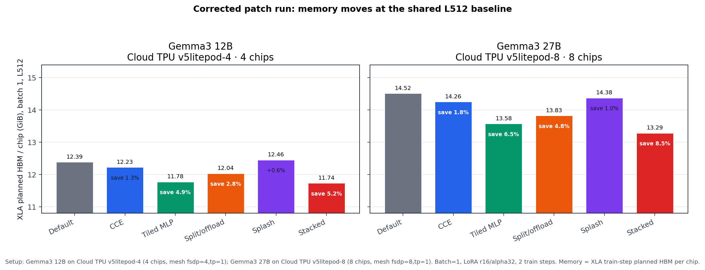
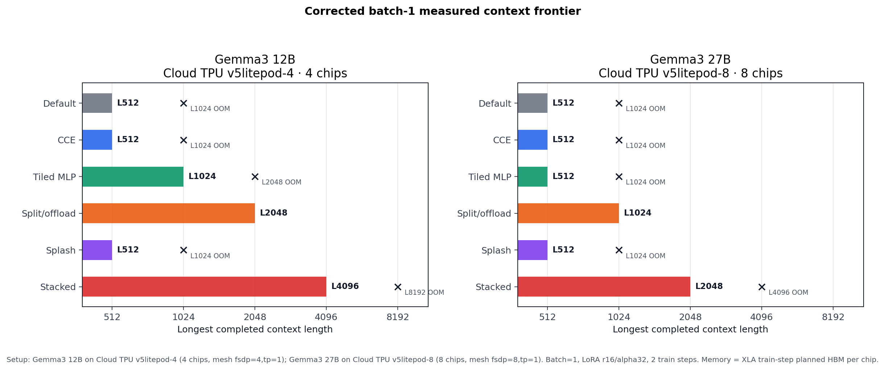
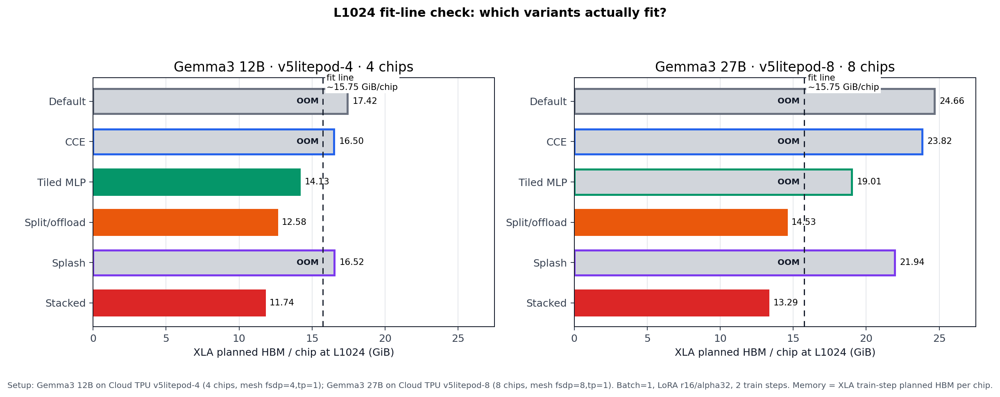
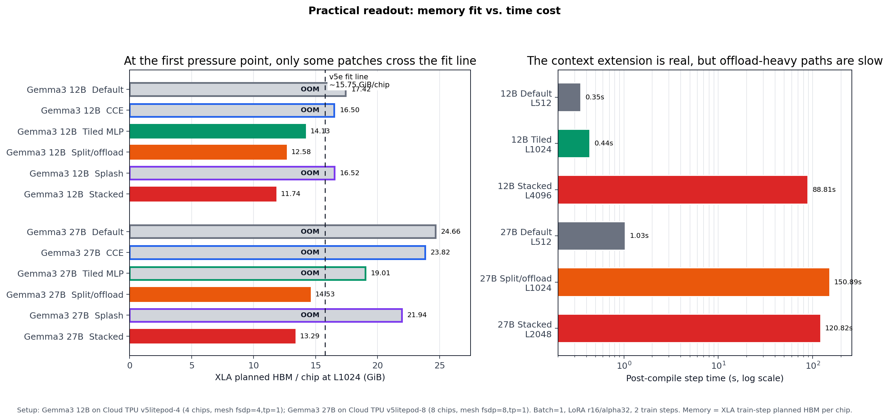
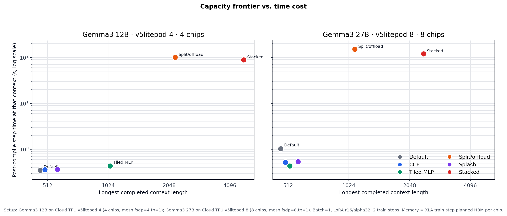
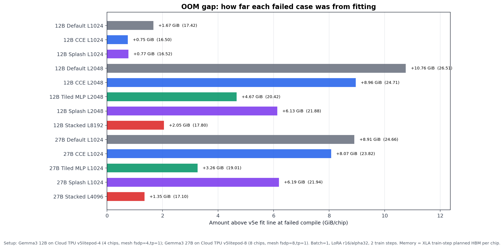

# Gemma3 12B/27B Patch Sweep on TPU v5e

## Executive Summary

This corrected sweep answers the question that the first large-model run failed
to answer: do the drop-in patches still reduce memory and open longer context
lengths when Gemma3 is sharded across multiple TPU v5e chips?

The answer is yes, but not every patch has the same role.

| Claim | Corrected result |
| --- | --- |
| Memory moves at the shared L512 baseline | 12B Stacked: 12.39 -> 11.74 GiB/chip; 27B Stacked: 14.52 -> 13.29 GiB/chip |
| A single practical patch can move 12B | 12B Tiled MLP makes L1024 fit at 14.13 GiB/chip where Default OOMs at 17.42 GiB/chip |
| 27B needs the heavier memory levers | 27B Tiled MLP lowers L1024 to 19.01 GiB/chip but still OOMs; split/offload makes L1024 fit at 14.53 GiB/chip |
| The full stack opens the longest measured context | 12B Stacked reaches L4096; 27B Stacked reaches L2048 |
| The tradeoff is real | Offload-heavy successful rows take roughly 89-151s per post-compile step in this two-step smoke |

This is a systems boundary report. It does not claim translation quality,
long-run convergence, or final throughput. Each case ran two LoRA SFT steps so
we could capture XLA memory planning, success/failure, and a minimal
post-compile step-time signal.

## Experimental Shape

| Model | TPU slice | Chips | Mesh | Batch | Contexts | Extra stacked contexts |
| --- | --- | ---: | --- | ---: | --- | --- |
| Gemma3 12B IT | `v5litepod-4` | 4 | `fsdp=4,tp=1` | 1 | 512, 1024, 2048 | 4096, 8192 |
| Gemma3 27B IT | `v5litepod-8` | 8 | `fsdp=8,tp=1` | 1 | 512, 1024 | 2048, 4096 |

Every run used LoRA rank 16, LoRA alpha 32, 64 generated training examples, and
two train steps. The checkpoint and tokenizer came from the existing GCS Gemma3
artifacts:

```text
gs://gemma-data/checkpoints/gemma3-12b-it
gs://gemma-data/checkpoints/gemma3-27b-it
gs://gemma-data/tokenizers/tokenizer_gemma3.model
```

The reported memory is the XLA buffer-assignment train-step planned HBM per
chip. This is the right headline for this sweep because compile-time OOM is
decided per chip. Aggregate memory accounting can be useful for capacity
planning, but it is not one shared HBM pool and would make these results harder
to read.

## Patch Status Was Verified

The earlier large-model run was invalid because patched variants accidentally
ran with autopatching disabled. The bug was subtle:

```text
TUNIX_ACCEL_DISABLE_AUTOPATCH was removed for patched variants.
02-PACKING/run_gemma_training_benchmark.py then set it back to 1 by default.
```

The corrected runner sets `TUNIX_ACCEL_DISABLE_AUTOPATCH=0` for patched
variants. The benchmark summary also records explicit install flags such as
`cce_installed`, `gemma3_tiled_mlp_installed`,
`gemma3_activation_policy_installed`, and
`gemma3_splash_attention_installed`.

Successful corrected rows confirm that the requested patches were active. For
failed rows, the XLA failure still records the requested variant and memory
estimate; the run failed before producing a normal training summary.

## L512 Baseline: Small But Real Memory Movement

The shared L512 baseline keeps every variant within the v5e memory limit, so it
is useful for comparing memory movement before the true frontier pressure
appears.



At L512, the maximum observed savings came from the stacked path:

| Model | Default | CCE | Tiled MLP | Split/offload | Splash | Stacked |
| --- | ---: | ---: | ---: | ---: | ---: | ---: |
| 12B XLA HBM / chip | 12.39 | 12.23 | 11.78 | 12.04 | 12.46 | 11.74 |
| 27B XLA HBM / chip | 14.52 | 14.26 | 13.58 | 13.83 | 14.38 | 13.29 |

This is not the best way to sell the result. L512 is mostly a non-frontier
case. The savings are directionally useful, but the more important question is
whether those savings change what can run.

## Context Frontier: The Boundary Moves

The measured batch-1 context frontier changed substantially after the corrected
patches were applied.



The same result can be read as a first-pressure-point fit-line check at L1024.
This view is intentionally simpler: anything to the right of the dashed line
does not fit on the measured TPU slice, and anything to the left does.



For 12B on `v5litepod-4`:

| Variant | Longest completed context | Next observed OOM |
| --- | ---: | --- |
| Default | 512 | L1024 at 17.42 GiB/chip |
| CCE | 512 | L1024 at 16.50 GiB/chip |
| Tiled MLP | 1024 | L2048 at 20.42 GiB/chip |
| Split/offload | 2048 | not probed beyond L2048 |
| Splash | 512 | L1024 at 16.52 GiB/chip |
| Stacked | 4096 | L8192 at 17.80 GiB/chip |

For 27B on `v5litepod-8`:

| Variant | Longest completed context | Next observed OOM |
| --- | ---: | --- |
| Default | 512 | L1024 at 24.66 GiB/chip |
| CCE | 512 | L1024 at 23.82 GiB/chip |
| Tiled MLP | 512 | L1024 at 19.01 GiB/chip |
| Split/offload | 1024 | not probed beyond L1024 |
| Splash | 512 | L1024 at 21.94 GiB/chip |
| Stacked | 2048 | L4096 at 17.10 GiB/chip |

The qualitative pattern is consistent with the smaller-model workstreams, but
the balance of levers changes:

- CCE alone helps, but it is not enough to cross the first 12B/27B large-model
  frontier.
- Tiled MLP is a strong practical standalone lever on 12B and a meaningful
  partial lever on 27B.
- Split/offload and Stacked are the frontier-expansion levers for the largest
  rows.

## Practical Readout: Capacity Is Bought With Time



At L1024, the first pressure point, the fit-line story is clean:

| Model | Variant | L1024 status | L1024 XLA HBM / chip |
| --- | --- | --- | ---: |
| 12B | Default | OOM | 17.42 |
| 12B | CCE | OOM | 16.50 |
| 12B | Tiled MLP | OK | 14.13 |
| 12B | Split/offload | OK | 12.58 |
| 12B | Splash | OOM | 16.52 |
| 12B | Stacked | OK | 11.74 |
| 27B | Default | OOM | 24.66 |
| 27B | CCE | OOM | 23.82 |
| 27B | Tiled MLP | OOM | 19.01 |
| 27B | Split/offload | OK | 14.53 |
| 27B | Splash | OOM | 21.94 |
| 27B | Stacked | OK | 13.29 |

The cost side is equally clear. Tiled MLP is still a relatively practical
standalone patch when it is enough: 12B L1024 completed with a 0.44s
post-compile step. Activation offload changes the memory frontier more
dramatically, but the successful large rows are slow in this smoke:

| Model | Capacity row | Post-compile step time |
| --- | --- | ---: |
| 12B | Default L512 | 0.35s |
| 12B | Tiled MLP L1024 | 0.44s |
| 12B | Stacked L4096 | 88.81s |
| 27B | Default L512 | 1.03s |
| 27B | Split/offload L1024 | 150.89s |
| 27B | Stacked L2048 | 120.82s |

The right interpretation is not that Stacked is a fast training recipe. It is a
proof that the drop-in stack can change the large-model memory frontier. The
next engineering question is how much of the offload-heavy overhead can be
reduced without giving back the context capacity.

The frontier-vs-time view makes the tradeoff visible without mixing it into the
memory bars. Moving right means the variant reached longer context. Moving up
means the post-compile step became slower.



For failed compiles, the OOM-gap view shows how far the XLA planned HBM was
above the v5e fit line. This helps distinguish "almost fits" from "far from
fitting." For example, 12B CCE and Splash at L1024 are less than 1 GiB/chip over
the line, while 27B Default at L1024 is almost 9 GiB/chip over it.



## Why The Large-Model Shape Looks Different

The smaller 270M/1B/4B experiments often showed a cleaner product-style story:
one patch made a large visible improvement. In the 12B/27B sweep, model-state
residency, sharding layout, MLP activations, attention activations, and loss
memory are all competing near the HBM limit. A patch that is decisive on a
smaller model may only be a partial lever here.

That is why the corrected 27B row is especially useful:

```text
Default L1024:   24.66 GiB/chip, OOM
Tiled MLP L1024: 19.01 GiB/chip, OOM
Split/offload:  14.53 GiB/chip, OK
Stacked L2048:  13.58 GiB/chip, OK
Stacked L4096:  17.10 GiB/chip, OOM
```

This separates "the patch does nothing" from "the patch helps but is not the
dominant remaining limiter." The previous invalid run could not make that
distinction.

## Limitations

- This is a two-step smoke per case. The step-time values are useful for
  direction and order-of-magnitude tradeoff, not final throughput.
- Failed rows record compile-time XLA memory estimates; they do not have normal
  runtime memory summaries.
- The reported context frontier is a measured frontier, not a mathematical
  maximum. Some variants were not probed beyond their last success.
- Quality metrics and translation samples are intentionally out of scope.

## Data

The report directory keeps lightweight corrected summaries:

```text
05-GEMMA3-LARGE-SWEEP/raw/12b_corrected/
05-GEMMA3-LARGE-SWEEP/raw/27b_corrected/
05-GEMMA3-LARGE-SWEEP/data/gemma3_large_patch_sweep_corrected_summary.csv
```

Full raw archives, including XLA dumps, are stored in GCS:

```text
gs://gcp-ml-172005-ddpm-training/tunix-large-sweep/gemma3-large-patch-sweep-corrected-12b.tar.gz
gs://gcp-ml-172005-ddpm-training/tunix-large-sweep/gemma3-large-patch-sweep-corrected-27b.tar.gz
```
