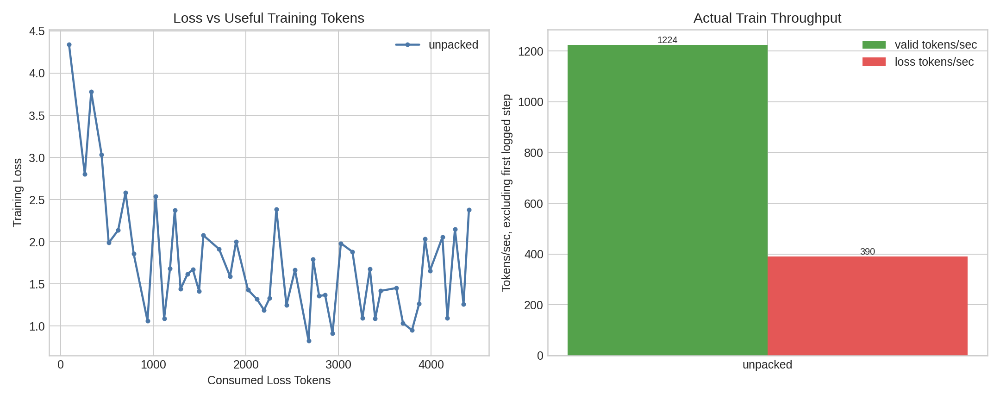

# Gemma3 Packing Training Benchmark

This run compares ordinary fixed-length Tunix SFT batches against packed batches using Default CE only.

- Dataset: `opus100-en-fr-gemma3-it`
- Source: Helsinki-NLP/opus-100 en-fr train split, Tunix Gemma3 IT prompt wrapper, target-only loss mask, target EOS
- Model: `google/gemma-3-1b-it`
- Tokenizer source: `sentencepiece`

## Summary

| Variant | Steps | Batch | Max length | Fit examples | Rows/batches | Final loss | Eval loss | BLEU | chrF | Step time | Valid tok/s | Loss tok/s | Packing density |
| --- | ---: | ---: | ---: | ---: | ---: | ---: | ---: | ---: | ---: | ---: | ---: | ---: | ---: |
| unpacked | 50 | 8 | 512 | 4999 | 624 | 2.3786 | 1.6070 | 30.93 | 55.00 | 0.226s | 1224 | 390 | 10.5% |
